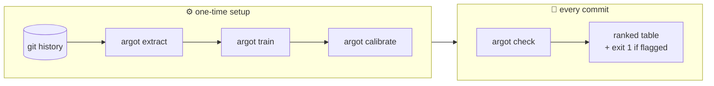
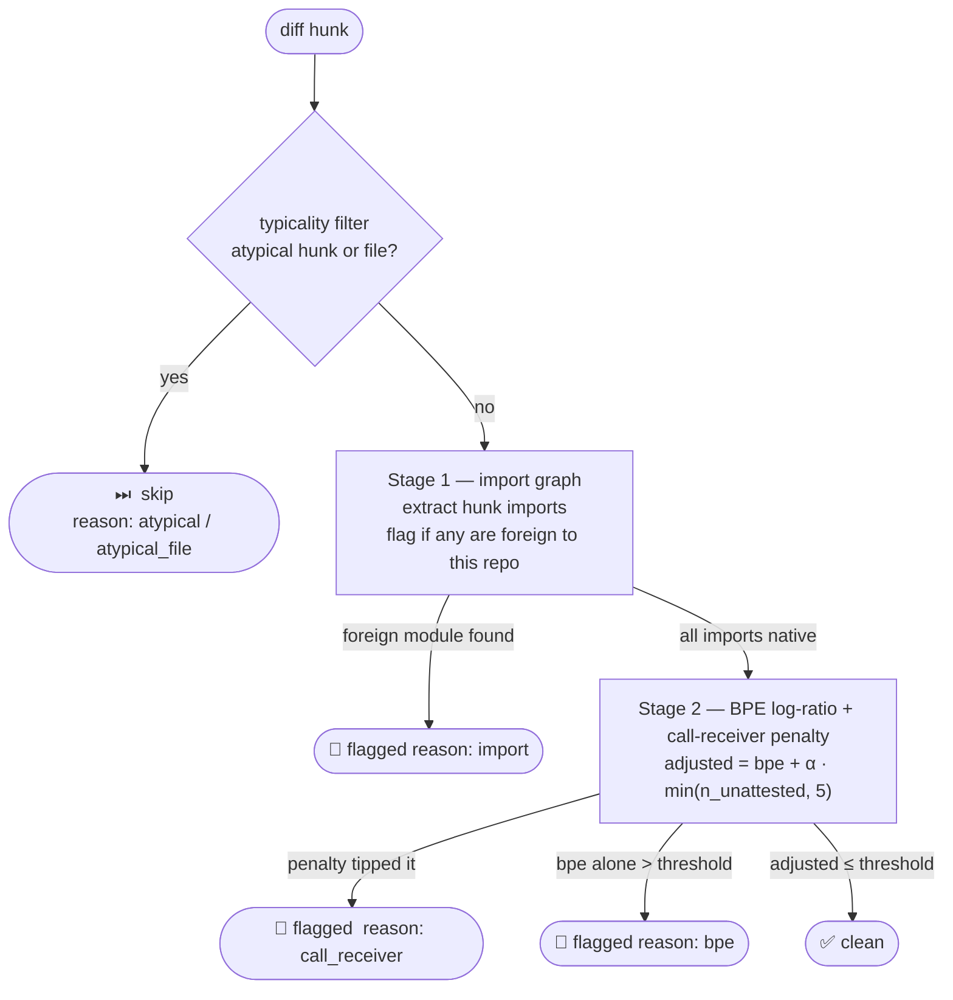

<p align="center">
  
</p>

<p align="center">
  <strong>Like ESLint, but for the unwritten rules.</strong><br/>
  <em>A three-stage scorer learns your repo's import patterns, call-site callees, and token distribution — argot flags what diverges.</em>
</p>

<p align="center">
  <a href="https://github.com/get-tmonier/argot/actions/workflows/ci.yml"></a>
  <a href="https://github.com/get-tmonier/argot/blob/main/LICENSE"></a>
  
  
</p>

<p align="center">
  Style linter that builds a statistical model of your codebase's voice from its own git history,<br/>
  then flags hunks whose token distribution diverges from the learned norm.<br/>
  No GPU · No cloud · No telemetry · Runs in seconds after a one-time calibration
</p>

$$\text{score}(\text{hunk}) \;=\; \underbrace{\max_{t \;\in\; \text{tokens}(\text{hunk})} \log \frac{P_{\text{generic}}(t)}{P_{\text{repo}}(t)}}_{\text{BPE surprise}} \;+\; \underbrace{\alpha \cdot \min\!\bigl(|\text{callees}(\text{hunk}) \setminus \text{attested}(\text{repo})|,\; C\bigr)}_{\text{call-receiver penalty}\;(\alpha=2.0,\;C=5)}$$

---

## What it catches

It does *not* replace ESLint, ruff, or type checkers. It catches what they can't: things that are *technically fine but socially wrong* for this project.

| Signal | What it means |
|---|---|
| **LLM paste-through** | A block whose style diverges sharply from the surrounding file |
| **Convention drift** | Error handling, logging, or patterns that don't match the repo |
| **Foreign paradigm** | Class-based OOP dropped into a functional codebase, wrong import style |
| **Stylistic outlier** | New code that's correct, but doesn't sound like anyone on this team wrote it |

### Concrete examples

Validated against the FastAPI corpus (50 real PRs, 1,452 hunks). All three examples below were caught at **95%+ recall** by Stage 2 alone — with no import-level hints.

**Foreign framework routing** (`reason: import`, score 5.77)
```python
# flagged — Flask vocabulary in a FastAPI codebase
from flask import Flask, abort, jsonify, request
app = Flask(__name__)

@app.route("/users", methods=["GET", "POST"])
def users() -> object:
    return jsonify(list(_users.values()))
```
FastAPI routes use `@router.get` / `@router.post` with Pydantic-typed parameters. Flask's `@app.route(methods=[...])` + `request` proxy is a fully foreign vocabulary — Stage 1 catches the `flask` import immediately.

**Sync blocking in an async codebase** (`reason: bpe`, score 7.33)
```python
# flagged — requests.get() blocks the event loop
import requests
from fastapi import FastAPI

@app.get("/proxy")
async def proxy():
    resp = requests.get("https://upstream/api")  # blocks all concurrent requests
    return resp.json()
```
No foreign import — `requests` is a standard library. But its token pattern (`requests.get`, `requests.Session`, `cert=`, `timeout=`) is rare in the FastAPI corpus. Stage 2 catches this with 100% recall across all host PRs.

**Wrong validation style** (`reason: bpe`, score 5.82)
```python
# flagged — manual dict validation in a Pydantic codebase
def create_user(body: dict):
    if "name" not in body or not isinstance(body["name"], str):
        raise ValueError("name required")
    if "email" not in body:
        raise ValueError("email required")
    ...
```
FastAPI codebases use Pydantic models for input validation. Manual `isinstance`/`"key" not in body` guards produce token patterns absent from the training corpus.

## Installation

### curl (recommended)

```sh
curl -fsSL https://raw.githubusercontent.com/get-tmonier/argot/main/install.sh | sh
```

Installs the `argot` binary to `~/.local/bin` and installs `uv` if missing.

### npm

```sh
npm install -g @tmonier/argot
```

### Prerequisites

| Dependency | Required for | Install |
|---|---|---|
| `uv` | All commands (Python engine) | Installed automatically by curl script, or `curl -LsSf https://astral.sh/uv/install.sh \| sh` |

### Getting started

```sh
cd your-repo
argot extract      # parse git history → .argot/dataset.jsonl
argot train        # collect model-A source files and BPE reference → .argot/model_a.txt, .argot/model_b.json
argot calibrate    # sample calibration hunks, set threshold → .argot/scorer-config.json
argot check        # score uncommitted changes (or pass a ref/range)
```

> **Migrating from a JEPA-based `.argot/` directory?** Delete `.argot/` and re-run the pipeline above — the artifact layout has changed.

### Updating

```sh
argot update
```

### Development setup

```sh
git clone https://github.com/get-tmonier/argot
cd argot
just install     # bun install + uv sync
just verify      # full check suite
```

## Workflow

argot has four commands. Run them in order the first time, then just `check` on every commit.



### 1. Extract

Walks the repo's git history and writes a training dataset:

```bash
argot extract                        # extracts from current directory
argot extract /path/to/other/repo    # or any other repo
```

Output: `.argot/dataset.jsonl` — one record per hunk, with tokenized context and content.

### 2. Train

Collects the repo's source files as model A and copies the generic BPE reference as model B:

```bash
argot train
```

Output: `.argot/model_a.txt` (list of source file paths) and `.argot/model_b.json` (generic token reference). Only needs to be re-run when the codebase changes significantly.

### 3. Calibrate

Samples representative hunks from the repo to determine the scoring threshold, then writes the scorer config:

```bash
argot calibrate                      # samples 500 hunks (default), seed 0
argot calibrate --n-cal 200          # fewer calibration hunks
argot calibrate --repo /path/to/repo
```

Output: `.argot/scorer-config.json` with the BPE threshold for the repo. Re-run after major refactors.

### 4. Check

Scores every hunk in a git ref against the trained scorer and prints a ranked table. Exits non-zero if any hunk is above the threshold.

```bash
argot check                          # check uncommitted changes (default)
argot check HEAD                     # check the last commit
argot check HEAD~5..HEAD             # check a range of commits
argot check --repo /path/to/repo HEAD~5..HEAD
```

```
 SURPRISE  TAG         FILE                          LINE  REF
   1.1642  foreign     source/utils/http_helpers.ts     1  3d5cd8b6
   0.7231  suspicious  source/api/router.ts            42  3d5cd8b6
   0.5800  unusual     source/db/queries.ts            18  3d5cd8b6
```

**Understanding the score**

The surprise score is the BPE log-likelihood ratio for that hunk — how different its token distribution is from the repo's own corpus. A low score means the hunk matches the repo's patterns; higher values mean it diverges.

| Tag | Score range | Meaning |
|---|---|---|
| `ok` | ≤ threshold | Fits the repo's style |
| `unusual` | threshold – threshold+0.3 | Slightly off; worth a glance |
| `suspicious` | threshold+0.3 – threshold+0.6 | Noticeably diverges; review it |
| `foreign` | > threshold+0.6 | Sharply inconsistent with the codebase |

The threshold is set automatically by `argot calibrate`. Override it with `--threshold`.

## How it works

1. **Extract** — walks `git log`, extracts commit diffs, tokenizes each hunk and its surrounding context using a language-aware [tree-sitter](https://tree-sitter.github.io/tree-sitter/) tokenizer. Tree-sitter is an incremental, error-tolerant parser that works on partial and syntactically invalid fragments (essential for mid-block hunk slices) and provides a single uniform interface for every supported language.

2. **Train** — collects the repo's non-test source files into model A (the repo's own token distribution) and copies the bundled generic BPE reference (model B, a broad open-source corpus baseline). Data-dominant files (data tables, locale dumps, generated code) are excluded by the `is_data_dominant` structural predicate so they don't pollute the token distribution.

3. **Calibrate** — samples up to 500 representative top-level functions and classes from the repo (the typicality filter pre-excludes atypical candidates), scores them through the full two-stage scorer, and sets the BPE threshold to the max score over those normal hunks. Writes `.argot/scorer-config.json`.

4. **Check** — runs the three-stage scorer on the target diff:



   **Pre-scorer — typicality filter:** an AST-derived predicate short-circuits hunks whose content is structurally data-dominant (`literal_leaf_ratio > 0.80` with a named-leaf size gate) or whose enclosing file is globally data-dominant (file-level fallback). Replaces the legacy auto-generated heuristics at calibration and inference.

   **Stage 1 — import graph:** for each hunk, extracts its import statements and checks whether any imported module is absent from the repo's own first-party import set. A single foreign import immediately flags the hunk (`reason: "import"`).

   **Stage 2 — BPE log-ratio with call-receiver penalty:** tokenizes the hunk with the [UnixCoder](https://huggingface.co/microsoft/unixcoder-base) BPE tokenizer (pre-trained on 9M+ code files across 9 languages — only the vocabulary is used, not the neural network) and computes a max-surprise score over the hunk's tokens. The score is then adjusted by a presence-based penalty over call-expression receivers: `adjusted = bpe + α · min(n_unattested, 5)` where `n_unattested` is the count of distinct dotted callees in the hunk that never appear in the repo's own call sites. **α = 2.0** in the shipping config. A parse-fragment guard abstains when the hunk slice doesn't parse cleanly.

$$P_A(t) = \frac{\text{count}_A(t)}{\text{total}_A} + \varepsilon \qquad P_B(t) = \frac{\text{count}_B(t)}{\text{total}_B} + \varepsilon$$

$$\text{surprise}(t) = \log P_B(t) - \log P_A(t)$$

$$\text{score}(\text{hunk}) = \max_{t \;\in\; \text{tokens}(\text{hunk})} \text{surprise}(t)$$

   A high score means at least one token in the hunk is far more common in generic open-source code than in *this* repo — a reliable signal of foreign style. Model A is built by counting BPE tokens across the repo's non-test source files (CPU-only, takes seconds). Model B is a pre-built reference distribution bundled with argot — no download, no training loop. Prose lines (comments, docstrings) are blanked before scoring to avoid natural-language noise inflating the signal.

   The call-receiver penalty adds a fractional contribution for each distinct dotted callee the repo has never called. Calibration hunks have zero unattested callees by construction (their callees are drawn from the same repo that built the attested set), so the threshold set during calibration is invariant under α.

   A hunk is flagged if Stage 1 fires (foreign import) or Stage 2's adjusted score exceeds the calibration threshold. Reason attribution: `call_receiver` when the penalty pushed a below-threshold BPE over the line, `bpe` when raw BPE already crossed it. Scores and reasons are always included in the output for diagnostics.

Language-specific logic (import extraction, callee extraction, prose masking, sampleable-range enumeration) is fully encapsulated in `LanguageAdapter` implementations; the typicality filter is language-parameterized via a shared module rather than per-adapter methods. Python and TypeScript are supported out of the box.

No training data or model leaves your machine. All stages run entirely locally.

> **How we got here.** This three-stage design wasn't the first attempt —
> it's the one that cleared the gates after a GPU-hungry neural scorer,
> three dead ends, and 15+ phases of experiments. See
> [`docs/research/`](docs/research/README.md) for the full narrative
> (JEPA ensembles → honest eval → token-frequency signal hunt →
> import-graph breakthrough → typicality filter → call-receiver scorer →
> complex-chain canonicalization → alpha tuning)
> with 29 evidence docs.

## Validation

argot ships with a reproducible benchmark harness
([`benchmarks/`](benchmarks/)) that runs the production scorer against
six pinned open-source repos — fastapi, rich, faker (Python) and hono,
ink, faker-js (TypeScript) — using a hand-crafted catalog of **91
paradigm-break fixtures** across **34 categories** (Flask routing in a
FastAPI app, `requests` in async code, Django CBV, `Math.random` inside
a deterministic faker-js provider, etc.). Each break is scored against
a backdrop of **167k+ real PR hunks** from the same repos as negative
controls.

Latest full baseline ([`benchmarks/results/baseline/latest/report.md`](benchmarks/results/baseline/latest/report.md))
(115 fixtures, 5 PR snapshots per corpus, difficulty-labelled):

| Corpus | AUC | Recall | FP rate |
|:---|---:|---:|---:|
| fastapi | **0.9880** | **91.7%** | 0.8% |
| rich | 0.9780 | 95.0% | 0.8% |
| faker (py) | 0.9537 | 95.0% | 1.2% |
| hono | 0.8312 | 78.3% | 0.5% |
| ink | **0.9899** | **93.3%** | 0.4% |
| faker-js | 0.9463 | 53.3% | 1.0% |

Average recall **84.4%**; **FP rate ≤ 1.2% on all six corpora**. The
recall figures reflect the difficulty-stratified fixture set (115 fixtures
with easy/medium/hard/uncaught bands across all six corpora); easy and medium
fixtures are caught at ≥80% on five of six corpora. The production scorer
ships with the AST-derived typicality filter plus the Stage 1.5
call-receiver penalty (α=2.0). **Threshold CV ≤ 10%** across 5 seeds: runs are
reproducible.

Reproduce with a single command:

```bash
just bench         # all 6 corpora, ~1.5h first time (~20 min with caches)
just bench-quick   # ~1 min — one fixture per category on fastapi
```

See [`benchmarks/README.md`](benchmarks/README.md) for methodology,
per-category breakdowns, known weaknesses (calibration filtering
trade-off on two corpora, semantic-break blind spots on TS corpora),
and how to read a generated report.

## Limitations

- Needs enough source code to calibrate: the sampler looks for top-level functions/classes (≥ 5 body lines) in the current tree. Validated corpora had calibration pools of 112–494 hunks; repos with fewer than ~100 sampleable units will hit the pool-cap branch and may produce a noisier threshold.
- Best on codebases with a consistent hand. Highly polyglot repos or repos with many contributors and no enforced style are harder to model.
- Cold start on brand-new files: less context to score against.
- Signal is noisier on very small hunks (< 5 lines).

## Stack

**CLI** TypeScript + Bun · **Engine** Python + tree-sitter + HuggingFace tokenizer (UnixCoder BPE) · **Model** two frequency tables + max log-ratio — no neural network, no GPU

---

## Development

### Prerequisites

Install [mise](https://mise.jdx.dev/) then provision the toolchain:

```bash
mise install     # bun 1.3.12 · python 3.13 · uv 0.11.7 · just 1.49.0 · lefthook 2.1.6
```

### Setup

```bash
just install          # bun install + uv sync
lefthook install      # wire pre-commit hooks
```

### Tasks

```bash
just verify           # lint + format + typecheck + boundaries + knip + test
just test             # bun test (cli) + pytest (engine)
just extract .        # extract training data from this repo
just train            # collect model-A files and BPE reference
just check            # score HEAD~1..HEAD
just build            # compile dist/argot standalone binary
```

### Repository layout

```
argot/
├── cli/              # TypeScript CLI (Bun runtime)
│   └── src/
│       ├── cli.ts                    # entrypoint, Effect CLI wiring
│       ├── dependencies.ts           # root Effect Layer composition
│       ├── modules/<name>/           # vertical slice per feature
│       │   ├── domain/               # pure types, no deps
│       │   ├── application/          # use-cases + port interfaces
│       │   └── infrastructure/       # adapters implementing ports
│       └── shell/                    # CLI commands (inbound adapters)
├── engine/           # Python data pipeline (uv workspace)
│   └── argot/
│       ├── scoring/      # two-stage scorer
│       │   ├── scorers/  # SequentialImportBpeScorer + ImportGraphScorer
│       │   ├── calibration/  # random hunk sampler + calibrate entry point
│       │   ├── adapters/ # LanguageAdapter protocol + Python/TypeScript impls
│       │   ├── filters/  # typicality predicate (AST-derived, hunk + file level)
│       │   ├── bpe/      # bundled generic BPE reference (model B)
│       │   └── parsers/  # tree-sitter parse helpers
│       ├── git_walk.py   # pygit2 repo walker
│       ├── tokenize.py   # tree-sitter tokenizer
│       ├── extract.py    # extract → JSONL
│       ├── train.py      # collect model-A files + copy BPE reference
│       ├── check.py      # two-stage scoring entry point
│       ├── stats.py      # shared statistical helpers
│       └── dataset.py    # record schema
└── justfile          # task runner (canonical interface)
```

### Tooling

| Tool | Role |
|---|---|
| `mise` | Toolchain version manager |
| `just` | Task runner — single source of truth for all dev commands |
| `bun` | JS runtime, package manager, test runner |
| `uv` | Python package manager and virtual env |
| `oxlint` | Fast TypeScript/JS linter |
| `oxfmt` | TypeScript formatter |
| `tsgo` | TypeScript type-checker (native, ~10× faster) |
| `dependency-cruiser` | Enforces hexagonal layer boundaries |
| `knip` | Dead code and unused dependency detection |
| `lefthook` | Git hook runner |
| `ruff` | Python linter + formatter |
| `mypy` | Python type-checker (strict mode) |

## License

MIT
