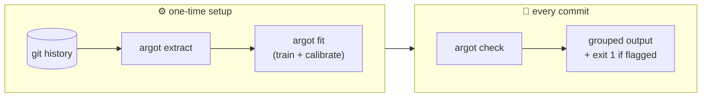
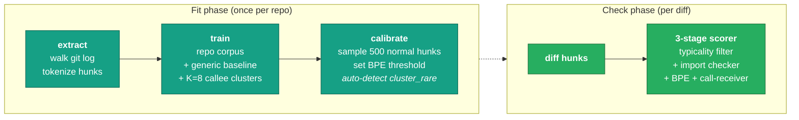
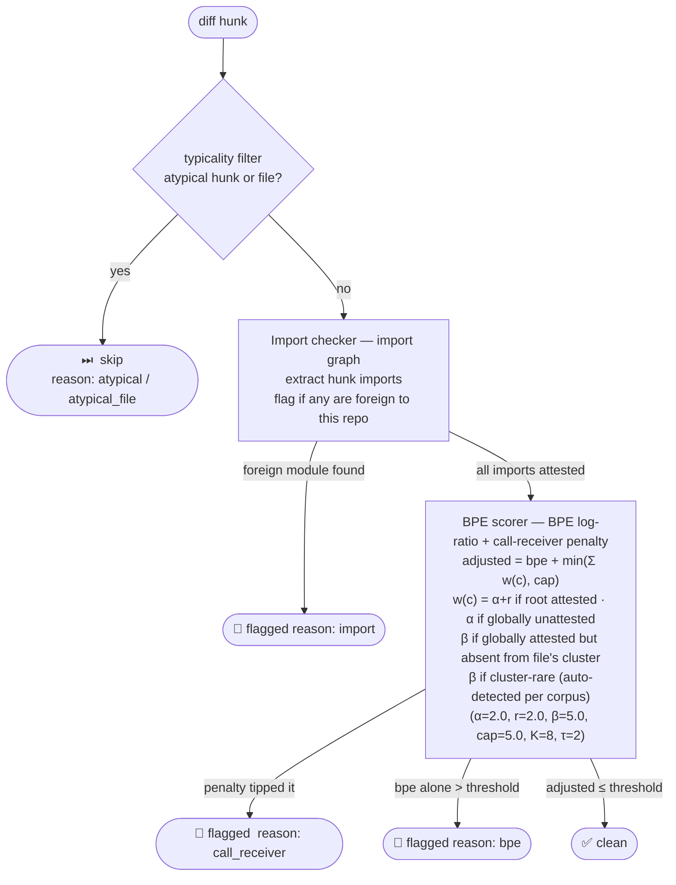

<p align="center">
  
</p>

<p align="center">
  <strong>Like ESLint, but for the unwritten rules.</strong><br/>
  <em>A three-stage scorer learns your repo's import patterns, call-site callees, and token distribution — argot flags what diverges.</em>
</p>

<p align="center">
  <a href="https://github.com/get-tmonier/argot/actions/workflows/ci.yml"></a>
  <a href="https://github.com/get-tmonier/argot/blob/main/LICENSE"></a>
  
  
</p>

<p align="center">
  <strong>Supported corpora:</strong>&nbsp;
  
  
  
  &nbsp;·&nbsp;<a href="#supported-languages">more coming →</a>
</p>

<p align="center">
  Voice linter that builds a statistical model of your codebase's voice from its own git history,<br/>
  then flags hunks whose token distribution diverges from the learned norm.<br/>
  No GPU · No cloud · No telemetry · Runs in seconds after a one-time calibration
</p>

> **Status: alpha — not yet recommended for production use.** The scorer is still being tightened, the validated corpus set is library-only, and several adoption-blocking surfaces (suppression, editor integration, CI integration) aren't built yet. See [Known issues & limitations](#known-issues--limitations) for the v1 roadmap.

$$
\text{score}(\text{hunk})
\;=\;
\underbrace{\max_{t \,\in\, \text{tokens}(\text{hunk})}
\log \frac{P_{\text{generic}}(t)}{P_{\text{repo}}(t)}}_{\text{BPE surprise}}
\;+\;
\underbrace{\min\!\Big(\sum_{c \,\in\, \text{distinct callees}} w(c),\; \text{cap}\Big)}_{\text{call-receiver penalty}}
$$

$$
w(c) =
\begin{cases}
\alpha + r & \text{root attested, callee unattested} \\
\alpha & \text{root unattested} \\
\beta & \text{globally attested, absent from file's cluster} \\
\beta & \text{cluster-rare (auto-detect enabled)} \\
0 & \text{otherwise}
\end{cases}
$$

$$\alpha = 2.0 \quad r = 2.0 \quad \beta = 5.0 \quad \tau = 2 \quad K = 8 \quad \text{cap} = 5.0$$

Files are clustered by callee-bag MinHash similarity into K=8 clusters at fit
time; a callee that's globally attested but absent from its file's cluster
contributes β. The fourth branch is the per-corpus auto-detect: at fit time,
probe `cluster_rare`'s per-hunk fire rate on extracted diff hunks; enable the
rule on corpora where it fires on < 5% of hunks (informative on uniform-cluster
repos), disable it elsewhere (Zipf-tail noise that would FP-flood).

---

## Supported languages

argot ships today with calibrated, benchmarked support for:

| Language | Extensions | Validated corpora | Headline result |
|---|---|---|---|
| Python | `.py` | FastAPI · rich · faker | recall 95–100% · FP 0.6–2.0% |
| TypeScript | `.ts` `.tsx` | hono · ink · faker-js | recall 88–93% · FP 0.5–2.0% |
| JavaScript | `.js` `.jsx` | _(uses the TypeScript adapter; not yet benchmarked on a JS-only corpus)_ | — |

Numbers above are from the live baseline at [`benchmarks/results/baseline/latest/report.md`](benchmarks/results/baseline/latest/report.md). Each corpus contributes a held-out set of expert-labelled "voice breaks" plus tens of thousands of real-PR controls; recall is measured against the breaks, FP against the controls.

**Adding more languages is a roadmap item, not an architectural blocker.** The scoring pipeline is language-agnostic; what's per-language is a tree-sitter adapter (see [tree-sitter parser list](https://github.com/tree-sitter/tree-sitter/wiki/List-of-parsers) — Go, Rust, Java, Ruby, Swift, Kotlin, C#, PHP, and many more all have parsers). Each new language we add ships **after** we've benchmarked it on a real-world corpus and confirmed the scorer's recall + false-positive numbers hold up — we'd rather be slow and honest about coverage than ship "supported" languages that score badly. Have a corpus you'd like to see validated? [Open an issue](https://github.com/get-tmonier/argot/issues/new).

---

## Motivation

**Code review used to be the place where "we don't do it that way here" got said.** That was sustainable when one human wrote one PR. Today an LLM can produce a hundred PRs in an afternoon — each syntactically perfect, type-correct, lint-clean, and written in the *average voice of every public codebase the model trained on*. Not the voice of yours.

Type checkers, linters, and formatters answer *"is this valid?"* They cannot answer *"is this how this team writes things?"* That second question used to be implicit in human review; now it's the bottleneck.

**argot is a calibrated, local, language-model-free way to ask the second question.** It builds two token-frequency distributions — one from your repo's git history, one from a generic open-source baseline — and flags hunks whose token distribution is sharply more likely under the generic baseline than under your repo. No neural network. No GPU. No cloud. No telemetry. Fits in seconds, runs in milliseconds, ships its threshold per repo.

The mental model is simple: a regex catches what you can write down; a type checker catches what you can prove; argot catches what your team has *implicitly agreed on by repetition*. Naming patterns, error-handling shapes, control-flow idioms, the difference between `response.raise_for_status()` and `if response.status_code >= 400: raise`. The kind of thing a senior reviewer would call out in five seconds and that no static analyser can articulate.

If your team is shipping LLM-assisted code, this is the layer your CI is missing.

## What it catches

It does *not* replace ESLint, ruff, or type checkers. It catches what they can't: things that are *technically fine but socially wrong* for this project.

| Signal | What it means |
|---|---|
| **LLM paste-through** | A block whose style diverges sharply from the surrounding file |
| **Convention drift** | Error handling, logging, or patterns that don't match the repo |
| **Foreign paradigm** | Class-based OOP dropped into a functional codebase, wrong import style |
| **Stylistic outlier** | New code that's correct, but doesn't sound like anyone on this team wrote it |

### Concrete examples

The examples below are pulled from argot's FastAPI benchmark catalog. **All three are syntactically valid, fully typed, lint-clean, and pass mypy strict.** Every other tool in your CI is silent on them. argot flags them because their *token shape* is absent from the FastAPI corpus's history. Headline numbers: catalog recall **95.4%**, false-positive rate on real-PR controls **0.6%** (32 fixtures vs 79,623 controls; see [`benchmarks/results/baseline/latest/report.md`](benchmarks/results/baseline/latest/report.md)).

**1. Wrong exception type** — _decorators are right, models are right, the `raise` line is the only break_

```python
# flagged — ValueError/KeyError instead of HTTPException
@router.get("/{user_id}", response_model=UserResponse)
async def get_user(user_id: int, db = Depends(get_db)) -> dict[str, Any]:
    user = db.get(user_id)
    if user is None:
        raise ValueError(f"User {user_id} not found")  # propagates as 500, not 404
    return user
```
Decorators, `Depends`, `response_model`, `async def`, the typed return — all idiomatic FastAPI. The break is exactly one token sequence: bare `ValueError`/`KeyError`/`RuntimeError` instead of `HTTPException(status_code=...)`. Type checker is happy (return shape is fine). Linters have nothing to say. argot catches it because the FastAPI corpus's exception-raising vocabulary is `HTTPException`, not Python's built-ins.

**2. Manual status check vs `raise_for_status()`** — _structural shape, not vocabulary_

```python
# flagged — every endpoint repeats the same if-block
@router.get("/users/{user_id}")
async def proxy_get_user(user_id: int) -> dict[str, Any]:
    response = _http_client.get(f"/v1/users/{user_id}")
    if response.status_code >= 400:
        raise HTTPException(status_code=response.status_code, detail=response.text)
    return response.json()
```
**Every individual token here exists in the FastAPI corpus** — `httpx.Client`, `response.status_code`, `HTTPException`, `response.json()`. What's missing is the *branching shape*: the FastAPI + httpx corpus uses `response.raise_for_status()` to propagate downstream errors, not a manual `if status_code >= 400: raise`. No linter can encode this preference; argot picks it up automatically because the BPE distribution over 5-token windows captures the structural difference.

**3. Sync blocking in an async codebase** — _correct decorators, wrong concurrency model_

```python
# flagged — sync def + blocking I/O on a hot path
@router.get("/users")
def list_users() -> list[dict[str, Any]]:
    response = httpx.get(f"{UPSTREAM_URL}/v1/users")  # blocks the worker thread
    return response.json()
```
`@router.get`, the path, the return type — all idiomatic. The break is `def` instead of `async def`, paired with `httpx.get(...)` (sync API) instead of `await client.get(...)`. Type checker is happy. Linters might warn on `bare except` patterns but not on this. argot picks it up because sync endpoints with blocking I/O are structurally absent from the FastAPI corpus — the entire bench/control set is built around `async def + await`.

## Installation

### curl (recommended)

```sh
curl -fsSL https://raw.githubusercontent.com/get-tmonier/argot/main/install.sh | sh
```

Installs the `argot` binary to `~/.local/bin` and installs `uv` if missing.

### npm

```sh
npm install -g @tmonier/argot
```

### Prerequisites

| Dependency | Required for | Install |
|---|---|---|
| `uv` | All commands (Python engine) | Installed automatically by curl script, or `curl -LsSf https://astral.sh/uv/install.sh \| sh` |

### Getting started

```sh
cd your-repo
argot extract      # walk git history → .argot/dataset.jsonl
argot fit          # build the repo corpus + generic baseline, then calibrate the threshold
argot check        # score uncommitted changes (or pass a ref/range)
```

### Updating

```sh
argot update
```

### Development setup

```sh
git clone https://github.com/get-tmonier/argot
cd argot
just install     # bun install + uv sync
just verify      # full check suite
```

## Workflow

argot has three commands. Run them in order the first time, then just `check` on every commit.



### 1. Extract

Walks the repo's git history and writes a training dataset:

```bash
argot extract                        # full history of the current repo
argot extract HEAD~50                # history up to and including HEAD~50
argot extract main..HEAD             # only commits in that range
```

Operates on the current repo (cwd is auto-detected via `git rev-parse`). Output: `.argot/dataset.jsonl` — one record per hunk, with tokenized context and content.

### 2. Fit

One-shot voice fitting: collects the repo's source files as the repo corpus, sets up the generic baseline, then samples representative hunks to set the scoring threshold.

```bash
argot fit
```

Output:
- `.argot/repo-corpus.txt` — list of source file paths in the repo corpus
- `.argot/generic-baseline.json` — generic baseline token reference
- `.argot/scorer-config.json` — calibrated scoring threshold

Re-run after major refactors. Internally `fit` runs the engine's two underlying phases (build corpus, then calibrate); they remain available for benchmark/research use via the engine entry points (`uv run python -m argot.train` / `argot.scoring.calibration`), but the day-to-day CLI surface is just `fit`.

### 3. Check

Scores changed hunks against the trained scorer and prints them grouped by file. Exits non-zero if any hunk is above the calibrated threshold.

```bash
argot check                          # uncommitted changes — modified + staged + untracked
argot check --staged                 # staged changes only
argot check --unstaged               # unstaged changes only (no staged, no untracked)
argot check HEAD~5                   # everything from HEAD~5 to current state, including uncommitted
argot check HEAD~5..HEAD             # commits in that range only
argot check --commit abc1234         # a single commit
argot check --only 'src/*'           # restrict to matching files (repeatable)
argot check --exclude 'test/*'       # drop matching files (repeatable; wins over --only)
argot check --min-severity foreign   # only show foreign-tier hits
argot check --verbose                # show full hunk contents (no truncation)
```

Sample output:

```
argot check · 2 hunks above threshold (1 foreign · 1 suspicious)
note: argot is a probabilistic style linter — verify before action.

src/utils/http-helpers.ts
  ●  L42-L48      8.21  foreign     · workdir · foreign import (import)
     ↳ axios — 0 of 47 module specifiers in repo
       common here: react (320×), express (88×), pg (47×)
  42 │ import axios from 'axios';
  43 │
  44 │ export async function fetchUserData(id: string) {
  45 │   const res = await axios.get(`/users/${id}`);
  46 │   return res.data;
  47 │ }

src/api/router.ts
  ◐  L102        5.89  suspicious  · staged · rare token sequence (bpe)
     ↳ startedAt (0×), _res (3×), use (88×)
  102 │ router.use((req, _res, next) => { req.startedAt = Date.now(); next(); });

tip: pass --verbose (-v) to expand truncated hunks.
```

The line under each hit (`↳`) is the **per-hunk evidence**. For BPE-fired hits it lists the surprising identifiers with their repo-wide attestation counts — `startedAt (0×)` means the token never appears elsewhere in the repo, while `use (88×)` is familiar; the flag is about the *combination*, not the words. For foreign-import / unfamiliar-callee hits it shows the offending names plus a `common here:` line orienting you to the repo's typical vocabulary in that dimension (the repo's stack, the cluster's typical callees).

**Files argot stays silent on**

argot won't flag **data-dominant files** — modules whose body is ≥80% top-level array / object literals (locale tables, fixture arrays, large generated lookups). The n-gram model treats their string-literal payloads as foreign vocabulary, so without this gate the scorer would fire on every line. Detection is heuristic and runs at both fit and check time so the model trains and scores on the same scope.

Test files, config files (`*.config.*`, `.eslintrc.*`, `.prettierrc.*`, …), and a handful of conventional dirs (`docs/`, `examples/`, `migrations/`, `scripts/`, `build/`, `dist/`) are also skipped today as a placeholder default — these will move to user-configurable rules with the suppression surface in [#57](https://github.com/get-tmonier/argot/issues/57).

**Understanding the score**

The surprise score is the BPE log-likelihood ratio for the hunk — how different its token distribution is from the repo's corpus. Low scores mean the hunk matches the repo's patterns; higher values mean it diverges. Severity tiers are relative to the calibrated threshold `t`:

| Tier | Range | Meaning |
|---|---|---|
| `unusual` | `t ≤ score < t+0.5` | Borderline — worth a glance, don't trust the call |
| `suspicious` | `t+0.5 ≤ score < t+1.5` | Likely worth a look |
| `foreign` | `score ≥ t+1.5` | High-confidence anomaly |

`t` is set automatically during `argot fit` and stored in `.argot/scorer-config.json`. Each hit also shows its **source** (`workdir` / `staged` / `untracked` / commit SHA) and the **scorer reason** that fired (`rare token sequence`, `unfamiliar callee`, or `foreign import`).

## How it works

The pipeline has two phases: **fit** (extract → train → calibrate, run once
per repo and after major refactors) and **check** (run on every diff).



1. **Extract** — walks `git log`, extracts commit diffs, tokenizes each hunk and its surrounding context using a language-aware [tree-sitter](https://tree-sitter.github.io/tree-sitter/) tokenizer. Tree-sitter is an incremental, error-tolerant parser that works on partial and syntactically invalid fragments (essential for mid-block hunk slices) and provides a single uniform interface for every supported language.

2. **Train** — collects the repo's non-test source files into the repo corpus (the repo's own token distribution) and copies the bundled generic BPE reference (generic baseline, a broad open-source corpus baseline). Data-dominant files (data tables, locale dumps, generated code) are excluded by the `is_data_dominant` structural predicate so they don't pollute the token distribution.

3. **Calibrate** — samples up to 500 representative top-level functions and classes from the repo (the typicality filter pre-excludes atypical candidates), scores them through the full two-stage scorer, and sets the BPE threshold to the max score over those normal hunks. Calibration also runs the per-corpus auto-detect probe: it loads ~1000 diff hunks from extract's `dataset.jsonl` and measures the per-hunk fire rate of `cluster_rare` (callees attested in only ≤τ cluster files). If fire rate < 5% (informative on uniform-cluster repos), the rule stays enabled at score time; otherwise it's disabled (Zipf-tail noise that would FP-flood). Writes `.argot/scorer-config.json` with the chosen config.

4. **Check** — runs the three-stage scorer on the target diff:



   **Pre-scorer — typicality filter:** an AST-derived predicate short-circuits hunks whose content is structurally data-dominant (`literal_leaf_ratio > 0.80` with a named-leaf size gate) or whose enclosing file is globally data-dominant (file-level fallback). Replaces the legacy auto-generated heuristics at calibration and inference.

   **Import checker — import graph:** for each hunk, extracts its import statements and checks whether any imported module is absent from the repo's own first-party import set. A single foreign import immediately flags the hunk (`reason: "import"`).

   **BPE scorer — BPE log-ratio with call-receiver penalty:** tokenizes the hunk with the [UnixCoder](https://huggingface.co/microsoft/unixcoder-base) BPE tokenizer (pre-trained on 9M+ code files across 9 languages — only the vocabulary is used, not the neural network) and computes a max-surprise score over the hunk's tokens. The score is then adjusted by a per-callee penalty: `adjusted = bpe + min(Σ w(c), cap)` summed over each distinct callee `c`. The weight `w(c)` is `α + r` when the callee is globally unattested but its root is attested (e.g. `req.send` when `req.get` is known), `α` when the callee root is also unattested, `β` when the callee is globally attested but absent from the attested set of its file's cluster, and (when per-corpus auto-detect enables it) also `β` when the callee is in the file's cluster but appears in only ≤τ cluster files (cluster-rare callees). **α = 2.0, r = 2.0, β = 5.0, cap = 5.0, τ = 2** in the shipping config. The cluster-conditional term targets context-dependent breaks where a known callee shows up in a file kind it never belongs to (e.g. `Math.random` in a deterministic faker-js provider, even though `Math.random` exists elsewhere in the repo's tests). The cluster-rare auto-detect probes the rule's per-hunk fire rate on extracted diff hunks at fit time and enables it only on corpora where it fires on < 5% of hunks (informative, not Zipf-tail noise). A parse-fragment guard abstains when the hunk slice doesn't parse cleanly.

   **File clustering for the cluster-conditional term:** at fit time, every non-data-dominant source file is reduced to its callee bag (set of dotted call expressions extracted via tree-sitter), encoded as a 128-perm MinHash signature, and clustered into K=8 groups via KMeans on the signatures. Each cluster's attested set is the union of its files' callees. At score time, the hunk's file is mapped to its cluster (or to the Jaccard-nearest cluster if the file isn't in the trained corpus). The clustering is derived purely from callee statistics — no path patterns, no per-corpus heuristics.

$$P_A(t) = \frac{\text{count}_A(t)}{\text{total}_A} + \varepsilon \qquad P_B(t) = \frac{\text{count}_B(t)}{\text{total}_B} + \varepsilon$$

$$\text{surprise}(t) = \log P_B(t) - \log P_A(t)$$

$$\text{score}(\text{hunk}) = \max_{t \;\in\; \text{tokens}(\text{hunk})} \text{surprise}(t)$$

   A high score means at least one token in the hunk is far more common in generic open-source code than in *this* repo — a reliable signal of foreign style. The repo corpus is built by counting BPE tokens across the repo's non-test source files (CPU-only, takes seconds). The generic baseline is a pre-built reference distribution bundled with argot — no download, no training loop. Prose lines (comments, docstrings) are blanked before scoring to avoid natural-language noise inflating the signal.

   The call-receiver penalty adds a fractional contribution for each distinct dotted callee that's either repo-novel or absent from its file's cluster. Calibration hunks come from files in the trained corpus, so by construction their callees are subsets of their cluster's attested set — calibration scores are invariant under both α and β. The threshold is set against raw BPE alone; the penalty exists to push genuinely anomalous hunks past the threshold at score time.

   A hunk is flagged if the import checker fires (foreign import) or the BPE scorer's adjusted score exceeds the calibration threshold. Reason attribution: `call_receiver` when the penalty pushed a below-threshold BPE over the line, `bpe` when raw BPE already crossed it. Scores and reasons are always included in the output for diagnostics.

Language-specific logic (import extraction, callee extraction, prose masking, sampleable-range enumeration) is fully encapsulated in `LanguageAdapter` implementations; the typicality filter is language-parameterized via a shared module rather than per-adapter methods. Python and TypeScript are supported out of the box.

No training data or model leaves your machine. All stages run entirely locally.

> **How we got here.** This three-stage design wasn't the first attempt —
> it's the one that cleared the gates after a GPU-hungry neural scorer,
> three dead ends, and 15+ phases of experiments. See
> [`docs/research/`](docs/research/README.md) for the full narrative
> (JEPA ensembles → honest eval → token-frequency signal hunt →
> import-graph breakthrough → typicality filter → call-receiver scorer →
> complex-chain canonicalization → alpha tuning → calibration hardening →
> cluster-conditional attestation → ML-stage hunt + routing-bug fix →
> structural-bound mapping → asymmetric calibration with per-corpus
> auto-detect)
> with 35+ evidence docs.

## Validation

argot ships with a reproducible benchmark harness
([`benchmarks/`](benchmarks/)) that runs the production scorer against
six pinned open-source repos — fastapi, rich, faker (Python) and hono,
ink, faker-js (TypeScript) — using a hand-crafted catalog of **116
paradigm-break fixtures** across **34 categories** (Flask routing in a
FastAPI app, `requests` in async code, Django CBV, `Math.random` inside
a deterministic faker-js provider, etc.). Each break is scored against
a backdrop of **494k+ real PR hunks** from the same repos as negative
controls.

Latest full bench (115 catalog fixtures across 6 corpora, K=7 multi-seed
calibration, current shipping config with `--auto-select-asym-cal`):

| Corpus | AUC | Recall | FP rate |
|:---|---:|---:|---:|
| fastapi | **0.9946** | **95.4%** | 0.57% |
| rich | **0.9964** | **100.0%** | 1.23% |
| faker (py) | 0.9537 | 95.0% | 1.96% |
| hono | 0.8321 | **88.3%** | 0.51% |
| ink | **0.9899** | 93.3% | 0.54% |
| faker-js | 0.9463 | **93.3%** | 2.00% |

Total fixture catches **108/115 (93.9%)**; **FP rate ≤ 2.0% on all six
corpora**. The production scorer ships with the AST-derived typicality
filter plus the BPE scorer call-receiver penalty (α=2.0, root_bonus=2.0,
cluster_bonus=5.0, K=8 MinHash clusters). The latest configuration adds
`cluster_rare_threshold=2` gated by per-corpus auto-detect: at fit time,
probe the rule's per-hunk fire rate on extracted diff hunks; enable the
rule on corpora where it's informative (~2% fire rate on uniform-cluster
repos) and disable it where it would FP-flood (10–22% fire rate on
heterogeneous repos). **Threshold CV = 0%** across 7 seeds: runs are
reproducible.

Reproduce with a single command:

```bash
just bench         # all 6 corpora, ~1.5h first time (~20 min with caches)
just bench-quick   # ~1 min — one fixture per category on fastapi
```

See [`benchmarks/README.md`](benchmarks/README.md) for methodology,
per-category breakdowns, known weaknesses (calibration filtering
trade-off on two corpora, semantic-break blind spots on TS corpora),
and how to read a generated report.

## Known issues & limitations

argot is **alpha** software. We ship honest benchmarks and a public research log, but several real gaps remain — both in the model itself and in the surfaces around it. We're tracking everything in the open; the [GitHub issue tracker](https://github.com/get-tmonier/argot/issues) is the source of truth.

### Modeling / scoring

- **Needs enough source code to calibrate:** the sampler looks for top-level functions/classes (≥ 5 body lines) in the current tree. Validated corpora had calibration pools of 112–494 hunks; repos with fewer than ~100 sampleable units will hit the pool-cap branch and may produce a noisier threshold.
- **Best on codebases with a consistent hand.** Highly polyglot repos or repos with many contributors and no enforced style are harder to model.
- **Single-threshold model on multi-language monorepos.** Mixed Python + TypeScript repos calibrate against a joint distribution today, dominated by whichever language has broader token diversity. Per-language calibration is on the roadmap ([#41](https://github.com/get-tmonier/argot/issues/41)).
- **Validation corpus is library-only.** All six benchmarked corpora are libraries / frameworks (FastAPI, rich, faker, hono, ink, faker-js). Application code may behave differently and the recall / FP numbers haven't been proven there yet ([#66](https://github.com/get-tmonier/argot/issues/66)).
- **Residual recall and FP gaps** under active research — currently 108/115 fixtures caught and two corpora at ~2% FP. The current research era pushes FP to ≤ 1% and chases the architectural recall ceiling ([#54](https://github.com/get-tmonier/argot/issues/54)).
- **Cold start on brand-new files:** less context to score against.
- **Signal is noisier on very small hunks** (< 5 lines).

### Surface / adoption gaps

- **No suppression mechanism** — there's no `.argotignore`, no inline magic comments, no `argot mute`. One stubborn false positive and the tool can't be silenced ([#57](https://github.com/get-tmonier/argot/issues/57)).
- **No editor integration** — argot is CLI-only today; no LSP server, no VSCode extension, no inline diagnostics ([#55](https://github.com/get-tmonier/argot/issues/55)).
- **No CI integration package** — no published GitHub Action, no pre-commit hook, no SARIF output for native PR comments ([#58](https://github.com/get-tmonier/argot/issues/58)).
- **No introspection / suitability check** — running `fit` then `check` is the only way to find out whether argot will work on your repo ([#51](https://github.com/get-tmonier/argot/issues/51)).
- **No model artifact versioning or hashing** — `.argot/` is opaque; reproducibility is undocumented ([#62](https://github.com/get-tmonier/argot/issues/62)).
- **No MCP server for LLM coding agents** — argot's signal would be especially useful as preemptive guidance during code generation, but there's no protocol surface yet ([#56](https://github.com/get-tmonier/argot/issues/56)).
- **No per-hunk evidence in `check` output** — hits show a friendly reason ("rare token sequence") but not *which* token was rare, leaving the user to guess ([#40](https://github.com/get-tmonier/argot/issues/40)).
- **No user-facing documentation site** — everything user-relevant lives in this README; no structured tutorials, how-tos, reference, or per-language pages ([#52](https://github.com/get-tmonier/argot/issues/52)).

### What we need for v1

The minimum-viable-v1 set we'd want to ship before recommending argot for production use:

| Issue | Why it blocks v1 |
|---|---|
| [#54](https://github.com/get-tmonier/argot/issues/54) | Push FP rate to ≤ 1% across all corpora and close the residual recall gap |
| [#66](https://github.com/get-tmonier/argot/issues/66) | Validate on application corpora, not just libraries |
| [#41](https://github.com/get-tmonier/argot/issues/41) | Per-language calibration in mixed-language monorepos |
| [#57](https://github.com/get-tmonier/argot/issues/57) | Suppression mechanism — adoption blocker without it |
| [#51](https://github.com/get-tmonier/argot/issues/51) | Repo introspection / suitability check |
| [#58](https://github.com/get-tmonier/argot/issues/58) | Official CI integration (GitHub Action + pre-commit + SARIF) |
| [#40](https://github.com/get-tmonier/argot/issues/40) | Per-hunk evidence in `check` output — point at the specific tokens carrying the score |
| [#52](https://github.com/get-tmonier/argot/issues/52) | User-facing documentation site (tutorials, how-tos, reference) |

Browse all open issues, including non-v1 work, at [`github.com/get-tmonier/argot/issues`](https://github.com/get-tmonier/argot/issues).

## Stack

**CLI** TypeScript + Bun · **Engine** Python + tree-sitter + HuggingFace tokenizer (UnixCoder BPE) · **Model** two frequency tables + max log-ratio — no neural network, no GPU

---

## Development

### Prerequisites

Install [mise](https://mise.jdx.dev/) then provision the toolchain:

```bash
mise install     # bun 1.3.12 · python 3.13 · uv 0.11.7 · just 1.49.0 · lefthook 2.1.6
```

### Setup

```bash
just install          # bun install + uv sync
lefthook install      # wire pre-commit hooks
```

### Tasks

```bash
just verify           # lint + format + typecheck + boundaries + knip + test
just test             # bun test (cli) + pytest (engine)
just extract .        # extract training data from this repo
just train            # collect repo corpus files and generic baseline
just check            # score HEAD~1..HEAD
just build            # compile dist/argot standalone binary
```

### Repository layout

```
argot/
├── cli/              # TypeScript CLI (Bun runtime)
│   └── src/
│       ├── cli.ts                    # entrypoint, Effect CLI wiring
│       ├── dependencies.ts           # root Effect Layer composition
│       ├── modules/<name>/           # vertical slice per feature
│       │   ├── domain/               # pure types, no deps
│       │   ├── application/          # use-cases + port interfaces
│       │   └── infrastructure/       # adapters implementing ports
│       └── shell/                    # CLI commands (inbound adapters)
├── engine/           # Python data pipeline (uv workspace)
│   └── argot/
│       ├── scoring/      # two-stage scorer
│       │   ├── scorers/  # SequentialImportBpeScorer + ImportGraphScorer
│       │   ├── calibration/  # random hunk sampler + calibrate entry point
│       │   ├── adapters/ # LanguageAdapter protocol + Python/TypeScript impls
│       │   ├── filters/  # typicality predicate (AST-derived, hunk + file level)
│       │   ├── bpe/      # bundled generic BPE reference (generic baseline)
│       │   └── parsers/  # tree-sitter parse helpers
│       ├── git_walk.py   # pygit2 repo walker
│       ├── tokenize.py   # tree-sitter tokenizer
│       ├── extract.py    # extract → JSONL
│       ├── train.py      # collect repo corpus files + copy generic baseline
│       ├── check.py      # two-stage scoring entry point
│       ├── stats.py      # shared statistical helpers
│       └── dataset.py    # record schema
└── justfile          # task runner (canonical interface)
```

### Tooling

| Tool | Role |
|---|---|
| `mise` | Toolchain version manager |
| `just` | Task runner — single source of truth for all dev commands |
| `bun` | JS runtime, package manager, test runner |
| `uv` | Python package manager and virtual env |
| `oxlint` | Fast TypeScript/JS linter |
| `oxfmt` | TypeScript formatter |
| `tsgo` | TypeScript type-checker (native, ~10× faster) |
| `dependency-cruiser` | Enforces hexagonal layer boundaries |
| `knip` | Dead code and unused dependency detection |
| `lefthook` | Git hook runner |
| `ruff` | Python linter + formatter |
| `mypy` | Python type-checker (strict mode) |

## Acknowledgements

argot's scorer is only as honest as the corpora we benchmark it against. We're grateful to the maintainers of the open-source projects below for the hours of human design, refactoring, and review whose patterns now serve as our ground-truth voice signal:

- [**FastAPI**](https://github.com/fastapi/fastapi) — Sebastián Ramírez and contributors (Python · async web framework)
- [**rich**](https://github.com/Textualize/rich) — Will McGugan and the Textualize team (Python · terminal rendering)
- [**faker**](https://github.com/joke2k/faker) — Daniele Faraglia and contributors (Python · fake-data generator)
- [**hono**](https://github.com/honojs/hono) — Yusuke Wada and contributors (TypeScript · edge web framework)
- [**ink**](https://github.com/vadimdemedes/ink) — Vadim Demedes and contributors (TypeScript · React for CLIs)
- [**faker-js**](https://github.com/faker-js/faker) — the faker-js team and contributors (TypeScript · fake-data generator)

The benchmark uses each project's history as a positive corpus and a small held-out set of expert-labelled "voice breaks" as the test set. None of these projects are affiliated with or endorse argot — we just stand on their shoulders.

argot's foundation also rests on:

- [**tree-sitter**](https://tree-sitter.github.io/tree-sitter/) — incremental, error-tolerant parsing across languages
- [**pygit2**](https://www.pygit2.org/) — libgit2 bindings powering the git walker
- [**HuggingFace tokenizers**](https://github.com/huggingface/tokenizers) — UnixCoder BPE used as the generic baseline
- [**Effect**](https://effect.website/) — the runtime behind the TypeScript CLI

## License

MIT
