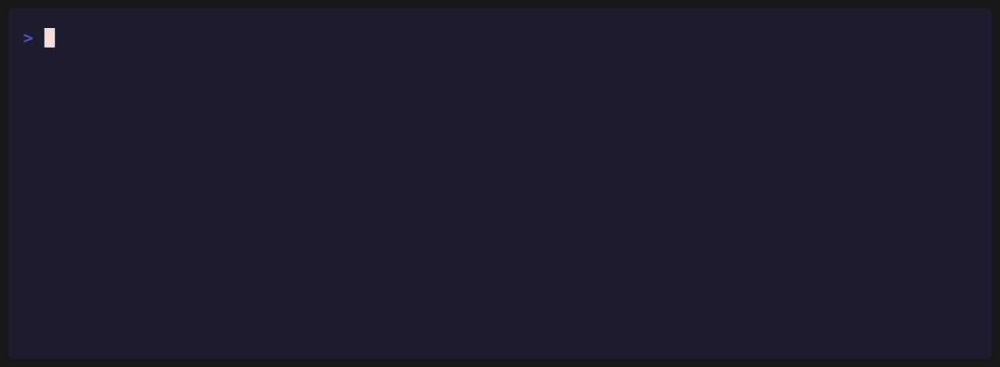

<p align="center">
  
</p>

<p align="center">
  <strong>Your codebase has a voice. argot makes AI code speak it.</strong><br/>
  <em>A local guardrail that catches AI-written code that doesn't fit your repo — a dependency you've never used, a function you already wrote, logic in the wrong place, an import that breaks your layering, or a test quietly weakened to make a failing suite green. Learned from your git history. No LLM, no cloud, no GPU.</em>
</p>

<p align="center">
  <a href="https://argot.tmonier.com"><strong>argot.tmonier.com</strong></a>
  &nbsp;·&nbsp;
  <a href="https://argot.tmonier.com/docs/">Documentation</a>
  &nbsp;·&nbsp;
  <a href="https://argot.tmonier.com/benchmarks">Benchmarks</a>
  &nbsp;·&nbsp;
  <a href="docs/research/README.md">Research log</a>
</p>

<p align="center">
  <a href="https://github.com/get-tmonier/argot/releases/latest"></a>
  <a href="https://www.npmjs.com/package/@tmonier/argot"></a>
  <a href="https://github.com/get-tmonier/argot/actions/workflows/ci.yml"></a>
  <a href="https://github.com/get-tmonier/argot/blob/main/LICENSE"></a>
  
  
</p>

<p align="center">
  
  
  
  
  
  
  
  
  
  
  
  &nbsp;·&nbsp;<a href="#benchmarks">11 languages →</a>
</p>

---

Type checkers ask *"is this valid?"* argot asks the question that used to live in code review: *"is this how **we** do it here?"* — and catches AI code that's flawless, type-correct, lint-clean, and still doesn't belong.

### Four detectors, all learned from your git history

| | Rule | It catches | |
| :-- | :-- | :-- | :-- |
| 🚫 | **`foreign-import`** + friends | a dependency, API, or idiom your repo has **never used** | *"we don't do it this way here"* |
| ♻️ | **`redundant`** | a new function that **reinvents one you already have** | *"you already have this"* |
| 📍 | **`misplaced`** | the right code, filed in the **wrong place** | *"this doesn't belong here"* |
| 🧱 | **`layering`** | an internal import that **reverses your architecture** | *"we never cross this boundary"* |

Copilot, ESLint, SAST — every tool judges by one *global* idea of good code. argot learns **yours** and judges each AI diff against it. Configure it like any linter: every rule defaults to `error`; downgrade or disable any of them.

- 📊 **98%** foreign catch (604/618) · **0.22%** false alarms (49 of 22,785 real hunks) — [honest, leak-free benchmarks](#benchmarks) on 31 repos, 11 languages
- 🧱 **96.8%** architecture-violation recall (244/252) at **0%** false positives (0/140 control edits)
- ⚡ **Rust · single static binary** — checks a diff in ~0.2 s (0.6 s when it defines new functions); the one-time fit is ~25 s on a 1,100-file repo, ~4 s to refresh (measured on FastAPI, laptop CPU)
- 🧠 **A local code-embedding model** (`jina-code`, ~100 MB, CPU-first, Metal on Macs) — semantic understanding from an encoder, **not an LLM**: no generation, no API key, no GPU
- 🔒 **Nothing leaves your machine** — no telemetry, no account; one cached version check per day (opt-out) is the only network call it ever makes on its own

## Get started

```sh
# install (single static binary — no Python, no Node)
curl --proto '=https' --tlsv1.2 -LsSf https://github.com/get-tmonier/argot/releases/latest/download/argot-installer.sh | sh
```

Windows: `powershell -c "irm https://github.com/get-tmonier/argot/releases/latest/download/argot-installer.ps1 | iex"` · npm: `npm install -g @tmonier/argot`

**Then — sixty seconds of proof, on your own history:**

```sh
argot init       # learn this repo's voice (~25 s on a 1,100-file repo)
argot replay     # ⏪ rewind: what would argot have caught in your last 50 commits?
```

`replay` fits the voice **as it was 50 commits ago** (in a temp worktree —
your tree stays untouched) and rescores everything since. Real run on
FastAPI's history:

```
━━ argot replay · 300 commits, judged by the voice as of c206f19b ━━

  4 finding(s) argot would have raised before merge, out of 120 hunks:

    foreign-import  ×2
    rare-tokens     ×2

  worth a look first:
  ! fastapi/responses.py:L1-L8  foreign-import  · 88021c3
      ↳ importlib (L1) — 0 of 73 module specifiers in repo
  ? fastapi/responses.py:L10-L64  rare-tokens  · 88021c3
      ↳ _UjsonModule (0×), Protocol (0×), _OrjsonModule (0×) (+1 more)

  Merged code is accepted code — read each as "would have prompted review",
  not as a bug list.
```

(Everything argot writes in-repo is gitignored except the small `argot.toml` —
the model and index live in `.argot/` and `~/.cache/argot`, never in your git.)

**Before you rely on it: the setup calls.** argot's accuracy is a function of
its setup — it learns from what it's allowed to see, and a fit that ingests
vendored SDKs, generated stubs, or data files speaks with the wrong voice.
Recommended: let your coding agent make those calls —

```sh
npx skills add get-tmonier/argot     # then run /argot-setup in your agent
```

`/argot-setup` (Claude Code, Cursor, 70+ agents) reads your codebase, decides
what shouldn't shape the voice, writes `argot.toml`, re-fits, and verifies
argot actually catches a foreign import. Then `/argot-check` scores each diff,
`/argot-review-pr` reviews a whole PR, `/argot-setup-ci` wires the GitHub
Action. By hand instead: `argot init --suggest`, review, add to `argot.toml
[exclude].paths`, re-run `argot init` — and argot itself tells you when to
revisit (every fit re-scans for new generated/data-heavy directories; `argot
status` is the health view). After that the voice maintains itself: when your
default branch gains enough new source, `check` re-fits in the background —
from **accepted history only**, so a feature branch's unmerged commits (the
code being judged) never train the judge.

## Demo

<p align="center">
  
</p>

A PR adds a **Django-style view** to an all-FastAPI codebase. mypy and ruff are
silent — the framework it reaches for is one this repo has never imported:

```
argot check · 1 hunk above threshold (1 foreign)
note: argot is a probabilistic style linter — verify before action.

fastapi/receipts.py
  !  L1-L10         1.00  foreign  · staged · foreign-import [94a92c256ea1]
     ↳ django (L1) — 0 of 74 module specifiers in repo
       common here: fastapi (357×), pydantic (129×), typing (129×) (+7 more)
  1 | from django.views import View
             ^^^^^^
  2 | from django.http import JsonResponse, HttpResponseNotFound
        (+8 more lines)
```

The `redundant` rule goes further — it names the code you already have:

```
src/text/slug.py
  .  L12-L24        0.86  unusual  · staged · redundant [c2117f8ab90d]
     ↳ duplicates slugify (src/utils/text.py:14) — similarity 0.86
```

`misplaced` names where the code actually belongs:

```
src/cli/commands/fetch.py
  .  L18-L41        0.62  unusual  · staged · misplaced [3e51b7c20d6f]
     ↳ looks like core/downloader code filed under cli/commands
```

And `layering` flags the import that quietly reverses your architecture:

```
core/parser.py
  .  L3             1.00  unusual  · staged · layering [77d1e02c433a]
     ↳ cli → core is this repo's direction — this import reverses it
```

The glyph grades confidence (`!` foreign · `?` suspicious · `.` unusual), the
`[hash]` is a stable id you can `argot mute`, and every `↳` line is your repo's
own evidence. Full anatomy: [Reading the output](https://argot.tmonier.com/docs/reading-the-output/).

## Configure it like any linter

`argot rules` lists every rule. All of them default to `error`; set any rule —
or a whole group — to `warn` or `off` in `argot.toml`, or per run:

```toml
[rules]
misplaced = "warn"     # report, but don't fail the check
semantic  = "off"      # disable the whole embedding-based group
```

```sh
argot check --rule layering=warn --error-on-warnings
```

Excludes are just as boring: `[exclude].paths` (gitignore-style; `argot init
--suggest` finds candidates), inline `# argot: ignore-next-line rule=redundant —
reason`, and `argot mute <hash> --reason "…"` for durable, committed
acceptances. Full guides: [Setup](https://argot.tmonier.com/docs/setup/) ·
[Configure](https://argot.tmonier.com/docs/configure/).

### argot vs. the tools you already run

|  | Type checker | Linter | Copilot · SAST | argot |
|---|:---:|:---:|:---:|:---:|
| Catches invalid code | ✅ | ✅ | ~ | — |
| Flags what's foreign to *this* repo | ❌ | ❌ | ❌ | ✅ |
| Flags a function you **already have** | ❌ | ❌ | ❌ | ✅ |
| Flags code filed in the **wrong place** | ❌ | ❌ | ❌ | ✅ |
| Flags an import that **breaks your layering** | ❌ | ❌ | ❌ | ✅ |
| Learns from *your* history · runs 100% local | ❌ | ❌ | ❌ | ✅ |

argot is additive: it sits *after* your type checker and linter and catches the
one thing they can't — code that's valid and lint-clean but unlike anything your
team has written.

## Benchmarks

**Honest, leak-free numbers**, measured by the real `fit → check` pipeline —
foreign fixtures spliced into real host files; false alarms counted on a
temporal holdout (fit at an old commit, replay only commits the model never saw).

- **Foreign catch — 604/618 (98%)** when the foreign symbol is visible in the diff.
- **False alarms — 0.22%** of 22,785 real hunks of the repos' own code; worst corpus **1.17%**. A fire on a genuinely *new* dependency in a real commit is a **detection**, reported separately — never counted against the tool.
- **Architecture — 244/252 (96.8%)** planted layering violations caught, **0/140** control edits flagged, worst over-fire 2.7% (23 corpora).
- **Reinvention — 85–100%** per corpus (median 94%) · false-fire ≤ 2.8% of hunks. **Misplacement — 86–99%** where the repo has separable architecture · ≤ 1.5%.

| Language | Corpora | Visible-foreign catch | Worst over-fire |
|---|---|---|---|
| Python | fastapi · rich · faker · saleor · wagtail · dagster · scrapy | 145/151 (96%) | 0.92% |
| TypeScript | hono · ink · faker-js · excalidraw · outline | 102/105 (97%) | 0.11% |
| JavaScript | express · commander · eslint | 48/48 (100%) | 0.00% |
| Go | gh-cli · hugo | 37/38 (97%) | 1.17% |
| Rust | ripgrep · bat | 38/38 (100%) | 0.30% |
| Java | guava · junit5 | 38/38 (100%) | 0.82% |
| C# | powershell · jellyfin | 40/42 (95%) | 0.06% |
| C | redis · curl | 37/38 (97%) | 0.18% |
| C++ | rocksdb · fmt | 40/41 (98%) | 0.22% |
| Ruby | homebrew · rubocop | 38/38 (100%) | 0.63% |
| PHP | laravel · composer | 41/41 (100%) | 0.00% |

One documented limit: **masked foreign** — a foreign symbol whose name collides
with one you already use — is statistically invisible to a voice model (~17%
of the hardest fixtures). We publish that number rather than hide it. Full
per-corpus tables, methodology, and confidence intervals:
[benchmarks page](https://argot.tmonier.com/benchmarks) (fed from CI, can't
drift from what ships). Earlier train-on-test numbers were retracted —
[issue #92](https://github.com/get-tmonier/argot/issues/92).

Want a language or corpus validated? The pipeline is language-agnostic —
per-language is a tree-sitter adapter, shipped only after honest benchmarks.
[Open an issue](https://github.com/get-tmonier/argot/issues/new).

## CI

```yaml
- uses: get-tmonier/argot@main   # non-blocking voice score on every PR
```

`argot check --format github` prints inline PR annotations directly;
`--format sarif` feeds GitHub code scanning; `--format json` is a stable
schema for anything else. `.pre-commit-hooks.yaml` registers an `argot-check`
hook, and `argot model fetch` pre-warms the embedding model in CI images.
Copy-paste setups: [the CI guide](https://argot.tmonier.com/docs/ci/).

## How it works

**Four detectors, one source of truth: your git history.**

1. *Voice* (`foreign-import` · `unfamiliar-callee` · `rare-tokens` · `convention`) —
   a statistical scorer per diff hunk: is any module foreign to this repo? how
   much likelier are these tokens under a generic open-source baseline than
   under *yours*? does it call things this kind of file never calls? Two
   frequency tables and a callee-cluster partition — no neural net, fits in
   seconds, scores in milliseconds.
2. *Reinvention* (`redundant`) — at fit, argot embeds every function with a
   local code-embedding model (`jina-code`, statically linked llama.cpp). At
   check it asks: *is there already one just like this?* — and self-calibrates
   against your own history so repos with legitimate parallel code (per-locale
   providers, protocol variants) don't drown in noise.
3. *Placement* (`misplaced`) — *do this function's nearest neighbours all live
   somewhere else?* argot learns your real package granularity and abstains
   entirely on repos with no separable architecture.
4. *Architecture* (`layering`) — a module-dependency graph of your imports; a
   diff that reverses an established layer direction or crosses a boundary the
   repo never crosses gets flagged, with **0%** false positives on control edits.

No prompt, no generation, nothing leaves your machine. Full detail:
[How it works](https://argot.tmonier.com/docs/how-it-works/) ·
[The scoring model](https://argot.tmonier.com/docs/the-scoring-model/) ·
experiment log in [docs/research/](docs/research/README.md).

## Contributing

Issues and PRs welcome — start with [CONTRIBUTING.md](CONTRIBUTING.md) (`rustup`
+ `just`, the `just verify` gate, proposing a new language or corpus).

```sh
git clone https://github.com/get-tmonier/argot && cd argot
just build       # cargo build --release -p argot → target/release/argot
just verify      # cargo fmt --check + clippy -D warnings + cargo test
```

## Acknowledgements

argot's scorer is only as honest as the corpora it's benchmarked against. We use
these repositories as **read-only benchmark corpora** — cloned at benchmark time,
never redistributed. None are affiliated with argot; each remains under its own
license.

- **Python** — [FastAPI](https://github.com/tiangolo/fastapi) · [rich](https://github.com/Textualize/rich) · [faker](https://github.com/joke2k/faker) · [Saleor](https://github.com/saleor/saleor) · [Wagtail](https://github.com/wagtail/wagtail) · [Dagster](https://github.com/dagster-io/dagster) · [Scrapy](https://github.com/scrapy/scrapy)
- **TypeScript** — [Hono](https://github.com/honojs/hono) · [Ink](https://github.com/vadimdemedes/ink) · [faker-js](https://github.com/faker-js/faker) · [Excalidraw](https://github.com/excalidraw/excalidraw) · [Outline](https://github.com/outline/outline)
- **JavaScript** — [Express](https://github.com/expressjs/express) · [Commander.js](https://github.com/tj/commander.js) · [ESLint](https://github.com/eslint/eslint)
- **Go** — [GitHub CLI](https://github.com/cli/cli) · [Hugo](https://github.com/gohugoio/hugo) &nbsp;·&nbsp; **Rust** — [ripgrep](https://github.com/BurntSushi/ripgrep) · [bat](https://github.com/sharkdp/bat) &nbsp;·&nbsp; **Java** — [Guava](https://github.com/google/guava) · [JUnit 5](https://github.com/junit-team/junit5)
- **C#** — [PowerShell](https://github.com/PowerShell/PowerShell) · [Jellyfin](https://github.com/jellyfin/jellyfin) &nbsp;·&nbsp; **C** — [redis](https://github.com/redis/redis) · [curl](https://github.com/curl/curl) &nbsp;·&nbsp; **C++** — [RocksDB](https://github.com/facebook/rocksdb) · [fmt](https://github.com/fmtlib/fmt)
- **Ruby** — [Homebrew](https://github.com/Homebrew/brew) · [RuboCop](https://github.com/rubocop/rubocop) &nbsp;·&nbsp; **PHP** — [Laravel](https://github.com/laravel/framework) · [Composer](https://github.com/composer/composer)

Built on [tree-sitter](https://tree-sitter.github.io/tree-sitter/) (11 grammars),
[libgit2](https://libgit2.org/) via [git2](https://docs.rs/git2/), HuggingFace
[tokenizers](https://github.com/huggingface/tokenizers) (UnixCoder BPE),
[clap](https://docs.rs/clap/), [Serde](https://serde.rs/), and
[cargo-dist](https://opensource.axo.dev/cargo-dist/) / [axoupdater](https://github.com/axodotdev/axoupdater).
The semantic layer links [llama.cpp](https://github.com/ggml-org/llama.cpp) (MIT)
statically via [`llama-cpp-2`](https://crates.io/crates/llama-cpp-2); its model is
[**jina-embeddings-v2-base-code**](https://huggingface.co/jinaai/jina-embeddings-v2-base-code)
by [Jina AI](https://jina.ai/) (Apache-2.0), fetched on first use as a `Q4_K_M`
GGUF quantization (a derivative work under Apache-2.0 §4) from the
[`semantic-model-v1`](https://github.com/get-tmonier/argot/releases/tag/semantic-model-v1)
release. argot is not affiliated with, nor endorsed by, Jina AI.

## License

MIT
