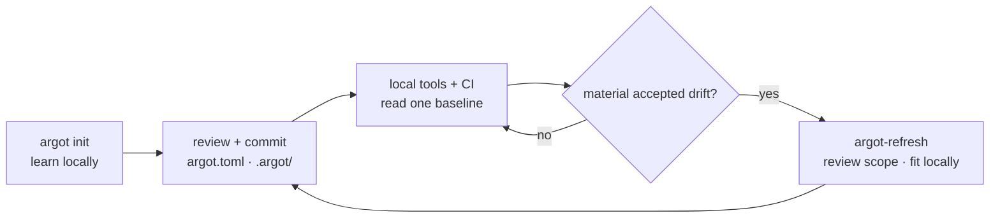

<p align="center">
  
</p>

<p align="center">
  <strong>Lint the rules you never wrote down.</strong>
</p>

<p align="center">
  <em>AI writes the code. argot harnesses it with the one thing that can’t
  hallucinate: <strong>your repo’s own history</strong>.<br/>
  Statistics, not a second LLM. 100% local. It surfaces the divergence — you
  decide what to accept.</em>
</p>

<p align="center">
  <a href="https://argot.tmonier.com"><strong>argot.tmonier.com</strong></a>
  &nbsp;·&nbsp;
  <a href="https://argot.tmonier.com/docs/">Documentation</a>
  &nbsp;·&nbsp;
  <a href="https://argot.tmonier.com/benchmarks">Evidence</a>
  &nbsp;·&nbsp;
  <a href="docs/research/README.md">Research log</a>
</p>

<p align="center">
  <a href="https://github.com/get-tmonier/argot/releases/latest"></a>
  <a href="https://www.npmjs.com/package/@tmonier/argot"></a>
  <a href="https://github.com/get-tmonier/argot/blob/main/LICENSE"></a>
</p>

<p align="center">
  
  
  <a href="https://argot.tmonier.com/docs/languages/"></a>
  <a href="https://argot.tmonier.com/benchmarks"></a>
</p>

<table align="center">
  <tr>
    <td align="center" valign="middle">
      <a href="https://glama.ai/mcp/servers/get-tmonier/argot"></a>
    </td>
    <td align="center" valign="middle">
      <a href="https://argot.tmonier.com/#film"></a>
      <br/>
      <em>🎬 <a href="https://argot.tmonier.com/#film">Watch the 45-second launch film</a></em>
    </td>
  </tr>
</table>

## Start with an audit

`argot audit` needs no prior Argot fit or configuration. It fits a historical
base in a temporary worktree, then evaluates the surviving base-to-HEAD net
diff. Your working tree is left untouched. It is a review prompt—not a census
of who wrote code, or proof that a finding is a defect.

```sh
# macOS / Linux
curl --proto '=https' --tlsv1.2 -LsSf https://github.com/get-tmonier/argot/releases/latest/download/argot-installer.sh | sh

cd your-repository
argot audit
```

Windows: `powershell -c "irm https://github.com/get-tmonier/argot/releases/latest/download/argot-installer.ps1 | iex"`.
The npm package is also available as `npm install -g @tmonier/argot`.

Audit needs usable Git history and supported source. It has no fixed runtime
promise. It runs fully offline — the code-embedding model behind the semantic
findings ships inside the binary. See
[Getting started](https://argot.tmonier.com/docs/getting-started/) for install
and fit details.

If the audit gives you a useful lead, fit the current repository and score the
changes you intend to review:

```sh
argot init
argot check
```

Review and commit the generated `argot.toml` and `.argot/` fit snapshot, then
merge it into the branch future PRs target before adding a CI workflow. Local
tools and CI then use the same learned baseline. CI only reads the base branch
snapshot; it never fits, so the initial snapshot PR must be separate from the
CI-workflow PR. `argot status` later recommends a local
fit-and-commit refresh only when accepted source, function, or layout surfaces
have materially changed. Commit count and age are not refresh triggers by
default; `[fit] refresh-after` is available only as an explicit team backstop.
The `argot-refresh` skill re-audits exclusions, structural paths, and mutes
before fitting, so a reorganized repository does not blindly relearn old scope.


```mermaid
flowchart LR
    A["argot init<br/>learn locally"] --> B["review + commit<br/>argot.toml · .argot/"]
    B --> C["local tools + CI<br/>read one baseline"]
    C --> D{"material accepted drift?"}
    D -- no --> C
    D -- yes --> E["argot-refresh<br/>review scope · fit locally"]
    E --> B
```

The embedding model itself ships inside the binary. Git stores only the
repository-specific learned snapshot—typically a few MB to a few tens of MB—so
every clone can reproduce the check without retraining or operating a service.

`check` reports patterns worth reviewing on the selected changeset; a clean result
does not prove the change correct or fully idiomatic. Read the
[Audit](https://argot.tmonier.com/docs/audit/),
[Init and Fit](https://argot.tmonier.com/docs/init-and-fit/), and
[Check](https://argot.tmonier.com/docs/check/) guides for the exact contracts.

## What it surfaces

**Type checkers ask if it compiles. argot asks if it’s yours.** A clean,
type-correct, well-reviewed pull request can still be foreign to the repository
it lands in. These are the rules argot ships, every one of them learned from
your own history rather than configured by hand:

| Rule                | Group        | What it flags                                                    |
| ------------------- | ------------ | ---------------------------------------------------------------- |
| `foreign-import`    | voice        | an import of a dependency the repo has never used                 |
| `unfamiliar-callee` | voice        | a call to a receiver or callee the repo's code never calls        |
| `rare-tokens`       | voice        | a token sequence statistically foreign to the repo's voice        |
| `convention`        | voice        | a construction that breaks a convention learned from the repo     |
| `superseded`        | voice        | a pattern this repo has been replacing, or declared migrated away |
| `redundant`         | semantic     | a new function that duplicates one the repo already has           |
| `misplaced`         | semantic     | a function that looks like it belongs in another module area      |
| `layering`          | architecture | an internal import that reverses the repo's layer direction       |
| `test-deleted`      | integrity    | a test removed while the code it exercised still exists           |
| `test-disabled`     | integrity    | a skip marker added, or a test gutted, as production changes      |
| `test-weakened`     | integrity    | assertions removed, tautologized, or loosened alongside a change  |
| `rule-tampered`     | governance   | a change that removes or weakens a locked rule                    |

Repositories add their own on top — a TOML manifest plus a sandboxed Rhai
script under `.argot/rules/`, with working ones to copy in
[`examples/rules/`](examples/rules/). No recompilation.

argot is a probabilistic review guardrail, not a correctness oracle. Each
finding carries repository evidence. Treat it as a prompt to inspect and make
the human decision explicit—never as proof that the code is wrong.

## Choose how to run it

The CLI is the complete, explicit changeset check. Other routes have narrower
triggers and coverage; none provides a universal acceptance-time check.

| Route              | Execution class                                          | Prerequisites and coverage                                                                                                                                                               | Evidence status                         |
| ------------------ | -------------------------------------------------------- | ---------------------------------------------------------------------------------------------------------------------------------------------------------------------------------------- | --------------------------------------- |
| CLI                | Invoked by a user or agent                               | Run `audit`, `init`, or the full `check`; fitting is required where the command needs it.                                                                                                | CLI/source inventory, 2026-07-22        |
| Skills             | Invoked                                                  | Seven on-demand workflows for a compatible skill host; installation does not schedule commands, configure MCP, or add a hook.                                                            | Manifest/source inventory, 2026-07-30   |
| MCP                | Passive                                                  | A configured client selects read-only context, hunk, or complete-changeset tools; a fitted repository is required for model-dependent tools. Fitting remains an explicit local CLI/skill workflow. | Focused test and source inspection, 2026-07-30 |
| Claude Code plugin | Automatic when configured, plus invoked/passive surfaces | Its opt-in pre-write hook, in a fitted repository, asks only when a `Write`, `Edit`, or `MultiEdit` introduces a foreign import. It never blocks and is not a full or end-of-turn check. | Manifest/source inspection, 2026-07-22  |
| pre-commit         | Automatic when user-configured                           | Scores staged supported files in a fitted repository. The `argot-check` hook is advisory for findings; `argot-check-gate` is opt-in for error-severity exits.                            | Manifest inspection, 2026-07-22         |
| GitHub Action      | Automatic when user-configured                           | Scores the configured ref/range in a workflow; it needs checkout history and release-download access. `fail-on-hits` defaults to `false`.                                                | Action manifest inspection, 2026-07-22  |

Canonical setup and host details: [Claude Code](https://argot.tmonier.com/docs/plugin/),
[other agents and MCP](https://argot.tmonier.com/docs/agents/), and
[CI and pre-commit](https://argot.tmonier.com/docs/ci/).

## Evidence and limits

Current public measurements are detector-specific, not a product-wide accuracy
or combined-brief claim. The [approved claim manifest](landing/src/data/claims/manifest.json)
records:

- visible foreign-symbol fixtures: **620/637 — 97.3%** across 36 corpora and 12 languages;
- reinvention fixtures: **545/584 — 93.3%** across 31 corpora and 11 languages;
- placement transplants: **12,899/13,456 — 95.9%** across the 22 evaluable corpora and 11 languages
  (the other nine abstain because their layouts have no separable architecture);
- layering fixtures: **264/272 — 97.1%** across 25 corpora and 12 languages;
- test-integrity fixtures: **154/164 — 93.9%** across 23 corpora and 12 languages.

A catch rate means little without the noise it costs, so both are published. On
the same 36 corpora, the voice detectors flag **0.25%** of ordinary accepted
edits — and **0.00%** of the hunks in newly added files, where a repository has
the least to say about what belongs.

Each number has a distinct corpus, denominator, and qualifier. The combined
briefing/noise result and ordinary-repository timing are not yet measured public
claims. See the
[benchmark methodology and sources](https://argot.tmonier.com/benchmarks).

Argot ships adapters for 12 languages. The five tested release targets are macOS
arm64/x64, Linux x64/arm64, and Windows x64. The local analysis path uses
statistical, graph, scripted, and embedding evidence; no generative or
opinion-forming model decides a finding.

Fit health matters. A repository with shallow, generated, vendored, or
otherwise unsuitable history may not produce a useful model. Argot is also
least reliable for an incorrect choice made entirely with familiar vocabulary,
masked prose, and code outside the selected range. Read
[Limitations](https://argot.tmonier.com/docs/limitations/) before relying on a
specific detector.

## Reproducible authored proof


This is an **authored fixture**, not a wild-case corpus. Its pinned command,
version, receipts, checksums, regeneration procedure, and the visual’s
non-byte-stable GIF qualification are documented in
[the proof receipt](docs/demo/proof/README.md). The image is a reproducible
companion to the [auditable Markdown receipt](docs/demo/proof/audit.md).

## Privacy and open source

Argot analyzes source, history, and findings locally. The individual local core
is free, MIT-licensed open source, and requires no account or cloud service.
Argot has no default telemetry and does not upload source code. No analysis it
performs needs a network at all — the code-embedding model behind the semantic
findings is compiled into the binary. It can still use network paths for
update/version checks, release downloads, or an explicitly configured
review/update/CI integration. Set `ARGOT_OFFLINE=1` to prevent network use;
nothing analytical is lost.

Read the complete [privacy and security boundary](https://argot.tmonier.com/privacy/),
[security policy](SECURITY.md), and [MIT license](LICENSE).

## Contribute

Contributions are welcome. Start with [CONTRIBUTING.md](CONTRIBUTING.md), then
see the [product strategy](docs/strategy/ARGOT_STRATEGY.md) for the maintained
decision record and [research log](docs/research/README.md) for evidence.

## Acknowledgements

Every number argot publishes is measured against the real history of 36
open-source projects, across the twelve supported languages — fastapi, rich,
faker, saleor, wagtail, scrapy, hono, ink, faker-js, excalidraw, outline,
express, commander, eslint, gh-cli, hugo, ripgrep, bat, guava, junit5,
powershell, jellyfin, redis, curl, rocksdb, fmt, homebrew, rubocop, laravel,
composer, castle-engine, mORMot2, uos, ideU, MSEide/MSEgui, and dagster.

The benchmark would not exist without them, and we are grateful to their
maintainers and contributors. Argot vendors and redistributes none of their
code: the harness clones each repository at a pinned SHA, reads its history
locally, and ships nothing from it. Each project remains under its own license,
held by its own authors. Full list with links, and what argot does commit:
[`benchmarks/README.md`](benchmarks/README.md#acknowledgements).

argot does redistribute one thing. The model behind `redundant` and `misplaced`
is a 15.6M-parameter static table distilled from
[jina-embeddings-v2-base-code](https://huggingface.co/jinaai/jina-embeddings-v2-base-code)
(Jina AI, Apache-2.0) using the
[model2vec](https://github.com/MinishLab/model2vec) technique (MinishLab, MIT).
Its weights are compiled into the binary and redistributed under Apache-2.0;
full terms in [`NOTICE`](NOTICE). argot is not affiliated with either project.
