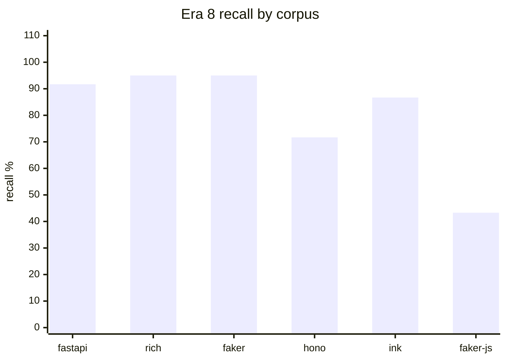
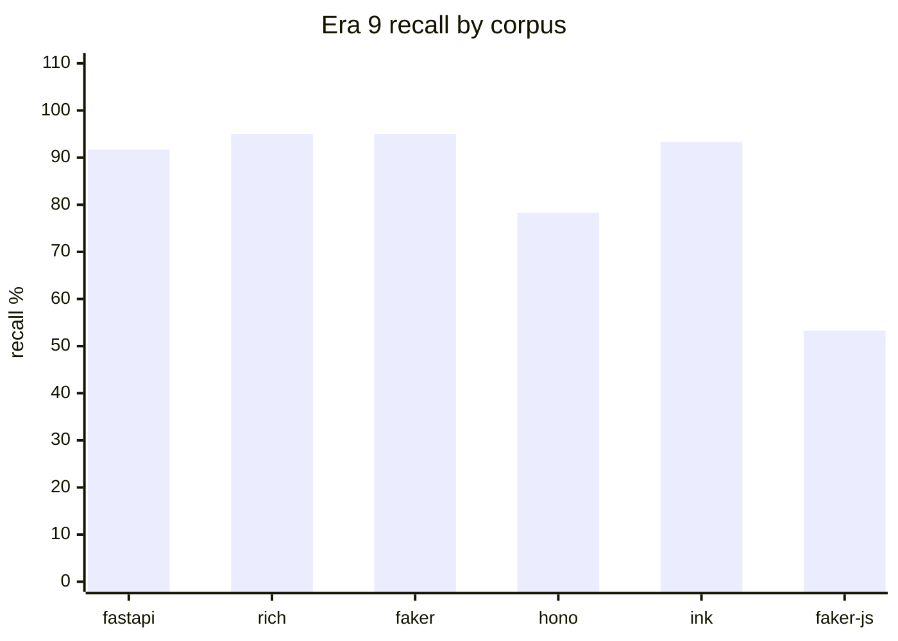
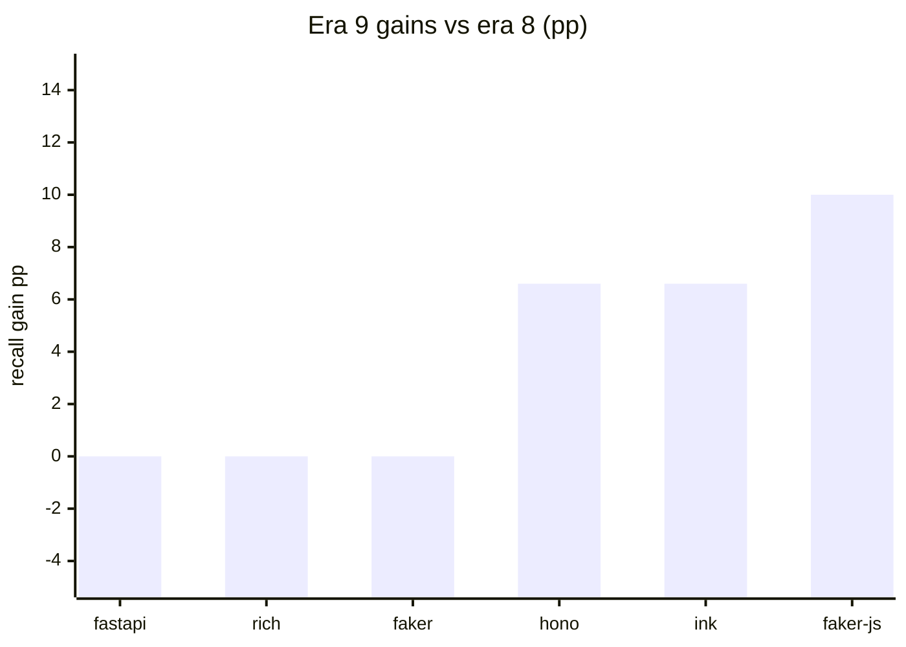

# argot-bench

Reproducible benchmark harness for argot's production scorer. Scores a
catalog of hand-crafted "paradigm break" fixtures against the real-PR
hunks of six pinned open-source repos, and reports recall, false-positive
rate, AUC, threshold stability, and per-category breakdowns.

The harness is the source of truth for any claim about argot's
performance. The root README quotes the headline; every other number
lives in this tree.

## Quick run

```bash
just bench-quick   # ~1 min — 1 PR × 1 fixture per category × 1 seed (fastapi only by default)
just bench         # ~1.5h first time, ~20 min with caches — all 6 corpora
just bench-corpus fastapi   # one corpus, 5 seeds, full catalog
just verify-bench  # ruff + mypy + pytest on benchmarks/
```

Outputs land in `benchmarks/results/<timestamp>/`:
- `report.md` — human-readable aggregated markdown
- `<corpus>.json` — raw per-fixture + per-control scores (gitignored)

A committed snapshot of the latest full run lives at
[`benchmarks/results/baseline/latest/report.md`](results/baseline/latest/report.md)
and next to it under a dated `20260423T155121Z/` folder for historical diffs.

## Corpora

Six repos pinned to specific SHAs for reproducibility
(see [`targets.yaml`](targets.yaml)):

| Corpus | Language | PRs | Why |
|---|---|---|---|
| **fastapi** | python | 1 HEAD + historical walk | Async-first web framework; strong Pydantic/Depends voice |
| **rich** | python | 1 HEAD + historical walk | Terminal UI library; tight renderer/console vocabulary |
| **faker** | python | 1 HEAD + historical walk | Deterministic fake-data library; provider-heavy |
| **hono** | typescript | 5 pre-merge snapshots | Edge-runtime web framework |
| **ink** | typescript | 5 pre-merge snapshots | React components for CLI UIs |
| **faker-js** | typescript | 5 pre-merge snapshots | TS port of faker with locale data |

Python corpora have one HEAD SHA; the bench walks history from there.
TypeScript corpora use 5 pre-merge PR snapshots each to capture
"hunks in review" rather than merged history (git history on TS repos
often collapses PRs into a single squash commit).

## Fixture catalogs

Each corpus has 15–32 fixtures across 5–9 break categories with ≥3 fixtures
per category (except newly-added single-fixture uncaught bands), rationales
grounded in corpus evidence, and line-precise hunk bounds. Every fixture
carries a difficulty label (easy/medium/hard/uncaught).
See `benchmarks/catalogs/<corpus>/manifest.yaml`.

| Corpus | Categories | Fixtures |
|---|---|---|
| fastapi | 9 | 32 |
| rich | 5 | 16 |
| faker | 5 | 16 |
| hono | 5 | 17 |
| ink | 5 | 17 |
| faker-js | 5 | 17 |
| **total** | **34** | **115** |

Example categories: `framework_swap` (Django CBV in a FastAPI app),
`async_blocking` (`time.sleep` inside an async def), `serialization`
(manual `json.dumps` when Pydantic is idiomatic), `foreign_rng`
(`Math.random` inside a deterministic faker-js provider).

## Methodology

Per corpus, per seed:

1. **Clone** the pinned SHA (cached across runs).
2. **Extract** training-quality hunks from the repo via `argot-extract`
   (the production pipeline's data step — not a bench-specific tokenizer).
3. **Calibrate** the production scorer on `n_cal=100` sampled hunks from
   the repo.
4. **Score** every catalog fixture as a break candidate.
5. **Score** every real PR hunk as a control.

Repeat across 5 independent seeds (Python corpora) or 5 seeds on the
primary PR plus 4 additional PRs (TypeScript) to measure threshold
stability.

The calibration-pool candidates and the real-PR control hunks are
both pre-filtered through the AST-derived typicality predicate
(`engine/argot/scoring/filters/typicality.py`). Atypical candidates are
excluded from calibration sampling; atypical controls short-circuit to
`reason="atypical"` or `reason="atypical_file"` without invoking the
scorer and are excluded from the FP-rate denominator. See
[`docs/research/05-calibration-hygiene.md`](../docs/research/05-calibration-hygiene.md)
for the design.

### Metrics

| Metric | Meaning |
|---|---|
| **AUC** | Area under the ROC curve for break (catalog) vs control (real PR) scores. 1.0 = perfect separation; 0.5 = chance. |
| **Recall** | Fraction of catalog fixtures flagged as breaks. Reported overall and per category. |
| **FP rate** | Fraction of real PR hunks that crossed the flag threshold. |
| **Separation gap** | `min(break_score) − max(control_score)`. Positive = clean separation; negative = overlap. |
| **Threshold CV** | Coefficient of variation of the calibrated threshold across 5 seeds. Low CV = reproducible. |
| **Calibration stability** | Jaccard overlap of top-scored calibration hunks across seeds. |
| **Stage attribution** | Whether each break was caught by the import-graph stage (`import`), the BPE log-ratio stage (`bpe`), or missed (`none`). |

### What each metric tells you

- **High AUC, low recall** = the scorer orders breaks above controls but
  the calibrated threshold is too high. The ranking is useful; the cut
  isn't.
- **Low AUC** = the scorer can't tell some breaks from idiomatic code at
  all. Token novelty alone isn't enough for that category.
- **High FP rate with known culprits** = often data/locale/test files
  that are structurally unusual but not breaks. Calibration filter issue,
  not a scorer issue.
- **Low separation gap with high AUC** = breaks and controls overlap but
  the bulk of the break mass sits above the bulk of the control mass.
  Acceptable, but sensitive to calibration drift.

## Metric definitions

### avg_recall

Arithmetic mean of per-corpus recall, where:

    per-corpus recall = flagged_fixtures / total_fixtures

Corpora are weighted equally — faker's 15 fixtures count the same as fastapi's 31.

### recall_by_difficulty

Per-difficulty-band recall, newly added in era 7:

    recall_band = flagged_in_band / total_in_band

Bands: `easy` (Stage 1 import catch), `medium` (Stage 2 BPE catch),
`hard` (Stage 1.5 call-receiver catch), `uncaught` (scorer currently misses).

### FP rate

    FP rate = flagged_controls / eligible_controls

"Eligible" excludes hunks with reason in `{atypical, atypical_file, excluded_path,
auto_generated}` — these are short-circuited before the scorer and are not true
false positives.

## Current baseline

From [`latest/report.md`](results/baseline/latest/report.md)
(run `20260424T163221Z`, 115 fixtures, 5 PR snapshots per corpus,
difficulty-labelled, call_receiver_alpha=2.0 — shipping scorer default):

| Corpus | AUC | Recall | FP | N_fix | N_ctrl |
|:---|---:|---:|---:|---:|---:|
| fastapi | 0.9880 | 91.7% | 0.8% | 32 | 79,623 |
| rich | 0.9780 | 95.0% | 0.8% | 16 | 68,598 |
| faker | 0.9537 | 95.0% | 1.2% | 16 | 75,996 |
| hono | 0.8312 | 78.3% | 0.5% | 17 | 54,717 |
| ink | 0.9899 | 93.3% | 0.4% | 17 | 16,678 |
| faker-js | 0.9463 | 53.3% | 1.0% | 17 | 255,760 |

Average recall 84.4%; all corpora FP ≤ 1.2%. Easy and medium fixtures are
caught at ≥80% on five of six corpora; hard fixtures depend on Stage 1.5.
Threshold CV ≤ 10% across all corpora: runs are reproducible across seeds.

### Known weaknesses (flagged by this baseline)

1. **Object-keyed structured data resists structural detection.**
   The typicality filter ([`docs/research/05-calibration-hygiene.md`](../docs/research/05-calibration-hygiene.md))
   closed the broader data/locale/test false-positive tail, but
   residual FP sources remain on TS / Python locale providers where
   property/class/method identifiers dilute `literal_leaf_ratio`
   below the 0.80 cutoff.

2. **Single-callee foreign-receiver breaks below threshold.** faker-js
   `foreign_rng_1` and `_3` have a single `Math.random()` call each; the
   soft penalty at α=2.0 (contribution 2.0) is still below the gap between
   their BPE scores (0.52) and the threshold (4.77). Catching these would
   require a frequency-weighted variant of the scorer.

3. **Semantic breaks with no foreign callee at all.** hono
   `middleware_3` calls `next()` synchronously instead of `await next()`
   — no foreign callee to flag, no token novelty, no import diff. The
   scorer is structurally blind to this class.

4. **Threshold-borderline ink dom_access_2.** ink `dom_access_2`
   (window.location.href) scores 4.215, just below ink's threshold of
   4.826 (within the ±6.9% calibration noise band). A tighter ink
   calibration (larger n_cal or p95 threshold) would be needed to catch it
   reliably.

## Reading a report

The generated `report.md` has, per corpus:

- **Summary** — AUC, recall, FP, threshold, separation gap, sample sizes.
- **Score distribution** — quantiles for breaks vs controls; shows where
  the threshold sits relative to both.
- **Per-category detail table** — recall, hits/total, mean/min/max break
  score, fixture IDs.
- **Per-fixture table** (expandable `<details>`) — every fixture's score,
  flagged status, reason, file, line range, and rationale.
- **Missed fixtures** — explicit callout with distance-to-threshold and
  rationale for each unflagged break.
- **Top 5 real-PR controls** — the hunks closest to flagging but not
  flagged; useful for investigating near-FPs.
- **Stage attribution** — import vs bpe vs none, with percentages.

## Era history

Each era represents a research increment that cleared all pre-registered gates
and was promoted as the canonical baseline. Only eras that shipped are listed.

### Era 8 — complex-chain callee canonicalization (20260424T144605Z, α=1.0)

Extended the call-receiver extractor to canonicalize call-rooted member chains
(`Router().route(path).get(h)`) as `<call>.route` / `<call>.get` instead of
silently dropping them. One fixture moved uncaught→hard: `hono_routing_2`.

| Corpus | AUC | Recall | FP | N_fix | N_ctrl |
|:---|---:|---:|---:|---:|---:|
| fastapi | 0.9880 | 91.7% | 0.8% | 32 | 79,623 |
| rich | 0.9780 | 95.0% | 0.4% | 16 | 68,598 |
| faker | 0.9537 | 95.0% | 0.9% | 16 | 75,996 |
| hono | 0.8312 | 71.7% | 0.4% | 17 | 54,717 |
| ink | 0.9899 | 86.7% | 0.4% | 17 | 16,678 |
| faker-js | 0.9463 | 43.3% | 0.8% | 17 | 255,760 |

Avg recall 80.57%. Fixtures relabelled: `hono_routing_2` uncaught→hard.



See [`docs/research/08-complex-chain-callee.md`](../docs/research/08-complex-chain-callee.md).

### Era 9 — alpha=2.0 sweep (20260424T163221Z, α=2.0)

Raised `call_receiver_alpha` from 1.0 to 2.0. Primary α=3.0 failed Gate 3
(faker FP 1.6% > 1.5%); fallback α=2.0 cleared all 6 gates. Four fixtures
moved uncaught→hard: `faker_js_http_sink_1`, `faker_js_http_sink_3`,
`hono_routing_3`, `ink_dom_access_1`.

| Corpus | AUC | Recall | FP | N_fix | N_ctrl |
|:---|---:|---:|---:|---:|---:|
| fastapi | 0.9880 | 91.7% | 0.8% | 32 | 79,623 |
| rich | 0.9780 | 95.0% | 0.8% | 16 | 68,598 |
| faker | 0.9537 | 95.0% | 1.2% | 16 | 75,996 |
| hono | 0.8312 | 78.3% | 0.5% | 17 | 54,717 |
| ink | 0.9899 | 93.3% | 0.4% | 17 | 16,678 |
| faker-js | 0.9463 | 53.3% | 1.0% | 17 | 255,760 |

Avg recall 84.4% (+3.8 pp vs era-8).



Era-8 vs era-9 delta:



See [`docs/research/09-alpha-sweep.md`](../docs/research/09-alpha-sweep.md).

## Updating the baseline

After a run you're satisfied with:

```bash
just bench
cp -r benchmarks/results/<timestamp> benchmarks/results/baseline/<timestamp>
cp benchmarks/results/<timestamp>/report.md benchmarks/results/baseline/latest/report.md
# Strip the large per-corpus JSONs — we only commit report.md for regression diffs
rm benchmarks/results/baseline/<timestamp>/*.json
git add benchmarks/results/baseline/
git commit -m "data(bench): baseline <date> for regression comparison"
```

Only `report.md` is committed. The raw JSONs are large (~41M total,
dominated by per-PR control scores) and reproducible from a rerun.

## Layout

```
benchmarks/
├── README.md                              # this file
├── pyproject.toml
├── targets.yaml                           # 6 pinned corpora
├── catalogs/                              # fixture catalogs per corpus
│   ├── fastapi/
│   │   ├── manifest.yaml
│   │   └── breaks/
│   │       ├── paradigm_break_flask_routing.py
│   │       └── ...
│   └── ...
├── src/argot_bench/
│   ├── cli.py                             # argparse entry point
│   ├── run.py                             # per-corpus orchestrator
│   ├── clone.py                           # git clone + checkout w/ cache
│   ├── extract.py                         # argot-extract subprocess wrapper
│   ├── score.py                           # wraps SequentialImportBpeScorer
│   ├── fixtures.py                        # Catalog/Fixture/PRHost + YAML loader
│   ├── metrics.py                         # AUC, recall, FP, threshold CV, …
│   ├── report.py                          # CorpusReport + markdown renderer
│   └── targets.py                         # targets.yaml loader
├── tests/                                 # 51 unit tests + 1 e2e smoke
└── results/
    ├── <timestamp>/                       # one dir per run, gitignored
    └── baseline/                          # checked-in snapshots
        ├── latest/report.md               # most-recent baseline
        └── <timestamp>/report.md          # historical baselines for diff
```

## See also

- Root [README](../README.md) — what argot is and how to use it
- [`targets.yaml`](targets.yaml) — the exact commit SHAs used for this run
- [`docs/superpowers/plans/2026-04-23-benchmark-harness.md`](../docs/superpowers/plans/2026-04-23-benchmark-harness.md) — the implementation plan this tree was built from
