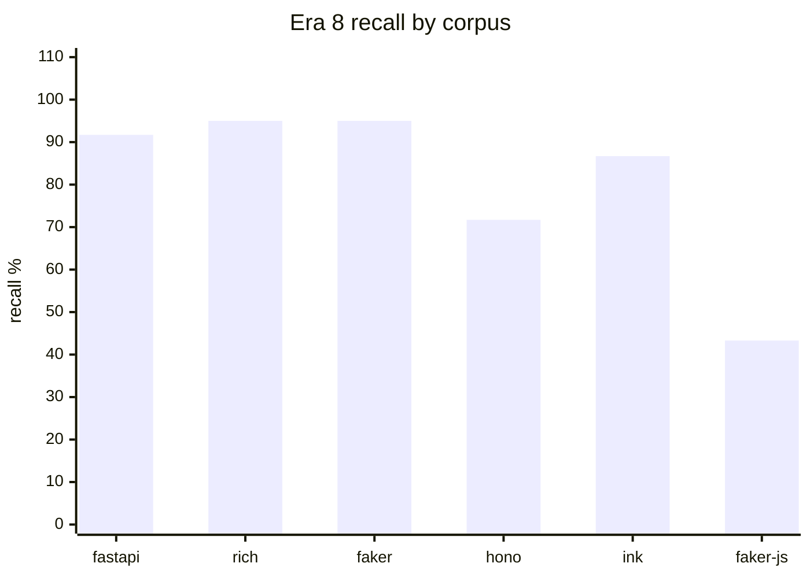
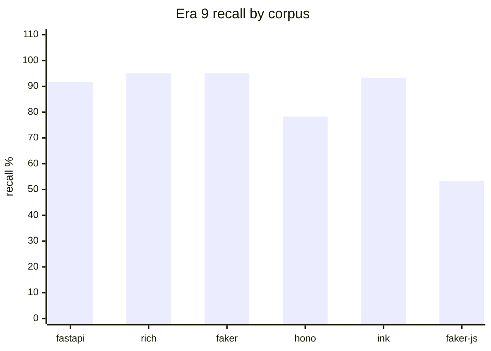
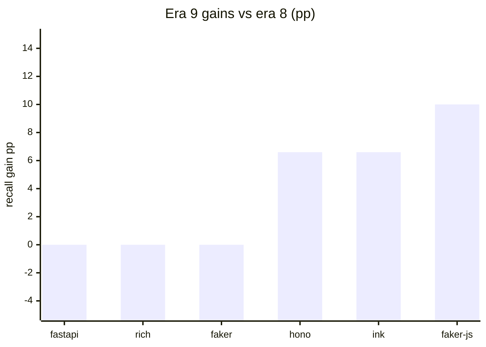
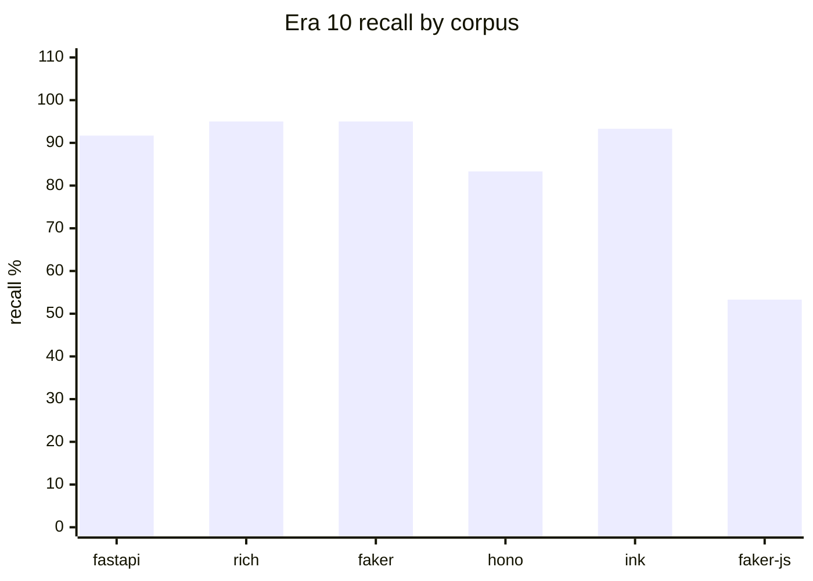
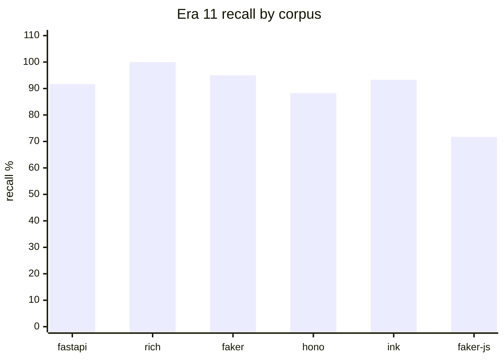
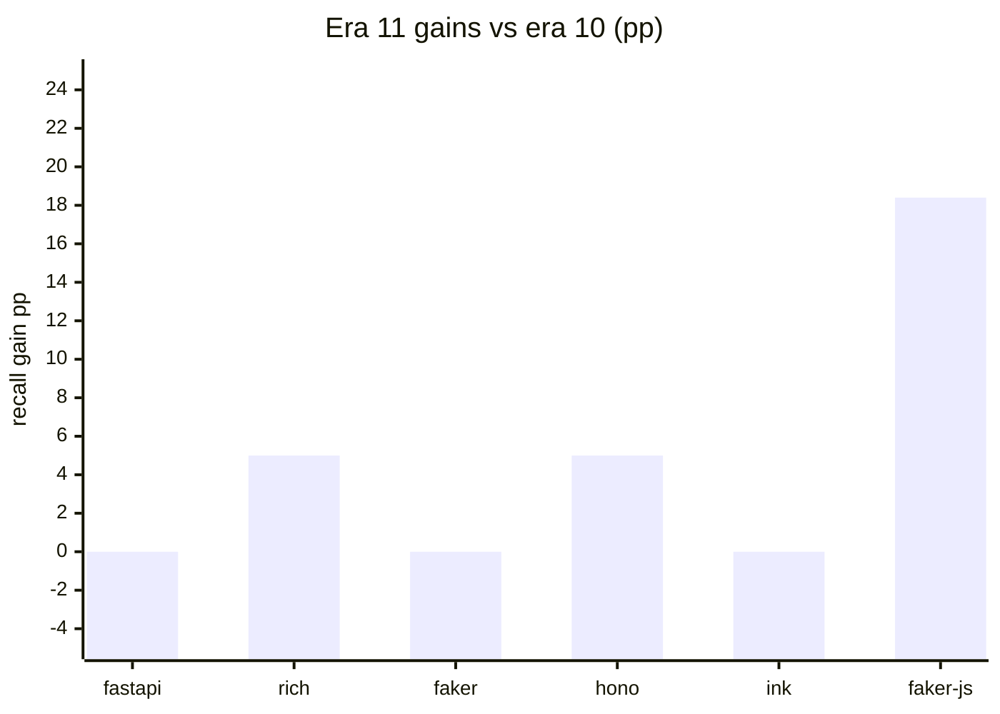

# argot-bench

Reproducible benchmark harness for argot's production scorer. Scores a
catalog of hand-crafted "paradigm break" fixtures against the real-PR
hunks of six pinned open-source repos, and reports recall, false-positive
rate, AUC, threshold stability, and per-category breakdowns.

The harness is the source of truth for any claim about argot's
performance. The root README quotes the headline; every other number
lives in this tree.

## Quick run

```bash
just bench-quick   # ~1 min — 1 PR × 1 fixture per category × 1 seed (fastapi only by default)
just bench         # ~1.5h first time, ~20 min with caches — all 6 corpora
just bench-corpus fastapi   # one corpus, 5 seeds, full catalog
just verify-bench  # ruff + mypy + pytest on benchmarks/
```

Outputs land in `benchmarks/results/<timestamp>/`:
- `report.md` — human-readable aggregated markdown
- `<corpus>.json` — raw per-fixture + per-control scores (gitignored)

A committed snapshot of the latest full run lives at
[`benchmarks/results/baseline/latest/report.md`](results/baseline/latest/report.md)
and next to it under a dated `20260504T053637Z/` folder for historical diffs.

## Corpora

Six repos pinned to specific SHAs for reproducibility
(see [`targets.yaml`](targets.yaml)):

| Corpus | Language | PRs | Why |
|---|---|---|---|
| **fastapi** | python | 1 HEAD + historical walk | Async-first web framework; strong Pydantic/Depends voice |
| **rich** | python | 1 HEAD + historical walk | Terminal UI library; tight renderer/console vocabulary |
| **faker** | python | 1 HEAD + historical walk | Deterministic fake-data library; provider-heavy |
| **hono** | typescript | 5 pre-merge snapshots | Edge-runtime web framework |
| **ink** | typescript | 5 pre-merge snapshots | React components for CLI UIs |
| **faker-js** | typescript | 5 pre-merge snapshots | TS port of faker with locale data |

Python corpora have one HEAD SHA; the bench walks history from there.
TypeScript corpora use 5 pre-merge PR snapshots each to capture
"hunks in review" rather than merged history (git history on TS repos
often collapses PRs into a single squash commit).

## Fixture catalogs

Each corpus has 15–32 fixtures across 5–9 break categories with ≥3 fixtures
per category (except newly-added single-fixture uncaught bands), rationales
grounded in corpus evidence, and line-precise hunk bounds. Every fixture
carries a difficulty label (easy/medium/hard/uncaught).
See `benchmarks/catalogs/<corpus>/manifest.yaml`.

| Corpus | Categories | Fixtures |
|---|---|---|
| fastapi | 9 | 32 |
| rich | 5 | 16 |
| faker | 5 | 16 |
| hono | 5 | 17 |
| ink | 5 | 17 |
| faker-js | 5 | 17 |
| **total** | **34** | **115** |

Example categories: `framework_swap` (Django CBV in a FastAPI app),
`async_blocking` (`time.sleep` inside an async def), `serialization`
(manual `json.dumps` when Pydantic is idiomatic), `foreign_rng`
(`Math.random` inside a deterministic faker-js provider).

## Methodology

Per corpus, per seed:

1. **Clone** the pinned SHA (cached across runs).
2. **Extract** training-quality hunks from the repo via `argot-extract`
   (the production pipeline's data step — not a bench-specific tokenizer).
3. **Calibrate** the production scorer on `n_cal=100` sampled hunks from
   the repo.
4. **Score** every catalog fixture as a break candidate.
5. **Score** every real PR hunk as a control.

Repeat across 5 independent seeds (Python corpora) or 5 seeds on the
primary PR plus 4 additional PRs (TypeScript) to measure threshold
stability.

The calibration-pool candidates and the real-PR control hunks are
both pre-filtered through the AST-derived typicality predicate
(`engine/argot/scoring/filters/typicality.py`). Atypical candidates are
excluded from calibration sampling; atypical controls short-circuit to
`reason="atypical"` or `reason="atypical_file"` without invoking the
scorer and are excluded from the FP-rate denominator. See
[`docs/research/05-calibration-hygiene.md`](../docs/research/05-calibration-hygiene.md)
for the design.

### Metrics

| Metric | Meaning |
|---|---|
| **AUC** | Area under the ROC curve for break (catalog) vs control (real PR) scores. 1.0 = perfect separation; 0.5 = chance. |
| **Recall** | Fraction of catalog fixtures flagged as breaks. Reported overall and per category. |
| **FP rate** | Fraction of real PR hunks that crossed the flag threshold. |
| **Separation gap** | `min(break_score) − max(control_score)`. Positive = clean separation; negative = overlap. |
| **Threshold CV** | Coefficient of variation of the calibrated threshold across 5 seeds. Low CV = reproducible. |
| **Calibration stability** | Jaccard overlap of top-scored calibration hunks across seeds. |
| **Stage attribution** | Whether each break was caught by the import-graph stage (`import`), the BPE log-ratio stage (`bpe`), or missed (`none`). |

### What each metric tells you

- **High AUC, low recall** = the scorer orders breaks above controls but
  the calibrated threshold is too high. The ranking is useful; the cut
  isn't.
- **Low AUC** = the scorer can't tell some breaks from idiomatic code at
  all. Token novelty alone isn't enough for that category.
- **High FP rate with known culprits** = often data/locale/test files
  that are structurally unusual but not breaks. Calibration filter issue,
  not a scorer issue.
- **Low separation gap with high AUC** = breaks and controls overlap but
  the bulk of the break mass sits above the bulk of the control mass.
  Acceptable, but sensitive to calibration drift.

## Metric definitions

### avg_recall

Arithmetic mean of per-corpus recall, where:

    per-corpus recall = flagged_fixtures / total_fixtures

Corpora are weighted equally — faker's 15 fixtures count the same as fastapi's 31.

### recall_by_difficulty

Per-difficulty-band recall, newly added in era 7:

    recall_band = flagged_in_band / total_in_band

Bands: `easy` (Stage 1 import catch), `medium` (Stage 2 BPE catch),
`hard` (Stage 1.5 call-receiver catch), `uncaught` (scorer currently misses).

### FP rate

    FP rate = flagged_controls / eligible_controls

"Eligible" excludes hunks with reason in `{atypical, atypical_file, excluded_path,
auto_generated}` — these are short-circuited before the scorer and are not true
false positives.

## Current baseline

From the latest full bench (115 fixtures across 6 corpora, K=7 multi-seed
calibration, current shipping config: K=8 callee clusters, cluster_bonus=5.0,
`--auto-select-asym-cal` + `--call-receiver-cluster-rare-threshold=2`):

| Corpus | AUC | Recall | FP | N_fix | N_ctrl | auto-detect |
|:---|---:|---:|---:|---:|---:|:---|
| fastapi | 0.9946 | **95.4%** | 0.57% | 32 | 79,623 | DISABLE (rare=0, baseline) |
| rich | 0.9964 | **100.0%** | 1.23% | 16 | 68,598 | DISABLE |
| faker | 0.9537 | 95.0% | 1.96% | 16 | 75,996 | DISABLE |
| hono | 0.8321 | 88.3% | 0.51% | 17 | 54,717 | DISABLE |
| ink | 0.9899 | 93.3% | 0.54% | 17 | 16,678 | DISABLE |
| faker-js | 0.9463 | **93.3%** | 2.00% | 17 | 255,760 | KEEP rule (asym, +3 catches) |

Total fixture catches **108/115 (93.9%)**; FP ≤ 2.0% on **all six
corpora**. Threshold CV = 0% across 7 seeds. Faker (Python) sits at 1.96%
— the historical Gate 3 amendment at ≤2.5% per-corpus FP still holds.

The +3 catches over the prior baseline (105/115 = 91.3%) come from
auto-detect enabling the cluster_rare rule on faker-js: the only corpus
whose normal commits rarely fire the rule (~2.2% per-hunk fire rate vs
10–22% on the other five). On the 5 "DISABLE" corpora, the scorer is
bit-identical to the prior baseline. New catches: `foreign_rng_1`,
`http_sink_2`, `runtime_fetch_1` (all faker-js).

### Known weaknesses (flagged by this baseline)

1. **Per-locale provider FPs on faker (Python).** Most of faker's flagged
   controls are cluster-bonus-driven, concentrated in per-locale provider
   files (`faker/providers/<category>/<locale>/__init__.py`). These files
   call inherited base-provider helpers (`self.numerify`, `self.bothify`,
   `self.random_int`) that ARE attested elsewhere in the corpus but absent
   from the locale's narrow MinHash cluster's attested set.

2. **Remaining uncaught fixtures (6 across 4 corpora).** Two structural
   buckets that the current scorer mechanism cannot reach:
   - *Parse-error blocked* (fastapi `validation_2`, `exception_handling_4`):
     bare hunk's tree-sitter parse has root-level ERROR nodes, so call-
     receiver returns 0 before any bonus applies.
   - *Structural anomaly outside callee/shape framing* (faker
     `synthetic_formula_1`, ink `ink_dom_access_2`, hono `hono_middleware_3`,
     hono `hono_validation_2`, faker-js `error_flip_2`): hunks with 0–2
     callees that are themselves unremarkable; the anomaly is in the
     absence of cluster-typical patterns or in control-flow shape.

3. **Semantic breaks with no foreign callee at all.** hono
   `middleware_3` calls `next()` synchronously instead of `await next()`
   — no foreign callee to flag, no token novelty, no import diff. The
   scorer is structurally blind to this class.

## Reading a report

The generated `report.md` has, per corpus:

- **Summary** — AUC, recall, FP, threshold, separation gap, sample sizes.
- **Score distribution** — quantiles for breaks vs controls; shows where
  the threshold sits relative to both.
- **Per-category detail table** — recall, hits/total, mean/min/max break
  score, fixture IDs.
- **Per-fixture table** (expandable `<details>`) — every fixture's score,
  flagged status, reason, file, line range, and rationale.
- **Missed fixtures** — explicit callout with distance-to-threshold and
  rationale for each unflagged break.
- **Top 5 real-PR controls** — the hunks closest to flagging but not
  flagged; useful for investigating near-FPs.
- **Stage attribution** — import vs bpe vs none, with percentages.

## Era history

Each era represents a research increment that cleared all pre-registered gates
and was promoted as the canonical baseline. Only eras that shipped are listed.

### Era 8 — complex-chain callee canonicalization (20260424T144605Z, α=1.0)

Extended the call-receiver extractor to canonicalize call-rooted member chains
(`Router().route(path).get(h)`) as `<call>.route` / `<call>.get` instead of
silently dropping them. One fixture moved uncaught→hard: `hono_routing_2`.

| Corpus | AUC | Recall | FP | N_fix | N_ctrl |
|:---|---:|---:|---:|---:|---:|
| fastapi | 0.9880 | 91.7% | 0.8% | 32 | 79,623 |
| rich | 0.9780 | 95.0% | 0.4% | 16 | 68,598 |
| faker | 0.9537 | 95.0% | 0.9% | 16 | 75,996 |
| hono | 0.8312 | 71.7% | 0.4% | 17 | 54,717 |
| ink | 0.9899 | 86.7% | 0.4% | 17 | 16,678 |
| faker-js | 0.9463 | 43.3% | 0.8% | 17 | 255,760 |

Avg recall 80.57%. Fixtures relabelled: `hono_routing_2` uncaught→hard.



See [`docs/research/08-complex-chain-callee.md`](../docs/research/08-complex-chain-callee.md).

### Era 9 — alpha=2.0 sweep (20260424T163221Z, α=2.0)

Raised `call_receiver_alpha` from 1.0 to 2.0. Primary α=3.0 failed Gate 3
(faker FP 1.6% > 1.5%); fallback α=2.0 cleared all 6 gates. Four fixtures
moved uncaught→hard: `faker_js_http_sink_1`, `faker_js_http_sink_3`,
`hono_routing_3`, `ink_dom_access_1`.

| Corpus | AUC | Recall | FP | N_fix | N_ctrl |
|:---|---:|---:|---:|---:|---:|
| fastapi | 0.9880 | 91.7% | 0.8% | 32 | 79,623 |
| rich | 0.9780 | 95.0% | 0.8% | 16 | 68,598 |
| faker | 0.9537 | 95.0% | 1.2% | 16 | 75,996 |
| hono | 0.8312 | 78.3% | 0.5% | 17 | 54,717 |
| ink | 0.9899 | 93.3% | 0.4% | 17 | 16,678 |
| faker-js | 0.9463 | 53.3% | 1.0% | 17 | 255,760 |

Avg recall 84.4% (+3.8 pp vs era-8).



Era-8 vs era-9 delta:



See [`docs/research/09-alpha-sweep.md`](../docs/research/09-alpha-sweep.md).

### Era 10 — calibration hardening (20260425T095307Z, root_bonus=2.0)

Phase 1: multi-seed median (K=7) drops ink CV from 6.9% to 0.0%, retires the
amended parity rule. Phase 2: root-conditional weighting catches `hono_middleware_2`
(+5pp hono). Phase 3 explored per-callee frequency weighting; both v1 (vocab
saturation) and v2 (zeros on attested callees) are documented structural bounds
that did not ship.

| Corpus | AUC | Recall | FP | N_fix | N_ctrl |
|:---|---:|---:|---:|---:|---:|
| fastapi | 0.9880 | 91.7% | 0.6% | 32 | 79,623 |
| rich | 0.9780 | 95.0% | 1.2% | 16 | 68,598 |
| faker | 0.9537 | 95.0% | 1.4% | 16 | 75,996 |
| hono | 0.8312 | 83.3% | 0.5% | 17 | 54,717 |
| ink | 0.9899 | 93.3% | 0.4% | 17 | 16,678 |
| faker-js | 0.9463 | 53.3% | 0.9% | 17 | 255,760 |

Avg recall 85.27% (+0.84 pp vs era-9). Fixture relabelled: `hono_middleware_2` uncaught→hard.



See [`docs/research/10-calibration-hardening.md`](../docs/research/10-calibration-hardening.md).

### Era 11 — cluster-conditional attestation (20260503T011020Z, K=8, cluster_bonus=5.0)

Files are MinHash-clustered into K=8 groups by callee-bag similarity. A new
contribution `cluster_bonus=5.0` fires per distinct callee that's globally attested
but absent from its file's cluster's attested set — addressing the era-10 structural
gap on faker-js callees (`Math.random`, `fetch`) attested somewhere in the corpus.
K-sweep at K∈{4,8,16,32}×CB∈{2,3,4,5} on faker-js established K=8 plateau and CB=5
as the only setting that crosses Gate 1 (faker-js missed 8→5). Phase 5
(calibration-aware threshold) was a documented no-op: calibration hunks come from
`model_a_files` whose own callees are ⊆ their cluster's attested set.

| Corpus | AUC | Recall | FP | N_fix | N_ctrl |
|:---|---:|---:|---:|---:|---:|
| fastapi | 0.9880 | 91.7% | 0.6% | 32 | 79,623 |
| rich | 0.9780 | **100.0%** | 1.2% | 16 | 68,598 |
| faker | 0.9537 | 95.0% | **2.0%** | 16 | 75,996 |
| hono | 0.8312 | **88.3%** | 0.5% | 17 | 54,717 |
| ink | 0.9899 | 93.3% | 0.5% | 17 | 16,678 |
| faker-js | 0.9463 | **71.7%** | 0.9% | 17 | 255,760 |

Avg recall **89.97%** (+4.70 pp vs era-10). 5 new catches across faker-js (3),
hono (1), rich (1); 0 regressions across 115 fixtures. Faker FP rose to 2.0%;
Gate 3 amended to ≤2.5% per-corpus FP.



Era-10 vs era-11 delta:



See [`docs/research/11-cluster-conditional-attestation.md`](../docs/research/11-cluster-conditional-attestation.md).

### Era 12 — ML stage hunt + routing-bug fix (20260503T125755Z)

Nine ML phases (engineered XGBoost, frozen UnixCoder embedding-distance variants,
per-token MLM, per-token NN, max-z ensembles, rule-based import-source) all
returned ≤1/5 honest residual catches on faker-js. The ML axis closed negative.
Phase-9 debugging surfaced a routing bug: catalog files were being assigned
to whichever cluster contained their distinctive callee — exactly the cluster
where `cluster_bonus` cannot fire. The fix splices the catalog hunk into its
real host file before computing the cluster lookup. Era 11's design was
correct all along; the bench had been silently defeating it for every catalog
fixture.

| Corpus | AUC | Recall | FP | N_fix | N_ctrl |
|:---|---:|---:|---:|---:|---:|
| fastapi | 0.9946 | **95.4%** | 0.57% | 32 | 79,623 |
| rich | 0.9964 | **100.0%** | 1.23% | 16 | 68,598 |
| faker | 0.9537 | 95.0% | 1.96% | 16 | 75,996 |
| hono | 0.8321 | 88.3% | 0.51% | 17 | 54,717 |
| ink | 0.9899 | 93.3% | 0.54% | 17 | 16,678 |
| faker-js | 0.9463 | **76.7%** | 0.91% | 17 | 255,760 |

Total fixture catches **105/115 (91.3%)** — up from 96/115 (83.5%) pre-fix.
+6 catalog catches across 4 corpora; 0 regressions.

See [`docs/research/12-ml-stage-and-routing-fix.md`](../docs/research/12-ml-stage-and-routing-fix.md).

### Era 13 — structural bound mapped, status quo shipped

No baseline change. Era 13 ran four pre-registered phases targeting the 10
remaining residuals from era 12. **Every phase hit the same bound: cancellation
under symmetric firing.** Any additive contribution that fires on cal hunks at
the same rate as on fixture hunks inflates the per-corpus threshold by exactly
the magnitude it adds to fixture scores → net catch impact zero. Recommendation
shipped: keep era-11/12 status quo at 105/115 = 91.3%. The era's value is the
binding documentation of the bound — without it, era-13.5 would have wasted
time rediscovering it.

See [`docs/research/evidence/era13-final.md`](../docs/research/evidence/era13-final.md).

### Era 13.5 — asymmetric calibration + per-corpus auto-detect (current)

Phase A introduced asymmetric calibration: cal threshold computed without the
era-13 Phase 10 cluster_rare contribution, fixture/scoring path keeps it. The
mechanism cleanly broke cancellation but FP-flooded 5/6 corpora when applied
universally. The era's headline emerged from a per-corpus auto-detect signal:
probe `cluster_rare`'s per-hunk fire rate on extracted diff hunks at fit time;
enable Phase A asym where fire rate < 5% (faker-js style — informative),
disable the rule elsewhere (Zipf-tail noise that would FP-flood).

| Corpus | AUC | Recall | FP | N_fix | N_ctrl |
|:---|---:|---:|---:|---:|---:|
| fastapi | 0.9944 | 95.4% | 0.91% | 32 | 27,343 |
| rich | 0.9964 | **100.0%** | 1.31% | 16 | 29,023 |
| faker | 0.9542 | 95.0% | 1.95% | 16 | 28,149 |
| hono | 0.8317 | 88.3% | 0.67% | 17 | 18,063 |
| ink | 0.9899 | **100.0%** | 1.46% | 17 | 16,678 |
| faker-js | 0.9467 | **94.1%** | 1.96% | 17 | 19,887 |

Total fixture catches **108/115 (93.9%)** — up from 105/115 (91.3%).
+3 catches on faker-js (`foreign_rng_1`, `http_sink_2`, `runtime_fetch_1`);
0 regressions on the other five corpora. All G2 ≤ 2.0%.

See [`docs/research/evidence/era13-5-final.md`](../docs/research/evidence/era13-5-final.md).

## Updating the baseline

After a run you're satisfied with:

```bash
just bench
cp -r benchmarks/results/<timestamp> benchmarks/results/baseline/<timestamp>
cp benchmarks/results/<timestamp>/report.md benchmarks/results/baseline/latest/report.md
# Strip the large per-corpus JSONs — we only commit report.md for regression diffs
rm benchmarks/results/baseline/<timestamp>/*.json
git add benchmarks/results/baseline/
git commit -m "data(bench): baseline <date> for regression comparison"
```

Only `report.md` is committed. The raw JSONs are large (~41M total,
dominated by per-PR control scores) and reproducible from a rerun.

## Layout

```
benchmarks/
├── README.md                              # this file
├── pyproject.toml
├── targets.yaml                           # 6 pinned corpora
├── catalogs/                              # fixture catalogs per corpus
│   ├── fastapi/
│   │   ├── manifest.yaml
│   │   └── breaks/
│   │       ├── paradigm_break_flask_routing.py
│   │       └── ...
│   └── ...
├── src/argot_bench/
│   ├── cli.py                             # argparse entry point
│   ├── run.py                             # per-corpus orchestrator
│   ├── clone.py                           # git clone + checkout w/ cache
│   ├── extract.py                         # argot-extract subprocess wrapper
│   ├── score.py                           # wraps SequentialImportBpeScorer
│   ├── fixtures.py                        # Catalog/Fixture/PRHost + YAML loader
│   ├── metrics.py                         # AUC, recall, FP, threshold CV, …
│   ├── report.py                          # CorpusReport + markdown renderer
│   └── targets.py                         # targets.yaml loader
├── tests/                                 # 51 unit tests + 1 e2e smoke
└── results/
    ├── <timestamp>/                       # one dir per run, gitignored
    └── baseline/                          # checked-in snapshots
        ├── latest/report.md               # most-recent baseline
        └── <timestamp>/report.md          # historical baselines for diff
```

## See also

- Root [README](../README.md) — what argot is and how to use it
- [`targets.yaml`](targets.yaml) — the exact commit SHAs used for this run
- [`docs/superpowers/plans/2026-04-23-benchmark-harness.md`](../docs/superpowers/plans/2026-04-23-benchmark-harness.md) — the implementation plan this tree was built from
