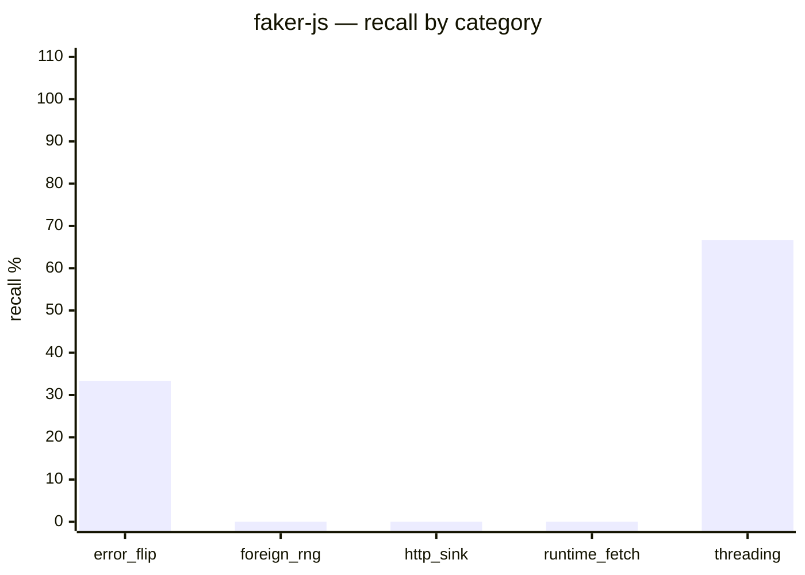
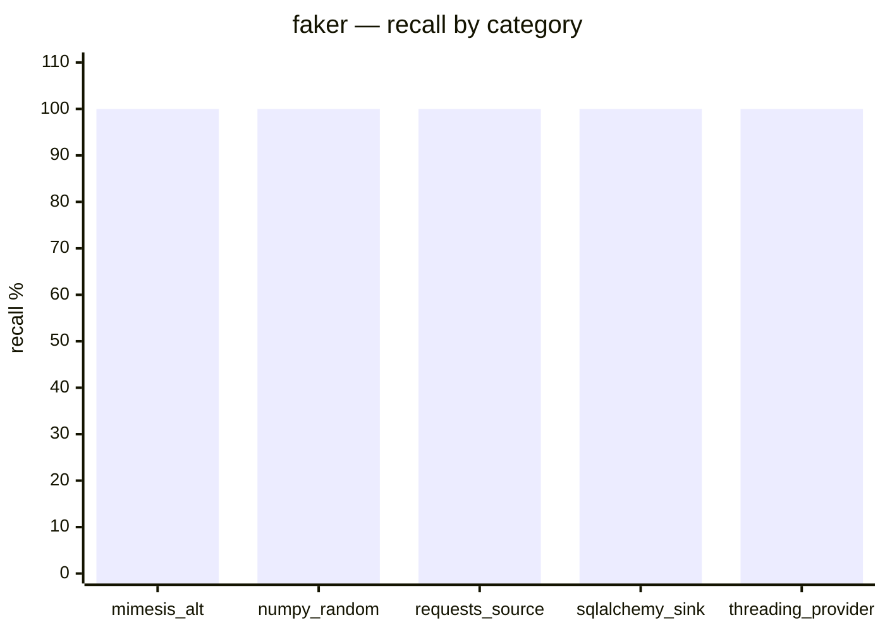
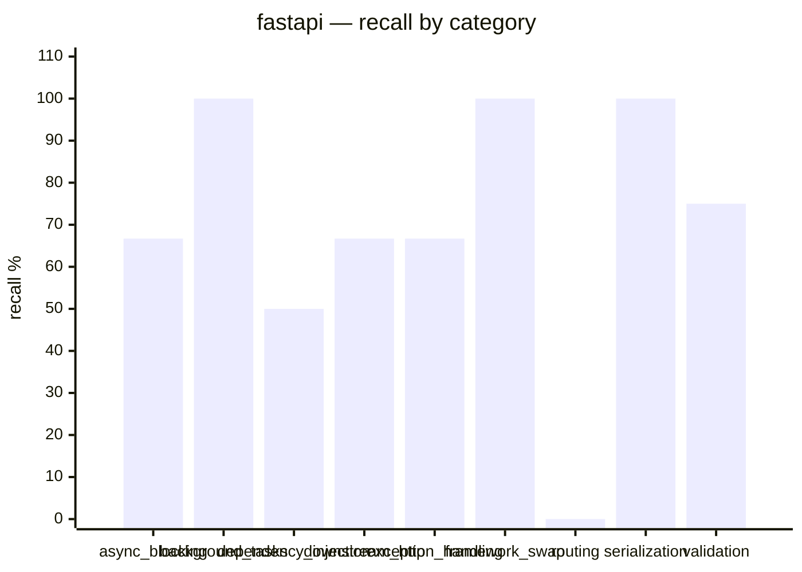
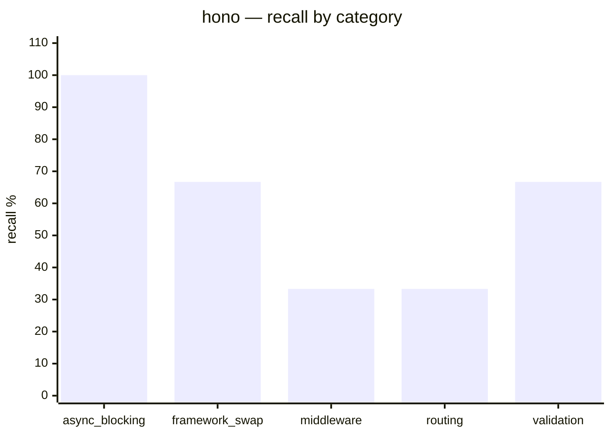
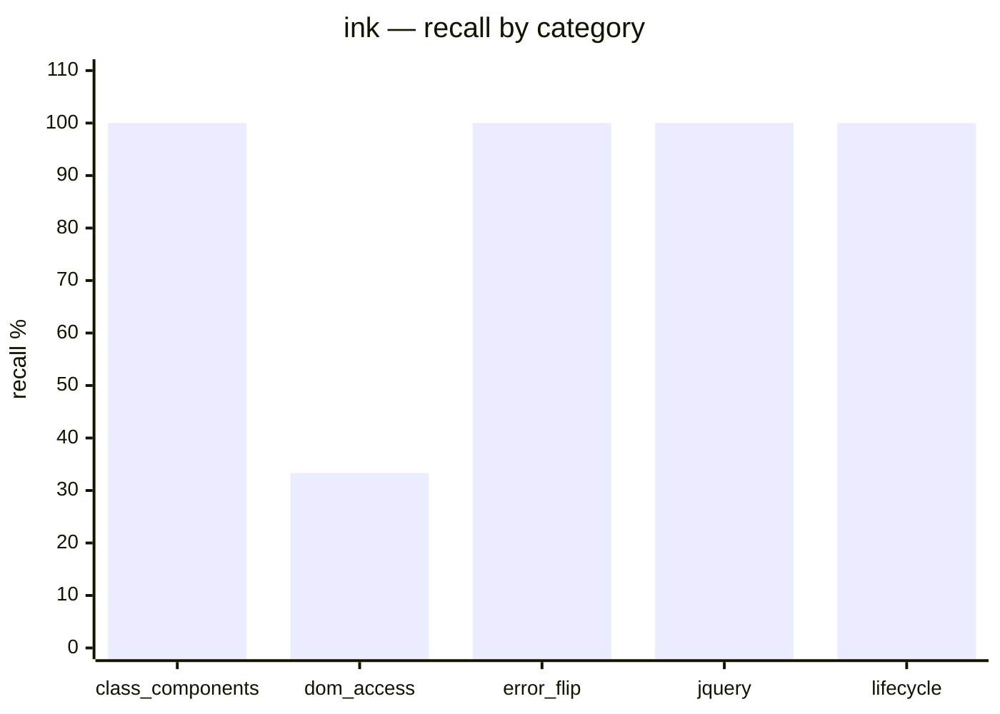
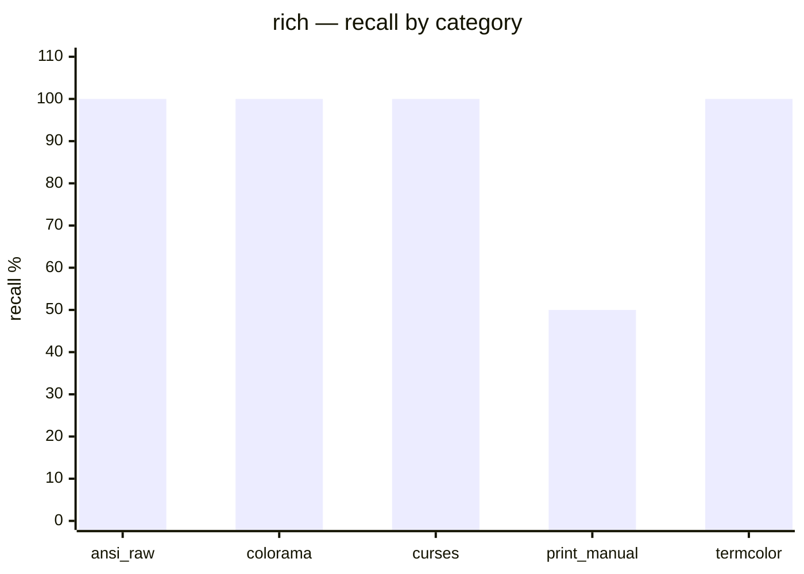

# argot-bench report

Generated: 2026-04-23T17:19:09.417159+00:00

## Headline

| Corpus | Lang | AUC | Recall | FP | Gap | N_fix | N_ctrl | Thr |
|:---|:---|---:|---:|---:|---:|---:|---:|---:|
| faker-js | typescript | 0.8568 | 20.0% | 5.0% | -9.851 | 15 | 71535 | 4.773 |
| faker | python | 0.9295 | 100.0% | 1.7% | -8.298 | 5 | 12603 | 5.211 |
| fastapi | python | 0.9915 | 69.4% | 0.3% | -4.379 | 31 | 8494 | 5.278 |
| hono | typescript | 0.7853 | 60.0% | 0.6% | -8.841 | 15 | 49032 | 4.427 |
| ink | typescript | 0.9881 | 86.7% | 1.1% | -6.728 | 15 | 14668 | 4.743 |
| rich | python | 0.9933 | 90.0% | 1.0% | -5.140 | 10 | 11502 | 4.164 |

_Gap = min(break) − max(control). Positive = clean separation; negative = overlap._

## faker-js (typescript)

### Summary

- **AUC (catalog vs real-PR controls):** 0.8568
- **Recall (mean across categories):** 20.0%
- **FP rate on real PR hunks:** 5.0% (3594/71535)
- **Threshold (mean across seeds):** 4.7729 (CV: 3.7%)
- **Calibration stability:** rel_var=0.006461, jaccard=0.1370
- **Separation gap (min break − max control):** -9.8513 (overlap)
- **Sample sizes:** 15 fixtures · 71535 real-PR controls

### Score distribution

| | n | min | p25 | median | p75 | p90 | max |
|:---|---:|---:|---:|---:|---:|---:|---:|
| Break (catalog) | 15 | 0.520 | 2.645 | 3.548 | 4.623 | 5.670 | 6.683 |
| Control (real PR) | 71535 | -9.300 | 0.000 | 0.055 | 1.833 | 3.470 | 10.371 |

Threshold **4.7729** — 12/15 breaks fall below it (misses), 3734/71535 controls fall at/above (false positives).

### Recall by category

### Per-category detail

| Category | Recall | Hits | Mean break score | Min | Max | Fixtures |
|:---|---:|---:|---:|---:|---:|:---|
| error_flip | 33.3% | 1/3 | 4.565 | 4.053 | 5.095 | faker_js_error_flip_1, faker_js_error_flip_2, faker_js_error_flip_3 |
| foreign_rng | 0.0% | 0/3 | 1.412 | 0.520 | 3.195 | faker_js_foreign_rng_1, faker_js_foreign_rng_2, faker_js_foreign_rng_3 |
| http_sink | 0.0% | 0/3 | 3.296 | 2.841 | 3.767 | faker_js_http_sink_1, faker_js_http_sink_2, faker_js_http_sink_3 |
| runtime_fetch | 0.0% | 0/3 | 2.656 | 1.971 | 3.548 | faker_js_runtime_fetch_1, faker_js_runtime_fetch_2, faker_js_runtime_fetch_3 |
| threading | 66.7% | 2/3 | 5.812 | 4.700 | 6.683 | faker_js_threading_1, faker_js_threading_2, faker_js_threading_3 |

### Per-fixture results

15 fixtures (click to expand)

| ID | Category | BPE | Flagged | Reason | File | Lines | Rationale |
|:---|:---|---:|:---:|:---|:---|:---|:---|
| faker_js_error_flip_1 | error_flip | 5.095 | ✓ | bpe | breaks/break_error_flip_1.ts | 3–11 | Provider throws mid-generation instead of returning a fake value |
| faker_js_error_flip_2 | error_flip | 4.546 | ✗ | none | breaks/break_error_flip_2.ts | 3–8 | Locale data accessor throws on missing entries instead of falling back |
| faker_js_error_flip_3 | error_flip | 4.053 | ✗ | none | breaks/break_error_flip_3.ts | 3–9 | seed() override throws, breaking the determinism contract |
| faker_js_foreign_rng_1 | foreign_rng | 0.520 | ✗ | none | breaks/break_foreign_rng_1.ts | 3–8 | Math.random instead of faker-js internal RNG |
| faker_js_foreign_rng_2 | foreign_rng | 3.195 | ✗ | none | breaks/break_foreign_rng_2.ts | 4–9 | crypto.randomBytes inside a word generator bypasses the seeded RNG |
| faker_js_foreign_rng_3 | foreign_rng | 0.520 | ✗ | none | breaks/break_foreign_rng_3.ts | 5–9 | Math.random index pick inside a person-name provider |
| faker_js_http_sink_1 | http_sink | 3.281 | ✗ | none | breaks/break_http_sink_1.ts | 4–13 | Provider method posts telemetry to an HTTP endpoint via axios |
| faker_js_http_sink_2 | http_sink | 3.767 | ✗ | none | breaks/break_http_sink_2.ts | 3–11 | Generator pipes every generated value to a remote log sink via fetch |
| faker_js_http_sink_3 | http_sink | 2.841 | ✗ | none | breaks/break_http_sink_3.ts | 3–9 | navigator.sendBeacon reporting inside a faker provider |
| faker_js_runtime_fetch_1 | runtime_fetch | 3.548 | ✗ | none | breaks/break_runtime_fetch_1.ts | 3–8 | Runtime fetch from a locale data file |
| faker_js_runtime_fetch_2 | runtime_fetch | 2.449 | ✗ | none | breaks/break_runtime_fetch_2.ts | 3–11 | ImageProvider.url() issues a live network fetch |
| faker_js_runtime_fetch_3 | runtime_fetch | 1.971 | ✗ | none | breaks/break_runtime_fetch_3.ts | 3–12 | CompanyProvider.name() fetches from a remote name-service |
| faker_js_threading_1 | threading | 4.700 | ✗ | none | breaks/break_threading_1.ts | 3–9 | Spawning a Worker from a locale module |
| faker_js_threading_2 | threading | 6.054 | ✓ | bpe | breaks/break_threading_2.ts | 1–10 | Module-level Worker pool inside a pure data file |
| faker_js_threading_3 | threading | 6.683 | ✓ | bpe | breaks/break_threading_3.ts | 3–10 | Generator implementation delegates to a Worker via postMessage |

### Missed fixtures (12)

Breaks that didn't trip the scorer (threshold 4.7729):

- **faker_js_threading_1** (`threading`) — score 4.6999, 0.0731 below threshold, reason: `none`
  - _Rationale:_ Spawning a Worker from a locale module
- **faker_js_error_flip_2** (`error_flip`) — score 4.5463, 0.2267 below threshold, reason: `none`
  - _Rationale:_ Locale data accessor throws on missing entries instead of falling back
- **faker_js_error_flip_3** (`error_flip`) — score 4.0527, 0.7202 below threshold, reason: `none`
  - _Rationale:_ seed() override throws, breaking the determinism contract
- **faker_js_http_sink_2** (`http_sink`) — score 3.7667, 1.0062 below threshold, reason: `none`
  - _Rationale:_ Generator pipes every generated value to a remote log sink via fetch
- **faker_js_runtime_fetch_1** (`runtime_fetch`) — score 3.5478, 1.2251 below threshold, reason: `none`
  - _Rationale:_ Runtime fetch from a locale data file
- **faker_js_http_sink_1** (`http_sink`) — score 3.2809, 1.4920 below threshold, reason: `none`
  - _Rationale:_ Provider method posts telemetry to an HTTP endpoint via axios
- **faker_js_foreign_rng_2** (`foreign_rng`) — score 3.1955, 1.5775 below threshold, reason: `none`
  - _Rationale:_ crypto.randomBytes inside a word generator bypasses the seeded RNG
- **faker_js_http_sink_3** (`http_sink`) — score 2.8413, 1.9316 below threshold, reason: `none`
  - _Rationale:_ navigator.sendBeacon reporting inside a faker provider
- **faker_js_runtime_fetch_2** (`runtime_fetch`) — score 2.4487, 2.3242 below threshold, reason: `none`
  - _Rationale:_ ImageProvider.url() issues a live network fetch
- **faker_js_runtime_fetch_3** (`runtime_fetch`) — score 1.9712, 2.8017 below threshold, reason: `none`
  - _Rationale:_ CompanyProvider.name() fetches from a remote name-service
- **faker_js_foreign_rng_1** (`foreign_rng`) — score 0.5200, 4.2529 below threshold, reason: `none`
  - _Rationale:_ Math.random instead of faker-js internal RNG
- **faker_js_foreign_rng_3** (`foreign_rng`) — score 0.5200, 4.2529 below threshold, reason: `none`
  - _Rationale:_ Math.random index pick inside a person-name provider

### Top 5 real-PR controls (closest to false positives)

| Rank | BPE | Flagged | Reason | File | Lines |
|---:|---:|:---:|:---|:---|:---|
| 1 | 10.371 | ✓ | bpe | src/locales/en/book/title.ts | 0–243 |
| 2 | 10.371 | ✓ | bpe | src/locales/en/music/album.ts | 0–926 |
| 3 | 10.371 | ✓ | bpe | src/locales/en/book/title.ts | 0–243 |
| 4 | 10.371 | ✓ | bpe | src/locales/en/music/album.ts | 0–926 |
| 5 | 10.371 | ✓ | bpe | src/locales/en/book/title.ts | 0–243 |

_Threshold is 4.7729; top control scores 10.3713._

### Stage attribution

- `bpe`: 3 (20.0%)
- `none`: 12 (80.0%)

## faker (python)

### Summary

- **AUC (catalog vs real-PR controls):** 0.9295
- **Recall (mean across categories):** 100.0%
- **FP rate on real PR hunks:** 1.7% (208/12603)
- **Threshold (mean across seeds):** 5.2111 (CV: 3.7%)
- **Calibration stability:** rel_var=0.006984, jaccard=0.0704
- **Separation gap (min break − max control):** -8.2984 (overlap)
- **Sample sizes:** 5 fixtures · 12603 real-PR controls

### Score distribution

| | n | min | p25 | median | p75 | p90 | max |
|:---|---:|---:|---:|---:|---:|---:|---:|
| Break (catalog) | 5 | 1.843 | 4.593 | 6.957 | 7.339 | 7.364 | 7.380 |
| Control (real PR) | 12603 | -1.301 | 0.848 | 1.170 | 2.069 | 3.097 | 10.141 |

Threshold **5.2111** — 2/5 breaks fall below it (misses), 251/12603 controls fall at/above (false positives).

### Recall by category

### Per-category detail

| Category | Recall | Hits | Mean break score | Min | Max | Fixtures |
|:---|---:|---:|---:|---:|---:|:---|
| mimesis_alt | 100.0% | 1/1 | 1.843 | 1.843 | 1.843 | mimesis_alt_1 |
| numpy_random | 100.0% | 1/1 | 4.593 | 4.593 | 4.593 | numpy_random_1 |
| requests_source | 100.0% | 1/1 | 7.380 | 7.380 | 7.380 | requests_source_1 |
| sqlalchemy_sink | 100.0% | 1/1 | 6.957 | 6.957 | 6.957 | sqlalchemy_sink_1 |
| threading_provider | 100.0% | 1/1 | 7.339 | 7.339 | 7.339 | threading_provider_1 |

### Per-fixture results

5 fixtures (click to expand)

| ID | Category | BPE | Flagged | Reason | File | Lines | Rationale |
|:---|:---|---:|:---:|:---|:---|:---|:---|
| mimesis_alt_1 | mimesis_alt | 1.843 | ✓ | import | breaks/break_mimesis_alt_1.py | 19–46 | mimesis Person/Address/Finance with Gender enum — competing fake-data library paradigm in a faker-looking file |
| numpy_random_1 | numpy_random | 4.593 | ✓ | import | breaks/break_numpy_random_1.py | 19–46 | numpy.random Generator/default_rng for name and age generation instead of faker internals in a faker-looking file |
| requests_source_1 | requests_source | 7.380 | ✓ | import | breaks/break_requests_source_1.py | 17–47 | requests.get() fetching real user data from HTTP APIs instead of local fake generation in a faker-looking file |
| sqlalchemy_sink_1 | sqlalchemy_sink | 6.957 | ✓ | import | breaks/break_sqlalchemy_sink_1.py | 17–49 | SQLAlchemy ORM model + session.add/commit to persist fakes — DB-sink paradigm in a faker-looking file |
| threading_provider_1 | threading_provider | 7.339 | ✓ | import | breaks/break_threading_provider_1.py | 19–53 | threading.Thread + Lock + Event parallel fake-data generator class in a faker-looking file |

### Top 5 real-PR controls (closest to false positives)

| Rank | BPE | Flagged | Reason | File | Lines |
|---:|---:|:---:|:---|:---|:---|
| 1 | 10.141 | ✓ | bpe | faker/providers/currency/ru_RU/__init__.py | 174–179 |
| 2 | 10.141 | ✓ | bpe | faker/providers/currency/uz_UZ/__init__.py | 173–178 |
| 3 | 10.141 | ✓ | bpe | faker/providers/currency/uz_UZ/__init__.py | 0–178 |
| 4 | 10.141 | ✓ | bpe | faker/providers/currency/ru_RU/__init__.py | 174–179 |
| 5 | 10.141 | ✓ | bpe | faker/providers/currency/ru_RU/__init__.py | 172–179 |

_Threshold is 5.2111; top control scores 10.1414._

### Stage attribution

- `import`: 5 (100.0%)

## fastapi (python)

### Summary

- **AUC (catalog vs real-PR controls):** 0.9915
- **Recall (mean across categories):** 69.4%
- **FP rate on real PR hunks:** 0.3% (24/8494)
- **Threshold (mean across seeds):** 5.2778 (CV: 0.4%)
- **Calibration stability:** rel_var=0.000106, jaccard=0.0617
- **Separation gap (min break − max control):** -4.3795 (overlap)
- **Sample sizes:** 31 fixtures · 8494 real-PR controls

### Score distribution

| | n | min | p25 | median | p75 | p90 | max |
|:---|---:|---:|---:|---:|---:|---:|---:|
| Break (catalog) | 31 | 2.980 | 5.136 | 5.877 | 6.567 | 6.852 | 7.361 |
| Control (real PR) | 8494 | -3.683 | 0.571 | 0.857 | 1.741 | 2.657 | 7.359 |

Threshold **5.2778** — 9/31 breaks fall below it (misses), 24/8494 controls fall at/above (false positives).

### Recall by category

### Per-category detail

| Category | Recall | Hits | Mean break score | Min | Max | Fixtures |
|:---|---:|---:|---:|---:|---:|:---|
| async_blocking | 66.7% | 2/3 | 6.619 | 5.247 | 7.361 | async_blocking_1, async_blocking_2, async_blocking_3 |
| background_tasks | 100.0% | 4/4 | 6.567 | 6.553 | 6.581 | background_tasks_1, background_tasks_2, background_tasks_3, background_tasks_4 |
| dependency_injection | 50.0% | 1/2 | 5.246 | 5.025 | 5.467 | dependency_injection_1, dependency_injection_2 |
| downstream_http | 66.7% | 2/3 | 5.196 | 3.557 | 6.153 | downstream_http_1, downstream_http_2, downstream_http_3 |
| exception_handling | 66.7% | 4/6 | 5.303 | 2.980 | 6.852 | exception_handling_1, exception_handling_2, exception_handling_3, exception_handling_4, exception_handling_5, exception_handling_6 |
| framework_swap | 100.0% | 3/3 | 5.449 | 5.281 | 5.786 | framework_swap_1, framework_swap_2, framework_swap_3 |
| routing | 0.0% | 0/3 | 3.536 | 2.980 | 4.309 | routing_1, routing_2, routing_3 |
| serialization | 100.0% | 3/3 | 6.503 | 5.877 | 7.128 | serialization_1, serialization_2, serialization_3 |
| validation | 75.0% | 3/4 | 5.264 | 2.980 | 6.504 | validation_1, validation_2, validation_3, validation_4 |

### Per-fixture results

31 fixtures (click to expand)

| ID | Category | BPE | Flagged | Reason | File | Lines | Rationale |
|:---|:---|---:|:---:|:---|:---|:---|:---|
| async_blocking_1 | async_blocking | 5.247 | ✗ | none | breaks/paradigm_break_subtle_sync_endpoint.py | 41–85 | the FastAPI corpus is dominated by async def endpoints; sync def endpoints with blocking I/O (time.sleep, requests.get, blocking DB calls… |
| async_blocking_2 | async_blocking | 7.361 | ✓ | bpe | breaks/paradigm_break_event_loop_blocking.py | 18–59 | asyncio.get_event_loop().run_until_complete() called inside async def endpoint bodies — incorrect usage that raises RuntimeError inside a… |
| async_blocking_3 | async_blocking | 7.250 | ✓ | bpe | breaks/paradigm_break_sync_file_io_async.py | 40–86 | OOV axis: blocking open() / Path.read_text() / json.loads() tight-loop calls inside async def endpoint bodies. Corpus evidence: 0 instanc… |
| background_tasks_1 | background_tasks | 6.581 | ✓ | bpe | breaks/paradigm_break_concurrent_futures_background.py | 55–87 | concurrent.futures executor.submit() called from each endpoint to dispatch deferred work, discarding the returned Future, instead of Fast… |
| background_tasks_2 | background_tasks | 6.553 | ✓ | bpe | breaks/paradigm_break_multiprocessing_background.py | 45–90 | multiprocessing.Process with daemon=True spawned from each endpoint instead of FastAPI BackgroundTasks.add_task(). multiprocessing.Proces… |
| background_tasks_3 | background_tasks | 6.553 | ✓ | bpe | breaks/paradigm_break_queue_carryover.py | 54–97 | Canonical pattern: docs_src/background_tasks/tutorial001_py310.py lines 12-15 — background_tasks.add_task() from an injected BackgroundTa… |
| background_tasks_4 | background_tasks | 6.581 | ✓ | bpe | breaks/paradigm_break_atexit_background.py | 68–100 | Deferred work accumulated in a module-level deque drained by a repeating threading.Timer, with atexit.register() as a flush safety net — … |
| dependency_injection_1 | dependency_injection | 5.467 | ✓ | bpe | breaks/paradigm_break_manual_generator_drain.py | 51–112 | Endpoints call next(get_db()) manually and manage teardown with try/finally, bypassing FastAPI's Depends() lifecycle. 428 Depends() sites… |
| dependency_injection_2 | dependency_injection | 5.025 | ✗ | none | breaks/paradigm_break_class_instance_no_depends.py | 73–120 | Service classes instantiated at module level and passed as plain default argument values (service: EmailService = email_service) instead … |
| downstream_http_1 | downstream_http | 3.557 | ✗ | none | breaks/paradigm_break_subtle_manual_status_check.py | 29–65 | FastAPI + httpx corpus uses response.raise_for_status() to propagate downstream errors; manually checking `if response.status_code >= 400… |
| downstream_http_2 | downstream_http | 6.153 | ✓ | bpe | breaks/paradigm_break_sync_requests_in_async.py | 17–73 | synchronous requests.get() / requests.post() with Session() inside async def endpoints blocks the event loop — the correct pattern is htt… |
| downstream_http_3 | downstream_http | 5.877 | ✓ | bpe | breaks/paradigm_break_aiohttp_no_context.py | 24–61 |  |
| exception_handling_1 | exception_handling | 6.852 | ✓ | bpe | breaks/paradigm_break_subtle_wrong_exception.py | 49–89 | decorators, Pydantic models, and Depends() are all idiomatic; the break is confined to the raise statements: ValueError, KeyError, and Ru… |
| exception_handling_2 | exception_handling | 2.980 | ✗ | none | breaks/paradigm_break_subtle_exception_swallow.py | 51–109 | decorators, Pydantic models, Depends(), HTTPException, and async def are all idiomatic; the break is purely structural: every endpoint bo… |
| exception_handling_3 | exception_handling | 6.781 | ✓ | bpe | breaks/paradigm_break_bare_except.py | 18–71 | every endpoint body wrapped in bare except: (no exception type) that silently returns empty data — broad exception-swallowing with no HTT… |
| exception_handling_4 | exception_handling | 3.028 | ✗ | none | breaks/paradigm_break_json_error_response.py | 51–100 | Endpoints return JSONResponse({"error": str(e)}) directly from except blocks instead of raising HTTPException. Canonical pattern: raise H… |
| exception_handling_5 | exception_handling | 6.852 | ✓ | bpe | breaks/paradigm_break_traceback_in_response.py | 46–100 | Endpoints expose full stack traces via traceback.format_exc() in response bodies on any exception. traceback.format_exc() is absent from … |
| exception_handling_6 | exception_handling | 5.326 | ✓ | bpe | breaks/paradigm_break_flask_errorhandler.py | 46–84 | Uses Flask's @app.errorhandler(...) decorator for exception registration instead of FastAPI's @app.exception_handler(...). Flask's errorh… |
| framework_swap_1 | framework_swap | 5.281 | ✓ | bpe | breaks/paradigm_break_django_cbv.py | 30–78 | FastAPI uses function-based endpoints with typed parameter injection; Django class-based views (View subclasses with def get/post methods… |
| framework_swap_2 | framework_swap | 5.281 | ✓ | bpe | breaks/paradigm_break_aiohttp_handler.py | 29–74 | FastAPI uses declarative method decorators with parameter injection; aiohttp's async def handler(request: web.Request), await request.jso… |
| framework_swap_3 | framework_swap | 5.786 | ✓ | bpe | breaks/paradigm_break_tornado_handler.py | 19–98 | tornado RequestHandler subclass with GET/POST methods using self.get_argument(), self.write(), self.finish(), and IOLoop — classic tornad… |
| routing_1 | routing | 4.309 | ✗ | none | breaks/paradigm_break_flask_routing.py | 28–67 | FastAPI uses @app.get / @router.post method-specific decorators and Pydantic parameter injection; Flask's @app.route(..., methods=[...]),… |
| routing_2 | routing | 3.321 | ✗ | none | breaks/paradigm_break_starlette_mount.py | 19–82 | bare Starlette Router with add_route() and url_for() instead of FastAPI's @router.get/@router.post DSL — imperative route registration wi… |
| routing_3 | routing | 2.980 | ✗ | none | breaks/paradigm_break_imperative_route_loop.py | 77–90 |  |
| serialization_1 | serialization | 5.877 | ✓ | bpe | breaks/paradigm_break_manual_json_response.py | 47–95 | explicit json.dumps() with custom default= for datetime/Decimal at every endpoint, wrapped in Response(content=..., media_type='applicati… |
| serialization_2 | serialization | 6.504 | ✓ | bpe | breaks/paradigm_break_manual_dict_response.py | 45–106 | Break axis: explicit field-by-field dict construction with manual float(), bool(), and .isoformat() coercions at every endpoint instead o… |
| serialization_3 | serialization | 7.128 | ✓ | bpe | breaks/paradigm_break_msgpack_response.py | 43–85 | Break axis: msgpack.packb() binary serialization with Response(media_type='application/x-msgpack') at every endpoint instead of JSON/resp… |
| validation_1 | validation | 6.226 | ✓ | bpe | breaks/paradigm_break_manual_validation.py | 29–84 | FastAPI's idiomatic pattern is Pydantic BaseModel parameter injection for automatic validation; accepting `body: dict = Body(...)` and th… |
| validation_2 | validation | 2.980 | ✗ | none | breaks/paradigm_break_voluptuous_validation.py | 30–84 | voluptuous Schema called manually inside endpoints for validation instead of Pydantic BaseModel injection — Schema, Required, Optional, A… |
| validation_3 | validation | 5.347 | ✓ | bpe | breaks/paradigm_break_cerberus_validation.py | 16–69 | cerberus Validator with schema dicts validates plain dict body params instead of Pydantic BaseModel injection — v.errors, validator.valid… |
| validation_4 | validation | 6.504 | ✓ | bpe | breaks/paradigm_break_assert_validation.py | 31–95 | Endpoints accept `body: dict = Body(...)` and validate fields with bare `assert` statements instead of Pydantic BaseModel injection. The … |

### Missed fixtures (9)

Breaks that didn't trip the scorer (threshold 5.2778):

- **async_blocking_1** (`async_blocking`) — score 5.2468, 0.0309 below threshold, reason: `none`
  - _Rationale:_ the FastAPI corpus is dominated by async def endpoints; sync def endpoints with blocking I/O (time.sleep, requests.get, blocking DB calls) block the event loop's thread pool — the decorator and Depends() vocabulary is correct but the sync + blocking-I/O combination is structurally absent from the corpus
- **dependency_injection_2** (`dependency_injection`) — score 5.0250, 0.2528 below threshold, reason: `none`
  - _Rationale:_ Service classes instantiated at module level and passed as plain default argument values (service: EmailService = email_service) instead of Depends(). FastAPI cannot manage lifecycle or substitute for testing. 0 corpus sites use this pattern vs 428 Depends() sites.
- **routing_1** (`routing`) — score 4.3089, 0.9688 below threshold, reason: `none`
  - _Rationale:_ FastAPI uses @app.get / @router.post method-specific decorators and Pydantic parameter injection; Flask's @app.route(..., methods=[...]), request.get_json(), request.args.get(), jsonify(), abort(), and app.run() are absent from the FastAPI corpus
- **downstream_http_1** (`downstream_http`) — score 3.5571, 1.7207 below threshold, reason: `none`
  - _Rationale:_ FastAPI + httpx corpus uses response.raise_for_status() to propagate downstream errors; manually checking `if response.status_code >= 400: raise HTTPException(...)` at every call site instead of calling raise_for_status() is a structural pattern absent from the corpus — all tokens are individually present but the branching structure is non-idiomatic
- **routing_2** (`routing`) — score 3.3206, 1.9572 below threshold, reason: `none`
  - _Rationale:_ bare Starlette Router with add_route() and url_for() instead of FastAPI's @router.get/@router.post DSL — imperative route registration with {id:int} path converters, no Pydantic and no Depends, is entirely absent from the FastAPI corpus
- **exception_handling_4** (`exception_handling`) — score 3.0281, 2.2497 below threshold, reason: `none`
  - _Rationale:_ Endpoints return JSONResponse({"error": str(e)}) directly from except blocks instead of raising HTTPException. Canonical pattern: raise HTTPException(status_code=..., detail=...) at 78 corpus sites. Single axis: error response constructed and returned at call site vs. raised and dispatched through registered exception handlers. Inline JSONResponse({"error": ...}) at endpoint scope is rare in corpus.
- **exception_handling_2** (`exception_handling`) — score 2.9797, 2.2981 below threshold, reason: `none`
  - _Rationale:_ decorators, Pydantic models, Depends(), HTTPException, and async def are all idiomatic; the break is purely structural: every endpoint body is wrapped in try/except Exception: pass or except Exception as e: logger.warning — broad exception-swallowing is absent from the FastAPI corpus, which propagates errors or handles specific exception types
- **validation_2** (`validation`) — score 2.9797, 2.2981 below threshold, reason: `none`
  - _Rationale:_ voluptuous Schema called manually inside endpoints for validation instead of Pydantic BaseModel injection — Schema, Required, Optional, All, Length, Range, Invalid, MultipleInvalid are voluptuous idioms entirely absent from the FastAPI corpus (0 import sites). Single axis: imperative schema-call validation vs declarative Pydantic parameter injection.
- **routing_3** (`routing`) — score 2.9797, 2.2981 below threshold, reason: `none`

### Top 5 real-PR controls (closest to false positives)

| Rank | BPE | Flagged | Reason | File | Lines |
|---:|---:|:---:|:---|:---|:---|
| 1 | 7.359 | ✓ | bpe | docs/en/docs/js/custom.js | 173–211 |
| 2 | 7.351 | ✓ | bpe | docs_src/generate_clients/tutorial004.js | 0–36 |
| 3 | 7.351 | ✓ | bpe | docs_src/generate_clients/tutorial004.js | 0–29 |
| 4 | 7.099 | ✓ | bpe | docs/en/docs/js/termynal.js | 71–85 |
| 5 | 6.514 | ✓ | bpe | docs/en/docs/js/init_kapa_widget.js | 0–29 |

_Threshold is 5.2778; top control scores 7.3591._

### Stage attribution

- `bpe`: 22 (71.0%)
- `none`: 9 (29.0%)

## hono (typescript)

### Summary

- **AUC (catalog vs real-PR controls):** 0.7853
- **Recall (mean across categories):** 60.0%
- **FP rate on real PR hunks:** 0.6% (317/49032)
- **Threshold (mean across seeds):** 4.4273 (CV: 4.0%)
- **Calibration stability:** rel_var=0.007256, jaccard=0.0185
- **Separation gap (min break − max control):** -8.8410 (overlap)
- **Sample sizes:** 15 fixtures · 49032 real-PR controls

### Score distribution

| | n | min | p25 | median | p75 | p90 | max |
|:---|---:|---:|---:|---:|---:|---:|---:|
| Break (catalog) | 15 | -1.736 | 1.334 | 4.713 | 5.778 | 6.341 | 6.406 |
| Control (real PR) | 49032 | -7.061 | 0.000 | 1.038 | 1.773 | 2.380 | 7.105 |

Threshold **4.4273** — 6/15 breaks fall below it (misses), 333/49032 controls fall at/above (false positives).

### Recall by category

### Per-category detail

| Category | Recall | Hits | Mean break score | Min | Max | Fixtures |
|:---|---:|---:|---:|---:|---:|:---|
| async_blocking | 100.0% | 3/3 | 5.988 | 5.744 | 6.406 | hono_async_blocking_1, hono_async_blocking_2, hono_async_blocking_3 |
| framework_swap | 66.7% | 2/3 | 4.356 | 1.484 | 6.373 | hono_framework_swap_1, hono_framework_swap_2, hono_framework_swap_3 |
| middleware | 33.3% | 1/3 | 1.226 | -1.736 | 5.304 | hono_middleware_1, hono_middleware_2, hono_middleware_3 |
| routing | 33.3% | 1/3 | 2.238 | 0.819 | 4.713 | hono_routing_1, hono_routing_2, hono_routing_3 |
| validation | 66.7% | 2/3 | 4.357 | 2.231 | 6.294 | hono_validation_1, hono_validation_2, hono_validation_3 |

### Per-fixture results

15 fixtures (click to expand)

| ID | Category | BPE | Flagged | Reason | File | Lines | Rationale |
|:---|:---|---:|:---:|:---|:---|:---|:---|
| hono_async_blocking_1 | async_blocking | 5.813 | ✓ | bpe | breaks/break_async_blocking_1.ts | 9–12 | fs.readFileSync blocking I/O inside a Hono request handler |
| hono_async_blocking_2 | async_blocking | 6.406 | ✓ | bpe | breaks/break_async_blocking_2.ts | 8–14 | fs.readFileSync and fs.statSync inside a streaming endpoint |
| hono_async_blocking_3 | async_blocking | 5.744 | ✓ | bpe | breaks/break_async_blocking_3.ts | 7–10 | child_process.execSync blocks the event loop per request |
| hono_framework_swap_1 | framework_swap | 1.484 | ✗ | none | breaks/break_framework_swap_1.ts | 5–12 | Express Router() idiom with (req, res) handlers mounted into a Hono app |
| hono_framework_swap_2 | framework_swap | 5.211 | ✓ | bpe | breaks/break_framework_swap_2.ts | 6–10 | Express (req: Request, res: Response) callback signature instead of Hono's Context |
| hono_framework_swap_3 | framework_swap | 6.373 | ✓ | bpe | breaks/break_framework_swap_3.ts | 7–10 | Express body-parser + cors middleware chain wired via app.use |
| hono_middleware_1 | middleware | 5.304 | ✓ | bpe | breaks/break_middleware_1.ts | 5–12 | Express (req, res, next) middleware signature in app.use |
| hono_middleware_2 | middleware | 0.110 | ✗ | none | breaks/break_middleware_2.ts | 9–14 | Express 4-arg (err, req, res, next) error-handler signature |
| hono_middleware_3 | middleware | -1.736 | ✗ | none | breaks/break_middleware_3.ts | 10–11 | Calling next() synchronously instead of Hono's await next() |
| hono_routing_1 | routing | 4.713 | ✓ | bpe | breaks/break_routing_1.ts | 6–12 | express.Router() mounted under app.use('/api', router) |
| hono_routing_2 | routing | 1.183 | ✗ | none | breaks/break_routing_2.ts | 6–14 | Router().route(path).get().post().delete() chain composition |
| hono_routing_3 | routing | 0.819 | ✗ | none | breaks/break_routing_3.ts | 7–14 | Express-shaped app.all('*', (req, res)) wildcard catch-all |
| hono_validation_1 | validation | 6.294 | ✓ | bpe | breaks/break_validation_1.ts | 7–13 | Hand-rolled email/password guards instead of a zod/valibot schema |
| hono_validation_2 | validation | 2.231 | ✗ | none | breaks/break_validation_2.ts | 7–13 | Manual typeof + length guards where a zod schema would fit |
| hono_validation_3 | validation | 4.547 | ✓ | bpe | breaks/break_validation_3.ts | 10–16 | Regex-literal phone/zip validation instead of a validator library |

### Missed fixtures (6)

Breaks that didn't trip the scorer (threshold 4.4273):

- **hono_validation_2** (`validation`) — score 2.2307, 2.1966 below threshold, reason: `none`
  - _Rationale:_ Manual typeof + length guards where a zod schema would fit
- **hono_framework_swap_1** (`framework_swap`) — score 1.4841, 2.9432 below threshold, reason: `none`
  - _Rationale:_ Express Router() idiom with (req, res) handlers mounted into a Hono app
- **hono_routing_2** (`routing`) — score 1.1832, 3.2441 below threshold, reason: `none`
  - _Rationale:_ Router().route(path).get().post().delete() chain composition
- **hono_routing_3** (`routing`) — score 0.8191, 3.6082 below threshold, reason: `none`
  - _Rationale:_ Express-shaped app.all('*', (req, res)) wildcard catch-all
- **hono_middleware_2** (`middleware`) — score 0.1104, 4.3169 below threshold, reason: `none`
  - _Rationale:_ Express 4-arg (err, req, res, next) error-handler signature
- **hono_middleware_3** (`middleware`) — score -1.7359, 6.1632 below threshold, reason: `none`
  - _Rationale:_ Calling next() synchronously instead of Hono's await next()

### Top 5 real-PR controls (closest to false positives)

| Rank | BPE | Flagged | Reason | File | Lines |
|---:|---:|:---:|:---|:---|:---|
| 1 | 7.105 | ✓ | bpe | src/jsx/base.test.tsx | 26–36 |
| 2 | 7.105 | ✓ | bpe | src/router/pattern-router/router.test.ts | 0–42 |
| 3 | 7.105 | ✓ | bpe | src/router/pattern-router/router.test.ts | 7–26 |
| 4 | 7.105 | ✓ | bpe | src/hono.test.ts | 376–460 |
| 5 | 7.105 | ✓ | bpe | src/router/pattern-router/router.test.ts | 0–451 |

_Threshold is 4.4273; top control scores 7.1051._

### Stage attribution

- `bpe`: 9 (60.0%)
- `none`: 6 (40.0%)

## ink (typescript)

### Summary

- **AUC (catalog vs real-PR controls):** 0.9881
- **Recall (mean across categories):** 86.7%
- **FP rate on real PR hunks:** 1.1% (162/14668)
- **Threshold (mean across seeds):** 4.7429 (CV: 10.6%)
- **Calibration stability:** rel_var=0.052844, jaccard=0.0847
- **Separation gap (min break − max control):** -6.7279 (overlap)
- **Sample sizes:** 15 fixtures · 14668 real-PR controls

### Score distribution

| | n | min | p25 | median | p75 | p90 | max |
|:---|---:|---:|---:|---:|---:|---:|---:|
| Break (catalog) | 15 | 2.105 | 5.428 | 6.310 | 8.833 | 8.833 | 8.833 |
| Control (real PR) | 14668 | -4.751 | -0.190 | 0.554 | 1.415 | 2.635 | 8.833 |

Threshold **4.7429** — 2/15 breaks fall below it (misses), 173/14668 controls fall at/above (false positives).

### Recall by category

### Per-category detail

| Category | Recall | Hits | Mean break score | Min | Max | Fixtures |
|:---|---:|---:|---:|---:|---:|:---|
| class_components | 100.0% | 3/3 | 8.833 | 8.833 | 8.833 | ink_class_components_1, ink_class_components_2, ink_class_components_3 |
| dom_access | 33.3% | 1/3 | 4.210 | 2.105 | 6.310 | ink_dom_access_1, ink_dom_access_2, ink_dom_access_3 |
| error_flip | 100.0% | 3/3 | 8.833 | 8.833 | 8.833 | ink_error_flip_1, ink_error_flip_2, ink_error_flip_3 |
| jquery | 100.0% | 3/3 | 6.404 | 5.428 | 8.357 | ink_jquery_1, ink_jquery_2, ink_jquery_3 |
| lifecycle | 100.0% | 3/3 | 5.428 | 5.428 | 5.428 | ink_lifecycle_1, ink_lifecycle_2, ink_lifecycle_3 |

### Per-fixture results

15 fixtures (click to expand)

| ID | Category | BPE | Flagged | Reason | File | Lines | Rationale |
|:---|:---|---:|:---:|:---|:---|:---|:---|
| ink_class_components_1 | class_components | 8.833 | ✓ | bpe | breaks/break_class_components_1.tsx | 5–15 | ES6 class component in a hooks-only ink codebase |
| ink_class_components_2 | class_components | 8.833 | ✓ | bpe | breaks/break_class_components_2.tsx | 8–18 | `extends Component` class with this.props / this.state in an ink file |
| ink_class_components_3 | class_components | 8.833 | ✓ | bpe | breaks/break_class_components_3.tsx | 8–21 | Class component with explicit constructor(props) in an ink file |
| ink_dom_access_1 | dom_access | 2.105 | ✗ | none | breaks/break_dom_access_1.tsx | 6–7 | document.getElementById + window.addEventListener in a terminal UI |
| ink_dom_access_2 | dom_access | 4.215 | ✗ | none | breaks/break_dom_access_2.tsx | 8–8 | window.location.href navigation inside a useInput handler |
| ink_dom_access_3 | dom_access | 6.310 | ✓ | bpe | breaks/break_dom_access_3.tsx | 9–10 | localStorage.getItem in an ink useEffect |
| ink_error_flip_1 | error_flip | 8.833 | ✓ | bpe | breaks/break_error_flip_1.tsx | 8–11 | throw new Error inside render via IIFE |
| ink_error_flip_2 | error_flip | 8.833 | ✓ | bpe | breaks/break_error_flip_2.tsx | 10–13 | throw inside a map callback in the render return |
| ink_error_flip_3 | error_flip | 8.833 | ✓ | bpe | breaks/break_error_flip_3.tsx | 8–15 | try/finally with throw but no catch inside render |
| ink_jquery_1 | jquery | 5.428 | ✓ | bpe | breaks/break_jquery_1.tsx | 7–9 | jQuery $('.item').on('click', ...) inside a functional component |
| ink_jquery_2 | jquery | 5.428 | ✓ | bpe | breaks/break_jquery_2.tsx | 8–12 | jQuery .show()/.hide() DOM manipulation from a hook |
| ink_jquery_3 | jquery | 8.357 | ✓ | bpe | breaks/break_jquery_3.tsx | 10–14 | $.ajax inside a useEffect where fetch/undici would be idiomatic |
| ink_lifecycle_1 | lifecycle | 5.428 | ✓ | bpe | breaks/break_lifecycle_1.tsx | 10–12 | componentDidMount + this.setState instead of useEffect |
| ink_lifecycle_2 | lifecycle | 5.428 | ✓ | bpe | breaks/break_lifecycle_2.tsx | 11–15 | Legacy componentWillReceiveProps lifecycle |
| ink_lifecycle_3 | lifecycle | 5.428 | ✓ | bpe | breaks/break_lifecycle_3.tsx | 11–16 | componentWillUnmount cleanup instead of useEffect return fn |

### Missed fixtures (2)

Breaks that didn't trip the scorer (threshold 4.7429):

- **ink_dom_access_2** (`dom_access`) — score 4.2150, 0.5279 below threshold, reason: `none`
  - _Rationale:_ window.location.href navigation inside a useInput handler
- **ink_dom_access_1** (`dom_access`) — score 2.1049, 2.6379 below threshold, reason: `none`
  - _Rationale:_ document.getElementById + window.addEventListener in a terminal UI

### Top 5 real-PR controls (closest to false positives)

| Rank | BPE | Flagged | Reason | File | Lines |
|---:|---:|:---:|:---|:---|:---|
| 1 | 8.833 | ✓ | bpe | test/flex-justify-content.tsx | 39–46 |
| 2 | 8.833 | ✓ | bpe | test/flex-justify-content.tsx | 39–46 |
| 3 | 8.831 | ✓ | bpe | test/flex-justify-content.tsx | 39–46 |
| 4 | 8.742 | ✓ | bpe | test/flex-justify-content.tsx | 39–46 |
| 5 | 8.479 | ✓ | bpe | test/flex-justify-content.tsx | 39–46 |

_Threshold is 4.7429; top control scores 8.8328._

### Stage attribution

- `bpe`: 13 (86.7%)
- `none`: 2 (13.3%)

## rich (python)

### Summary

- **AUC (catalog vs real-PR controls):** 0.9933
- **Recall (mean across categories):** 90.0%
- **FP rate on real PR hunks:** 1.0% (113/11502)
- **Threshold (mean across seeds):** 4.1642 (CV: 9.5%)
- **Calibration stability:** rel_var=0.037304, jaccard=0.0382
- **Separation gap (min break − max control):** -5.1405 (overlap)
- **Sample sizes:** 10 fixtures · 11502 real-PR controls

### Score distribution

| | n | min | p25 | median | p75 | p90 | max |
|:---|---:|---:|---:|---:|---:|---:|---:|
| Break (catalog) | 10 | 2.630 | 5.584 | 6.185 | 6.730 | 6.824 | 7.668 |
| Control (real PR) | 11502 | -1.086 | 0.797 | 1.210 | 1.654 | 2.320 | 7.770 |

Threshold **4.1642** — 1/10 breaks fall below it (misses), 71/11502 controls fall at/above (false positives).

### Recall by category

### Per-category detail

| Category | Recall | Hits | Mean break score | Min | Max | Fixtures |
|:---|---:|---:|---:|---:|---:|:---|
| ansi_raw | 100.0% | 2/2 | 4.836 | 4.215 | 5.457 | ansi_raw_1, ansi_raw_2 |
| colorama | 100.0% | 2/2 | 6.348 | 5.966 | 6.730 | colorama_1, colorama_2 |
| curses | 100.0% | 2/2 | 6.943 | 6.217 | 7.668 | curses_1, curses_2 |
| print_manual | 50.0% | 1/2 | 4.680 | 2.630 | 6.730 | print_manual_1, print_manual_2 |
| termcolor | 100.0% | 2/2 | 6.441 | 6.153 | 6.730 | termcolor_1, termcolor_2 |

### Per-fixture results

10 fixtures (click to expand)

| ID | Category | BPE | Flagged | Reason | File | Lines | Rationale |
|:---|:---|---:|:---:|:---|:---|:---|:---|
| ansi_raw_1 | ansi_raw | 5.457 | ✓ | bpe | breaks/break_ansi_raw_1.py | 18–43 | Manual ANSI escape code styling (\033[31m etc.) with print() in a rich-looking file |
| ansi_raw_2 | ansi_raw | 4.215 | ✓ | bpe | breaks/break_ansi_raw_2.py | 14–38 | Manual ANSI color code dict and progress bar using sys.stdout.write in a rich-looking file |
| colorama_1 | colorama | 6.730 | ✓ | import | breaks/break_colorama_1.py | 19–44 | colorama.init() + Fore/Back/Style paradigm for colored table output in a rich-looking file |
| colorama_2 | colorama | 5.966 | ✓ | import | breaks/break_colorama_2.py | 16–41 | colorama spinner and level-based log rendering with Fore/Back/Style in a rich-looking file |
| curses_1 | curses | 6.217 | ✓ | import | breaks/break_curses_1.py | 18–43 | curses.initscr/start_color/addstr/color_pair dashboard rendering in a rich-looking file |
| curses_2 | curses | 7.668 | ✓ | import | breaks/break_curses_2.py | 16–41 | curses navigable menu with KEY_UP/KEY_DOWN and color_pair highlight in a rich-looking file |
| print_manual_1 | print_manual | 2.630 | ✗ | none | breaks/break_print_manual_1.py | 19–40 | Plain print() with manual ljust/rjust for tabular output in a rich-looking file |
| print_manual_2 | print_manual | 6.730 | ✓ | bpe | breaks/break_print_manual_2.py | 19–42 | Plain print() with manual center/ljust/rjust for key-value report box in a rich-looking file |
| termcolor_1 | termcolor | 6.153 | ✓ | import | breaks/break_termcolor_1.py | 18–43 | termcolor.colored/cprint for banner, diff, and status line rendering in a rich-looking file |
| termcolor_2 | termcolor | 6.730 | ✓ | import | breaks/break_termcolor_2.py | 16–37 | termcolor.colored recursive dict-tree printer in a rich-looking file |

### Missed fixtures (1)

Breaks that didn't trip the scorer (threshold 4.1642):

- **print_manual_1** (`print_manual`) — score 2.6296, 1.5346 below threshold, reason: `none`
  - _Rationale:_ Plain print() with manual ljust/rjust for tabular output in a rich-looking file

### Top 5 real-PR controls (closest to false positives)

| Rank | BPE | Flagged | Reason | File | Lines |
|---:|---:|:---:|:---|:---|:---|
| 1 | 7.770 | ✓ | bpe | rich/_emoji_codes.py | 0–934 |
| 2 | 7.770 | ✓ | bpe | rich/_emoji_codes.py | 940–995 |
| 3 | 7.770 | ✓ | bpe | rich/_emoji_codes.py | 996–1022 |
| 4 | 7.770 | ✓ | bpe | rich/_emoji_codes.py | 1023–1067 |
| 5 | 7.770 | ✓ | bpe | rich/_emoji_codes.py | 1072–1577 |

_Threshold is 4.1642; top control scores 7.7700._

### Stage attribution

- `import`: 6 (60.0%)
- `bpe`: 3 (30.0%)
- `none`: 1 (10.0%)
