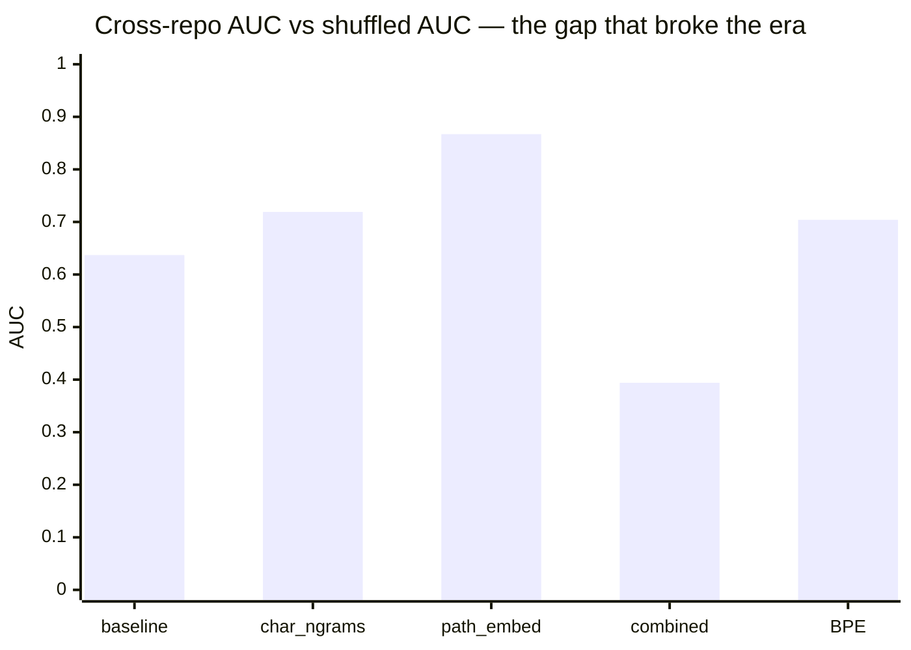

# The JEPA era (phases 1–6)

> **TL;DR.** Six sweeps along the obvious JEPA axes — context, capacity,
> epochs, n-grams, structural side-features, dense encoders. The
> eye-catching wins (cross-repo AUC up to 0.867) turned out to be
> **language detection**, not style discrimination. The only honest
> metric — shuffled AUC — plateaued at **0.713** at 20k records, well
> short of a usable style linter. More tuning would only produce more
> confident wrong numbers.

## The hypothesis we were testing

Argot's scoring model is trained under a **JEPA** objective — a joint embedding
predictive architecture, i.e. a model that embeds the surrounding context and
the changed hunk into the same vector space and learns to predict the target
from the context. A "stylish" hunk is one the predictor scores easily; an
out-of-style hunk is one it cannot. The Phase 2 sizing study had shown the
default JEPA setup was effectively random below 20k records and only modestly
useful above it (shuffled AUC 0.637 at 20k, 0.707 at 60k) — see the
[JEPA sizing plateau](evidence/jepa-sizing-plateau.md). The hypothesis
across phases 1–6 was that this plateau was a **tuning** problem: the
objective is right, the inputs and the encoder architecture are not yet.

So we ran six sweeps along the obvious axes — context window, embedding
capacity, training length, n-gram representation, structural side-features,
and learned dense token encoders — expecting one or two to clear the plateau.

## What we tried

- **Context after** (Phase 3 #1): wire the already-extracted `context_after`
  field into TF-IDF; +0.038 cross-repo at large, no regressions, otherwise tiny.
- **Embed dim 192 → 256** (Phase 3 #2): +0.013 cross at large, within noise.
- **Epochs 20 → 200** (Phase 3 #3): +0.213 cross at medium, but **−0.106
  cross at large** — overfitting; led to an adaptive `epochs = 1.4M / n` rule
  ([JEPA epochs overfitting](evidence/jepa-epochs-overfitting.md)).
- **Char n-grams** (Phase 3 #4, `char_wb` 3–5): the standout — large gains
  on every metric at every bucket, no regressions.
- **Imports-as-feature & path embedding** (Phase 3 #5–6): largest cross-repo
  numbers in the series, but classified as **repo-identity** signals (which
  packages, which directories) rather than style; shuffled AUC regressed.
- **Combined defaults** (Phase 4): char_ngrams + adaptive epochs +
  context_after promoted simultaneously; gains did not compound.
- **Word n-grams, token embeddings, BPE, transformer encoder** (Phases 5–6):
  the move from sparse TF-IDF to dense sequential encoders. Word n-grams
  failed a pre-set kill criterion against char_ngrams and gated out the
  transformer branch; token embeddings won shuffled AUC but collapsed
  cross-repo at large; BPE recovered some of that loss but not all.

## What the numbers said

The eye-catching wins (`char_ngrams` 0.719, `path_embed` 0.867) are
**cross-repo AUC** — scores on bucket pairs that mixed one TypeScript
repo with one Python repo. That metric was mostly measuring whether the
model could tell TS from Python, not whether it could spot a style break.
The same `path_embed` win — a 200-feature TF-IDF over file paths like
`packages/*/src/*.ts` vs `tests/test_*.py` — hit 0.867 without reading a
single line of code. When we held language and repo constant (shuffled
AUC), the best combined run plateaued at **0.713**.

| sweep | corpus / bucket | headline metric | Δ vs prior best | citation |
|:------|:----------------|:----------------|:----------------|:---------|
| baseline JEPA (TF-IDF) | TS+Py large (20k) | shuffled AUC 0.637 ± 0.006 | — (random below 20k) | [sizing plateau](evidence/jepa-sizing-plateau.md) |
| char_ngrams | TS+Py small (3k) | cross-repo AUC 0.719 ± 0.022 | +0.274 vs baseline 0.446 | [char n-grams sweep](evidence/jepa-char-ngrams-sweep.md) |
| path_embed | TS+Py small (3k) | cross-repo AUC 0.867 ± 0.006 | +0.421 vs baseline 0.446 | [path embed = repo ID](evidence/jepa-path-embed-repo-id-signal.md) |
| token_embed | TS+Py large (20k) | cross-repo AUC 0.457 ± 0.076 | −0.087 vs baseline 0.544 | [token embeddings collapse](evidence/jepa-token-embeddings-collapse.md) |
| combined defaults | TS+Py small (3k) | cross-repo AUC 0.394 ± 0.040 | −0.325 vs char_ngrams 0.719 | [wins did not compound](evidence/jepa-combined-wins-did-not-compound.md) |
| BPE (subword) | TS+Py large (20k) | shuffled AUC 0.704 ± 0.017 | +0.007 vs token_embed 0.697 | [BPE tokenisation sweep](evidence/jepa-bpe-tokenisation-sweep.md) |

## What broke the era

Two findings, both surfaced by the
[combined run where wins did not compound](evidence/jepa-combined-wins-did-not-compound.md),
forced the pivot.

### The wins did not compound

Stacking char_ngrams + adaptive epochs +
context_after gave the best shuffled AUC in the series at every size, but
regressed cross-repo by −0.325 at small and −0.170 at medium versus
char_ngrams alone. Different techniques pulled the model in different
directions and competed for capacity rather than adding up. There was no
obvious next sweep that would un-stick this.

### Cross-repo AUC was measuring the wrong thing

Every bucket paired one TypeScript repo with one Python repo, so cross-repo and injected
AUC were mostly **language detection**, not style discrimination. The path
embedding result made this brutally explicit: a 200-feature TF-IDF over
`packages/*/src/*.ts` vs `tests/test_*.py` reached cross-repo 0.867 at small
without reading a single line of code. The "biggest gains" of the era were
largely the model fingerprinting which repo a record came from. The only
honest metric left was shuffled AUC — same repo, same language, tokens in the
wrong order — and that ceiling was 0.713 at 20k for the
[best combination](evidence/jepa-combined-wins-did-not-compound.md), well
short of a usable style linter. More tuning of the same harness would only
buy us more confident wrong numbers.

## → next era

See [`docs/research/02-pivot-to-honest-eval.md`](02-pivot-to-honest-eval.md).
