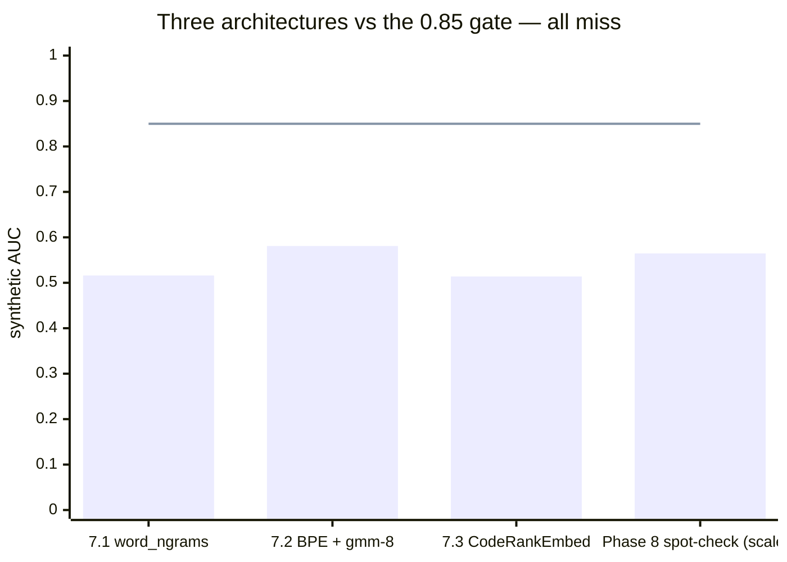

# The pivot to honest evaluation (phases 7–9)

> **TL;DR.** Same-language eval, one pass/fail gate (synthetic AUC
> 0.85), three architecture races back-to-back. **All three failed**
> (0.516 / 0.581 / 0.514). The diagnosis: distance-from-home objectives
> and semantics-preserving mutations are mathematically incompatible.
> Time to stop learning representations and start asking whether a
> single hunk carries any detectable signal at all.

## The hypothesis we were testing

Era 1 ended with a structural problem in the eval itself. Every bucket paired
one TypeScript repo with one Python repo, so `cross_auc` and `injected_auc`
were largely language detection, and the only honest metric left —
`shuffled_auc` — had plateaued at 0.713 on the best era-1 combination
([era 1 closing](01-jepa-era.md#what-broke-the-era)). We did not know
whether JEPA was adding *any* signal over trivial baselines on the sub-
problem that actually mattered: catching style violations in real code.

Phase 7 had two jobs: rebuild the eval so the primary metric was honest, then
race architectures against that eval with a single pass/fail gate. The target
was `synthetic_auc_mean ≥ 0.85` at the medium bucket on ≥ 2 of 3 seeds. The bet was
that once we fixed the eval, at least one of the four from-scratch encoders
(TF-IDF, word n-grams, token embeddings, BPE), or a density head, or a
frozen pretrained encoder, would cross the bar.

## What we tried

The new eval replaced TS+Py bucket pairs with **same-language pairs**
(httpx/requests, fastapi/flask, pydantic/django on Python; ky/zod, vite/
typescript-eslint, effect/angular on TypeScript), and introduced four
deterministic token-level mutations as the primary score: `case_swap`,
`debug_inject`, `error_flip`, `quote_flip`. Per-mutation AUC on held-
out normal records became `synthetic_auc_mean`; legacy TS+Py metrics were
kept for continuity but carried no decision weight.

On this frozen eval we ran three architecture experiments, each with a kill
gate at 0.85:

- **7.1 — Re-baseline.** All four existing from-scratch encoders scored against
  the new corpus (3 seeds × 6 buckets each, except BPE, killed after 7 runs
  when it tracked the others at the low end).
- **7.2 — Density heads on BPE.** Swap the JEPA predictor for a distance-based
  head: k-NN on mean-pooled BPE embeddings, plus GMMs with 8/16/32 components.
  This separated two hypotheses: was the predictor the bottleneck, or was
  the representation?
- **7.3 — Pretrained encoder + JEPA head.** Frozen `nomic-ai/CodeRankEmbed`
  (137M params, 768-dim), existing ArgotPredictor head. Pilot scope only
  (small-py and small-ts), because runtime made a full grid cost ~4 hours and
  the flat-trend priors from 7.1/7.2 made size-scaling unlikely to matter.

Phase 8 was the handoff sanity check: a cross-language spot-check running the
best Phase 7 pipeline against hand-authored paradigm-break fixtures on argot's
own CLI (Effect-TS) and engine (Python) repos, gated at overall delta ≥ 0.20.

## What the numbers said

> Phase 8's delta 0.0646 is plotted on the AUC axis as 0.5 + 0.0646/2 ≈ 0.565 for
> visual comparison; the actual gate was delta ≥ 0.20. Either way: well under.

| experiment | encoder + head | best `synthetic_auc_mean` | delta vs 0.85 gate | citation |
|:-----------|:---------------|:--------------------------|:-------------------|:---------|
| 7.1 re-baseline | word_ngrams + JEPA | 0.516 ± 0.007 (medium-py) | −0.334 | [jepa rebaseline on the honest corpus](evidence/jepa-rebaseline-honest-corpus.md) |
| 7.2 density heads | BPE + gmm-8 | 0.581 ± 0.014 (medium-py) | −0.269 | [density heads on BPE](evidence/density-heads-on-bpe.md) |
| 7.3 pretrained | CodeRankEmbed + JEPA | 0.514 ± 0.003 (small-py) | −0.336 | [pretrained encoder CodeRankEmbed](evidence/pretrained-encoder-coderankembed.md) |
| 8 spot-check | best Phase 7 pipeline | overall delta 0.0646 (gate 0.20) | −0.1354 | [paradigm-break spot-check](evidence/paradigm-break-spot-check.md) |

Three things the secondary metrics revealed, in order of importance:

### The pretrained encoder worked — just not for mutation detection

On the
7.3 pilot, CodeRankEmbed + JEPA hit `injected_auc` 0.942 ± 0.004 on small-py
and 0.965 ± 0.007 on small-ts, with `cross_auc_same_lang` 0.75 and
`shuffled_auc` 0.82–0.89 ([pretrained encoder CodeRankEmbed](evidence/pretrained-encoder-coderankembed.md)).
The representation discriminated repo origin, token order,
and foreign-hunk injection sharply. Synthetic mutations stayed at 0.50–0.52.

### Density heads traded sequential signal for repo-identity signal

GMM-16
on BPE cleared `cross_auc_same_lang` 0.868 at large-ts
([density heads on BPE](evidence/density-heads-on-bpe.md)) and picked
up the `case_swap` axis at medium-ts (0.780), but `shuffled_auc` collapsed
to exactly 0.500 — density scores a hunk by distance from the home
distribution, with no sequential input, so shuffled tokens sit at the same
distance as real ones.

### Two of four mutations were no-ops

`error_flip` and `quote_flip` landed
at exactly 0.500 across every encoder, head, and bucket in 7.1, 7.2, and
7.3, because ~half the held-out hunks lacked the trigger tokens (`raise`/
`throw`, quote characters) the mutations needed
([jepa rebaseline on the honest corpus](evidence/jepa-rebaseline-honest-corpus.md)).
Every `synthetic_auc_mean` was depressed for free by the two broken
mutations, each contributing 0.500 to the four-way mean. The broken mutations
were flagged for redesign but held frozen through Phase 7 per the no-
mid-phase-changes rule.

## What broke the era

Three back-to-back gate failures from architecturally distinct approaches
(from-scratch encoders, density heads, frozen pretrained) at 0.48–0.58 on
synthetic AUC ruled out the obvious levers. The Phase 7.3 write-up named the
cause: **no training signal anywhere in the loop targets mutations**. JEPA
surprise and density anomaly both measure distance from the home
distribution, but the mutations are engineered to stay inside that
distribution ([pretrained encoder CodeRankEmbed](evidence/pretrained-encoder-coderankembed.md)).

The Phase 8 spot-check then showed the problem was not just synthetic-eval-
specific: on hand-authored paradigm-break fixtures against argot's own
codebase, overall delta was 0.0646, well below the 0.20 gate, with the Python
engine side actually scoring negative (−0.0909) — paradigm-break fixtures
scored *lower* than control fixtures
([paradigm-break spot-check](evidence/paradigm-break-spot-check.md)).
Whatever signal Phase 7 had learned did not transfer to real-world style
violations.

Two conclusions for the next era. First, measuring "distance from home" as
a proxy for style was the wrong formulation — style violations are
semantics-preserving by construction, and an unsupervised objective trained
to predict real code has no reason to put them far from the distribution.
Second, if pretrained code embeddings already knew what `camelCase` and
`console.log` were (injected_auc 0.94+), the question was no longer *can we
learn useful representations* but *is there detectable signal in a single
hunk at all*. Before taking a third architecture swing, we needed to stop
and ask: is the hunk itself statistically different when style breaks, and
if so, on which token axis?

## → next era

See [era 3 — the BPE signal hunt](03-bpe-signal-hunt.md).
