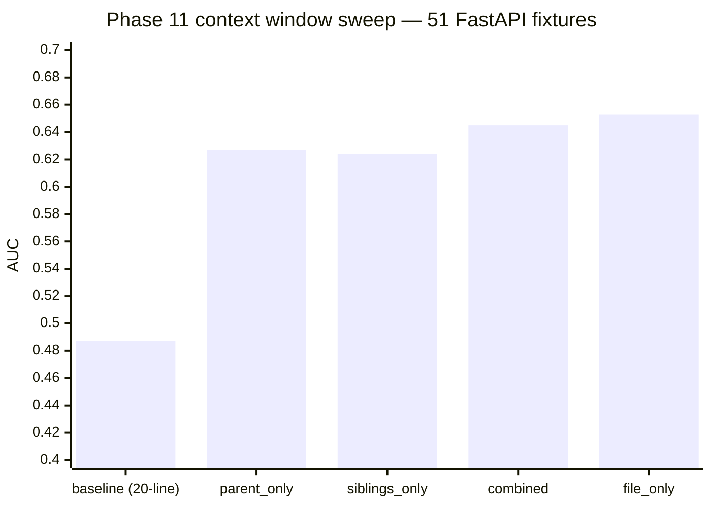
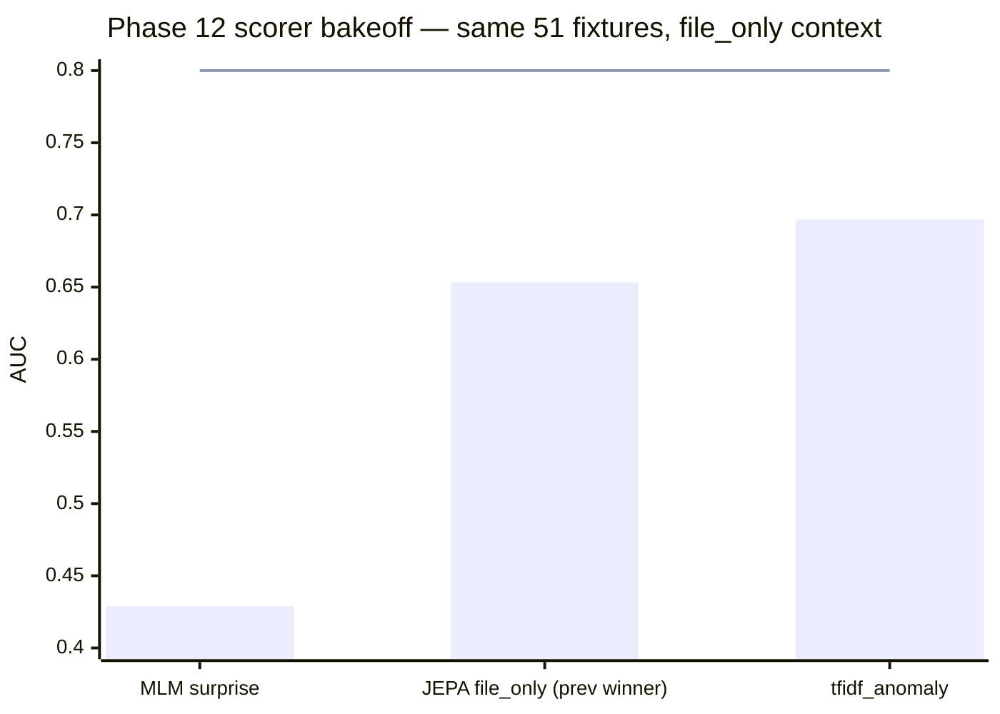

# The token-frequency signal hunt (phases 10–12)

> **TL;DR.** Before swinging at a third architecture, stop and ask the
> primitive question: is a style break statistically different at the
> token level? Two findings from the hunt: the 20-line lexical context
> window was **below chance** (AUC 0.487); replacing it with a full
> file-level window lifted JEPA to 0.653. And a zero-training
> **`tfidf_anomaly`** scorer then beat that at **AUC 0.6968** — JEPA
> was deposed by a frequency table. But still short of the 0.80 gate.

## The hypothesis we were testing

Era 2 ended with a direct diagnosis: no training signal in the loop
targeted mutations, and hand-authored paradigm breaks on argot's own
repos scored at overall delta 0.0646 against a 0.20 gate
([era 2 closing](02-pivot-to-honest-eval.md#what-broke-the-era)). Before
swinging at a third architecture, we needed a more primitive answer:
when a FastAPI break is written, is it statistically different from real
FastAPI code *at the token level*, and if so, on which axis?

A targeted re-read of the Phase 7–9 results characterised JEPA as
"fundamentally a vocabulary-level + structural-sequence detector, not a
semantic reasoner" ([jepa detection limits](evidence/jepa-detection-limits-diagnosis.md)).
It caught breaks whose hunk OOV rate was ≥ 8% against corpus vocabulary
(framework swaps, routing, serialization with `orjson`) at delta ≥ 0.20,
and silently failed on "correct vocabulary, wrong idiom" breaks —
`requests.get()` inside `async def`, `threading.Thread` inside
endpoints, marshmallow validators
([jepa detection limits](evidence/jepa-detection-limits-diagnosis.md)).
If JEPA's real contribution was vocabulary-level anomaly detection, a
much cheaper vocabulary-based scorer ought to reach the same frontier.

## What we tried

- **Phase 10 corpus audit.** Parsed 1083 FastAPI files (0 parse errors)
  and built per-category feature frequency tables: `@app.get` × 833,
  `Depends(...)` × 428, `BaseModel` × 384, `raise HTTPException` × 78,
  `BackgroundTasks` parameter × 10, `asyncio.create_task` in endpoint × 0
  ([FastAPI corpus audit](evidence/fastapi-corpus-audit.md)). The audit
  expanded the fixture set from 27 to 51 (31 break, 20 control, 9
  categories) and caught two inverted fixtures whose "break" vocabulary
  was more corpus-present than the control
  ([FastAPI corpus audit](evidence/fastapi-corpus-audit.md)).
- **Phase 10 structural-context scorers.** AST parent-scope, co-occurrence,
  and combined features, individually and blended at 0.25 / 0.50 / 0.75
  with JEPA.
- **Phase 11 context-window sweep.** Replaced the 20-line lexical window
  with four AST-derived context modes — `parent_only`, `file_only`,
  `siblings_only`, `combined` — each rebuilt from the FastAPI git tree
  (drop rate 0/2000 per mode).
- **Phase 12 MLM surprise bakeoff.** Joint-masking MLM surprise (mean,
  min, p05) against UniXCoder as a zero-training baseline.
- **Phase 12 token-anomaly re-benchmark.** Swept every existing
  non-JEPA scorer — `tfidf_anomaly`, `knn_cosine`, `lof_embedding`,
  `lm_perplexity`, three `ast_structural_*` variants — at Phase 11's
  `file_only` context on the same 51 fixtures, then ran a convex-simplex
  blend over the top-3 individuals.

## What the numbers said

**Finding 1 — the 20-line window was actively harmful.**

Every AST-derived context beat the 20-line baseline by ≥ +0.14 AUC.
`file_only` (full source file minus the hunk, 2000-char budget) took the
lead at **0.653** — biggest single-step AUC jump of the hunt, no scorer
change needed.

**Finding 2 — a frequency table beat JEPA at zero training cost.**

`tfidf_anomaly` — no GPU, no training loop, no neural network — beat
the Phase 11 JEPA winner by **+0.0436**. MLM came in inverted
(systematically ranked controls as more anomalous than breaks).

| experiment | key result | citation |
|:-----------|:-----------|:---------|
| 10 — JEPA on expanded corpus | `jepa (z)` AUC 0.6419; no AST blend surpassed it (best blend 0.6339) | [AST structural context blend](evidence/ast-structural-context-blend.md) |
| 11 — context window sweep | `baseline` (20-line) AUC 0.4871 — below chance; `file_only` AUC 0.6532 (+0.1661) | [AST context window sweep](evidence/ast-context-window-sweep.md) |
| 12 — MLM baseline | `mlm_surprise_mean` AUC 0.4290 (inverted); all three MLM variants below random | [MLM surprise bakeoff](evidence/mlm-surprise-bakeoff.md) |
| 12 — tfidf_anomaly | AUC 0.6968 — beats Phase 11 JEPA winner by +0.0436 with zero training | [tfidf-anomaly victory](evidence/tfidf-anomaly-victory.md) |
| 12 — simplex blend | best α = `{tfidf: 1.0, knn: 0.0, ast_zscore: 0.0}`; blend AUC 0.6968 = tfidf alone | [simplex blend refuses to mix](evidence/simplex-blend-refuses-to-mix.md) |

Three findings changed the next move.

### The 20-line lexical window was hurting, not helping

Phase 11's
baseline re-run of `EnsembleJepa mean_z` with the original 20-line
context landed at 0.4871 — below chance on 51 fixtures. Every AST-derived
context mode beat it by at least +0.1371 AUC, and `file_only` (full source
file minus the hunk, 2000-char budget) took the category lead to 0.6532
([AST context window sweep](evidence/ast-context-window-sweep.md)).
The lift was concentrated on `routing` (+0.3334),
`exception_handling` (+0.3334), and `background_tasks` (+0.3750 from a
0.0000 baseline), with zero categories regressing from the baseline.

### MLM surprise brought no useful signal

All three aggregations
(mean / min / p05) came in inverted on the 51-fixture set, systematically
ranking controls as more anomalous than breaks (overall AUC 0.4129–0.4290)
([MLM surprise bakeoff](evidence/mlm-surprise-bakeoff.md)).
The implementation switched to joint masking under MPS memory
constraints, which changes the conditional semantics; the per-token
variant was left unmeasured, but joint-masking MLM was cleanly ruled
out ([MLM surprise bakeoff](evidence/mlm-surprise-bakeoff.md)).

### A zero-training token-frequency scorer beat the JEPA ensemble

`tfidf_anomaly` at `file_only` context reached AUC 0.6968 on the same
51 fixtures — +0.0436 over the Phase 11 JEPA winner, with no training
and no GPU ([tfidf-anomaly victory](evidence/tfidf-anomaly-victory.md)).
Six of the nine categories were solid (`downstream_http` 1.0000, `serialization`
1.0000, `async_blocking` 0.8333, `validation` 0.7500, `framework_swap`
0.6667, `routing` 0.6667). `validation` in particular had been inverted
at 0.2500 under JEPA and was now at 0.7500. The convex simplex blend over
the three strongest individual scorers (`tfidf_anomaly`, `knn_cosine`,
`ast_structural_zscore`) put all weight on `tfidf_anomaly` and matched
the single-scorer number exactly
([simplex blend refuses to mix](evidence/simplex-blend-refuses-to-mix.md)).

## What broke the era

`tfidf_anomaly` was promoted over `EnsembleJepa mean_z` as the new
production default on the strength of +0.0436 AUC at zero training
cost ([tfidf-anomaly victory](evidence/tfidf-anomaly-victory.md)).
It was the era's clean win and the end of JEPA as the
production scorer. But the Phase 12 victory gate was not cleared, and the
three conditions that failed pointed at the same ceiling.

First, overall AUC stayed at 0.6968 against the 0.80 target, and the
paired bootstrap 95% CI on `tfidf_anomaly` vs the Phase 11 winner landed
at [0.5532, 0.8435] — a 0.29-wide band whose lower bound was 0.10 *below*
the JEPA baseline
([tfidf-anomaly victory](evidence/tfidf-anomaly-victory.md)). The gain was
real but not statistically tight on 51 fixtures.

Second, `background_tasks` remained inverted at 0.3750
([MLM surprise bakeoff](evidence/mlm-surprise-bakeoff.md)).
Both JEPA and `tfidf_anomaly` have the same blind
spot here: `BackgroundTasks.add_task()` is rare in commit diffs, while
`threading.Thread` and `asyncio.create_task` appear more often, so any
scorer that treats "anomalous against corpus frequency" as a proxy for
"non-idiomatic" gets it exactly backwards.

Third, and most telling for the next era — the simplex blend's refusal to
combine `tfidf_anomaly` with anything else meant the three candidate
scorers had no complementary signal on these fixtures. Token frequency
carried everything the blend was willing to use. If we wanted to break
through the token-frequency ceiling, the next signal had to come from a
structurally different place than the hunk itself.

## → next era

See [era 4 — the import-graph breakthrough](04-import-graph-breakthrough.md).
