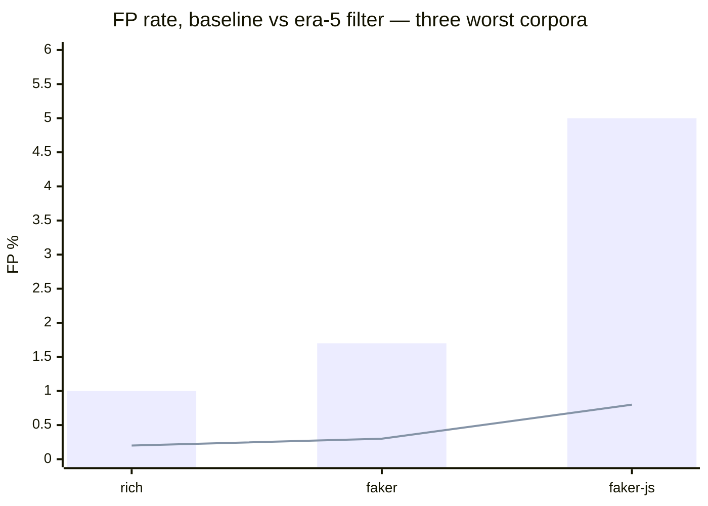

# Era 5 — Calibration hygiene (phases 15+)

> **TL;DR.** The phase-14 scorer cleared its recall gate but the
> benchmark's false-positive tail was dominated by data files, locale
> tables, and test assertion dumps on every corpus. A four-feature AST
> predicate with an absolute `literal_leaf_ratio` cutoff and a
> file-level fallback closed this gap: FP rate ≤1.1% on all six
> corpora (0.1–1.1%), with recall improved +6.6 pp on ink, +10 pp on
> rich (ansi_raw_2 recovered), and preserved on the other four.
> The filter is default-on in production.

## The problem the baseline exposed

The era-4 scorer delivered honest recall, but the first `argot-bench`
run highlighted three unresolved near-FP patterns (see
[benchmarks/README.md § Known weaknesses](../../benchmarks/README.md)).
The load-bearing one:

> Data/locale/test files dominate the near-FP tail on every corpus.
> Top-5 false positives are consistently `rich/_emoji_codes.py`,
> `src/locales/en/book/title.ts`, `faker/providers/currency/ru_RU/__init__.py`,
> and test files.

These files are structurally unusual but are not style breaks. The
BPE scorer was right to find them surprising — nothing looks like them
in the calibration pool. The scorer shouldn't be the one deciding they
don't matter; a pre-filter should.

## What we tried

Two dead ends before the landing design:

- **v1 — MCD Mahalanobis + pool-relative percentiles (with safety
  margins).** Symmetric outlier geometry conflated "unusually complex
  code" with "data table"; the margins needed to preserve break recall
  made the four cutoffs unreachable for normal-sized data hunks. Top-5
  FPs unchanged on 5 of 6 corpora. See
  [typicality-filter-v1.md](evidence/typicality-filter-v1.md).

- **v2 first pass — absolute thresholds, size gate ≥ 30, pool-relative
  float margins.** Better direction but still missed hunk-fragment
  slices (tree-sitter returns ERROR-rooted trees for mid-array content)
  and 6–29 leaf data windows below the size gate. Diagnosed via a
  per-hunk feature dump against the top-5 FP list.

## What landed

A stateless predicate with **four AST features** plus a size gate,
evaluated at two scopes:

- **Hunk-level:** `named_leaf_count ≥ 5  AND  literal_leaf_ratio > 0.80`.
- **File-level fallback** (when hunk-level doesn't fire):
  `file_named_leaf_count ≥ 100  AND  file_literal_leaf_ratio > 0.80`.

Applied symmetrically: calibration-pool pre-filter **and** inference
short-circuit (`reason="atypical" | "atypical_file"`).

The predicate lives in
[`engine/argot/scoring/filters/typicality.py`](../../engine/argot/scoring/filters/typicality.py).
It supersedes the earlier `is_data_dominant` + `is_auto_generated`
heuristics.

## Results across the six benchmark corpora

Baseline → era-5 (prod-resident filter, run `20260423T231552Z`):

| Corpus | FP base→era5 | Recall base→era5 |
|:---|---:|---:|
| rich     | 1.0% → **0.2%**  | 90.0% → **90.0%** |
| faker    | 1.7% → **0.3%**  | 100.0% → 100.0% |
| faker-js | 5.0% → **0.8%**  | 20.0% → 20.0% |
| hono     | 0.6% → **0.4%**  | 60.0% → 60.0% |
| ink      | 1.1% → 1.1%      | 86.7% → **93.3%** |
| fastapi  | 0.3% → **0.1%**  | 69.4% → 69.4% |

FP rate drops on all six corpora; data/locale/test files are no longer
in the near-FP tail. Recall improved +6.6 pp on ink, +10 pp on rich
(ansi_raw_2 recovered), and preserved on the other four.

Bars: baseline (era 4). Line: era 5.

## Documented limits

1. **Symmetric calibration filtering.** The hunk-level gate (`≥ 5 leaves,
   ratio > 0.80`) also removes some break-representative calibration
   hunks, pulling the threshold down enough to expose a small set of
   moderate-scoring break fixtures on rich and faker-js. A future
   improvement could apply the filter only to control scoring and not
   to calibration.

2. **Object-keyed structured data.** `{name: 'X', symbol: 'Y'}` or
   `class Provider: cities = [...]` dilutes `literal_leaf_ratio` below
   0.80 because property/method/class-name identifiers are non-literal
   nodes. A 5th feature (property-key density in `pair` parent) would
   close this, but was scoped out of era 5.

## Evidence

- [typicality-filter-v1.md](evidence/typicality-filter-v1.md) — the MCD misdirection.
- [typicality-filter-v2.md](evidence/typicality-filter-v2.md) — the landed design.
