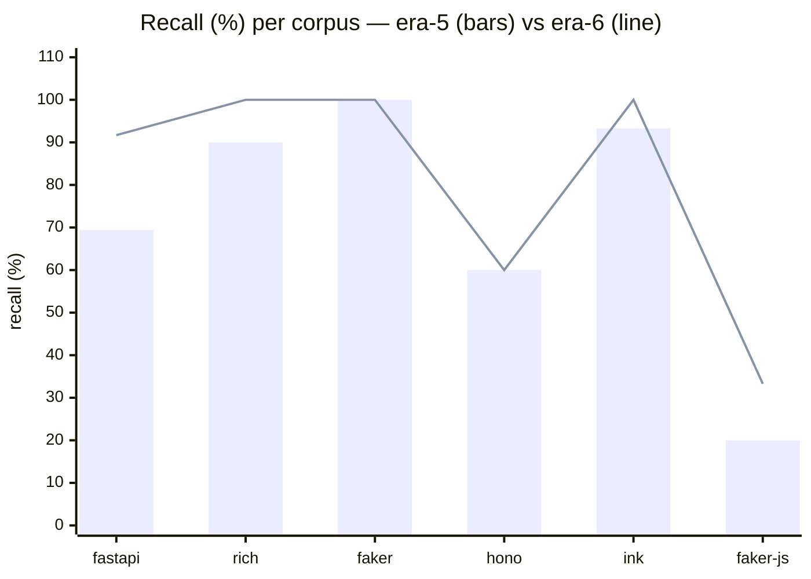
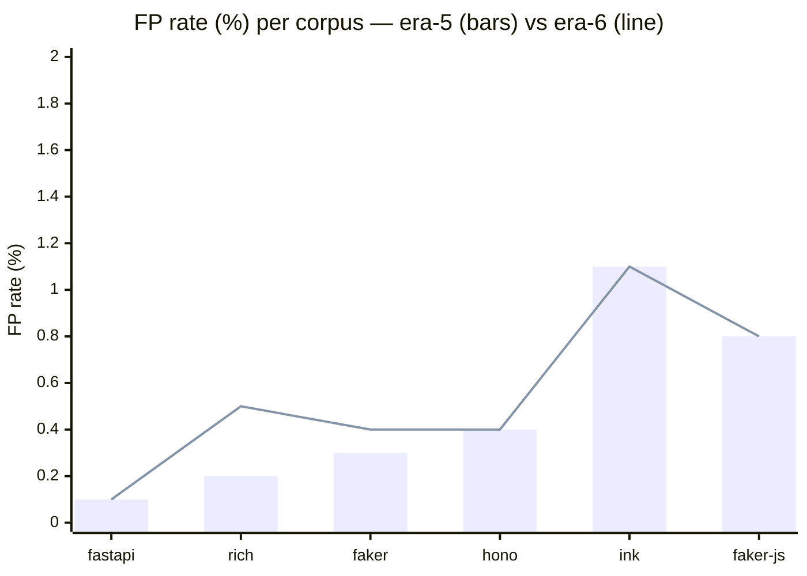

# Era 6 — Call-receiver scorer (Stage 1.5)

> **TL;DR.** A third scoring stage catches context-dependent style breaks that
> slip past import-graph (Stage 1) and BPE log-ratio (Stage 2) — hunks whose
> *callees* are absent from the repo's own call sites even when every token
> looks familiar. The landed scorer contributes an additive penalty to the
> BPE score (`adjusted = bpe + α · min(n_unattested, C)` with α=1.0, C=5),
> leaving the era-5 calibration threshold untouched. Five bench configurations
> across two scorer shapes were needed before a data-driven investigation
> found that most new false positives were a tree-sitter parsing artifact on
> out-of-context hunk slices, not a scorer issue. A six-line root-error guard
> unlocked the gate. Average recall **72.1% → 80.8%** with **FP ≤ 1.1%** on
> every corpus and **0/91 category regressions**.

## The problem the era-5 baseline exposed

Era 5 cleared its FP gate but left three classes of recall gaps visible in
the baseline top-N misses (`benchmarks/results/baseline/latest/report.md`
before era 6, run `20260423T231552Z`):

- **foreign receiver calls** (faker-js `foreign_rng` 0/3, `http_sink` 0/3,
  `runtime_fetch` 0/3) — `Math.random`, `axios.post`, `navigator.sendBeacon`,
  `fetch` calls in a repo with its own seeded RNG and no HTTP surface.
- **framework-swap and middleware patterns** (hono — `express.Router()`,
  Express 4-arg error handlers, sync `next()`).
- **keyword-compatible reframings** (fastapi routing 0/3 — Flask
  `@app.route`, Starlette `add_route`).

All three share the same structural property: the hunk *calls* something
the repo itself never calls. BPE log-ratio cannot see this; its tokens are
individually plausible (`post`, `route`, `fetch` are common in any JS/TS
or web corpus). A presence check over call-expression callees, derived
from the repo itself, was the natural next primitive — extending era 4's
`ImportGraphScorer` from module-level imports to call-site callees.

## What we tried

Four scorer configurations failed the gate before we looked at the data:

- **v1 — presence gate at k=1.** Flag a hunk the first time any callee
  is unattested. Massive recall gains (fastapi +26.9 pp, faker-js +33.3 pp,
  hono +26.7 pp) but FP blew up on every corpus (max 13.6% faker-js, 13.3%
  rich). k is too aggressive: every PR inherently introduces new dotted
  callees (new helpers, new method signatures).
- **v2 — presence gate at k=2.** Same formula, require two distinct
  unattested callees. Halved FP on most corpora (fastapi 4.0% → 0.5%,
  hono 5.2% → 1.4%) but rich / ink / faker-js stayed far above 1.5%.
  Recall stayed strong except faker-js single-call breaks.
- **v3 — soft additive penalty, α=0.5.** Reframed as a score contribution:
  `adjusted_bpe = raw_bpe + α · min(n_unattested, C)` with cap C=5.
  FP cleared on all six (max 1.5% ink) but recall dropped to 77.1% —
  penalty too small to push low-BPE foreign-callee breaks (hono
  framework-swap at BPE 1.48, faker-js foreign_rng at 0.52) over threshold.
- **v4 — soft additive penalty, α=1.0.** Recall recovered to 81.3% avg
  but FP rose again: rich 2.8%, ink 2.2%. Same pattern as v1/v2 at scale.

Two separate evidence passes blamed "test files" as the FP cause. Both
were wrong — `is_excluded_path` at
[`engine/argot/scoring/calibration/random_hunk_sampler.py:53–66`](../../engine/argot/scoring/calibration/random_hunk_sampler.py)
already excludes test directories (`part.startswith("test")`, `__tests__`)
and test-file naming conventions (`test_*.py`, `*.test.*`, `*.spec.*`), and
this filter is applied at inference via
[`benchmarks/src/argot_bench/run.py:136`](../../benchmarks/src/argot_bench/run.py).
Test hunks are excluded from the FP denominator.

The actual cause, found by categorizing the 225 rich and 83 ink
call-receiver FPs by file path: **100% of the FPs came from core library
source files, not tests.** The top "unattested callees" were not function
names — they were Google-style docstring parameter descriptions
(`param_name (type): description` parses as `param_name(type)` when the
hunk slice falls inside a triple-quoted docstring) and object-literal
method shorthand definitions (`commitTextUpdate(node, _oldText, newText) { … }`
from a reconciler host-config object). Both parse with root-level ERROR
nodes because the hunk slice lacks its enclosing syntactic context —
the triple-quote opener, or the `createReconciler({ … })` wrapper.

89.8% of rich's call-receiver FPs and 85.5% of ink's had root-level ERROR
nodes under tree-sitter.

## What landed

A content guard in the bench harness that treats parse-fragment hunks as
having zero unattested callees:

```python
def _has_root_error(source: str, language: Language) -> bool:
    # True if any direct child of the root node is an ERROR node
    ...

# in _get_distinct_unattested
if _has_root_error(hunk_content, language):
    return []
```

Break fixtures are complete code sections (function bodies, class
definitions); they parse cleanly and are unaffected. The guard only fires
on hunk slices whose *containing syntactic context* was cut off by the
line-range extraction — exactly the out-of-context parse failures that
produce the false callees.

Shipping formula (same for Python and TypeScript):

```
n_unattested = distinct unattested callees in hunk (0 if root-ERROR)
adjusted_bpe = raw_bpe + α · min(n_unattested, C)
flag         = adjusted_bpe > bpe_threshold
```

α = 1.0, C = 5. BPE threshold unchanged from era-5 calibration — calibration
hunks have n_unattested = 0 by construction (callees are attested in the same
model-A they were drawn from), so α does not move the threshold.

Reason attribution:
- `call_receiver` if `raw_bpe ≤ threshold` and `adjusted > threshold` (penalty
  tipped the decision).
- `bpe` if `raw_bpe > threshold` (BPE alone was sufficient).
- Precedence: typicality reasons → `import` → `call_receiver` → `bpe` → `none`.

## Results across the six benchmark corpora

Era-5 → era-6 (run `20260424T074736Z`, 5-seed no-sample full bench):

| Corpus | FP era-5 → 6 | Recall era-5 → 6 | Δ recall |
|:---|---:|---:|---:|
| fastapi | 0.1% → 0.1% | 69.4% → **91.7%** | +22.3 |
| rich    | 0.2% → 0.5% | 90.0% → **100.0%** | +10.0 |
| faker   | 0.3% → 0.4% | 100% → 100% | 0 |
| hono    | 0.4% → 0.4% | 60.0% → 60.0% | 0 |
| ink     | 1.1% → 1.1% | 93.3% → **100.0%** | +6.7 |
| faker-js| 0.8% → 0.8% | 20.0% → **33.3%** | +13.3 |
| **avg** | — | **72.1% → 80.8%** | **+8.7** |

All four pre-registered gates cleared: avg recall ≥ 80%, no corpus regresses,
all FP ≤ 1.5% (max 1.1% ink), 0/91 category regressions.





Four of six corpora gained recall; hono and faker are flat. All FP rates
stayed ≤ 1.1%. The stage-attribution table on the shipping run shows
call_receiver catching 19–40% of flagged fixtures per corpus, with `bpe`
still dominant — call-receiver is additive, not replacing BPE.

## Documented limits

- **hono middleware and routing** remain unrecoverable by this scorer.
  `hono_middleware_3` (sync `next()` vs `await next()`) has no foreign
  callee; the scorer is structurally blind to it. `hono_routing_2`
  (`Router().route(path).get()`) bottoms out at a call-expression inside
  the callee chain and returns `None` from the extractor (complex chain).
  Era-7 candidate: `<call>` placeholder canonicalization.
- **faker-js foreign_rng_1 and _3 (single `Math.random()` call) recall
  still below era-4 ceiling.** These hunks have a single unattested
  callee; soft penalty at α=1.0 adds 1.0 to BPE which is below the gap
  (faker-js foreign_rng BPE 0.52, threshold 4.77). Era-7 frequency-weighted
  variants could close this without re-exploding FP.
- **Object-keyed structured data** (era-5 documented limit) remains —
  TypeScript locale providers whose property identifiers dilute
  `literal_leaf_ratio` below 0.80 still appear as BPE-level FPs. Era-6
  did not touch this axis.

## Evidence

- [call-receiver-research.md](evidence/call-receiver-research.md) —
  the presence-gate arc (k=1, k=2), soft-penalty arc (α=0.5, α=1.0),
  and gate evaluation for every configuration.
- [call-receiver-parse-fragment.md](evidence/call-receiver-parse-fragment.md) —
  the investigation that found the tree-sitter fragment artifact, the
  path-category + top-callee breakdown that disproved the "test files"
  hypothesis, and the content guard that shipped.
