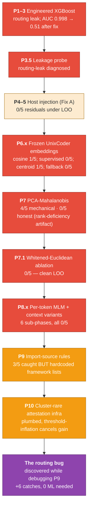
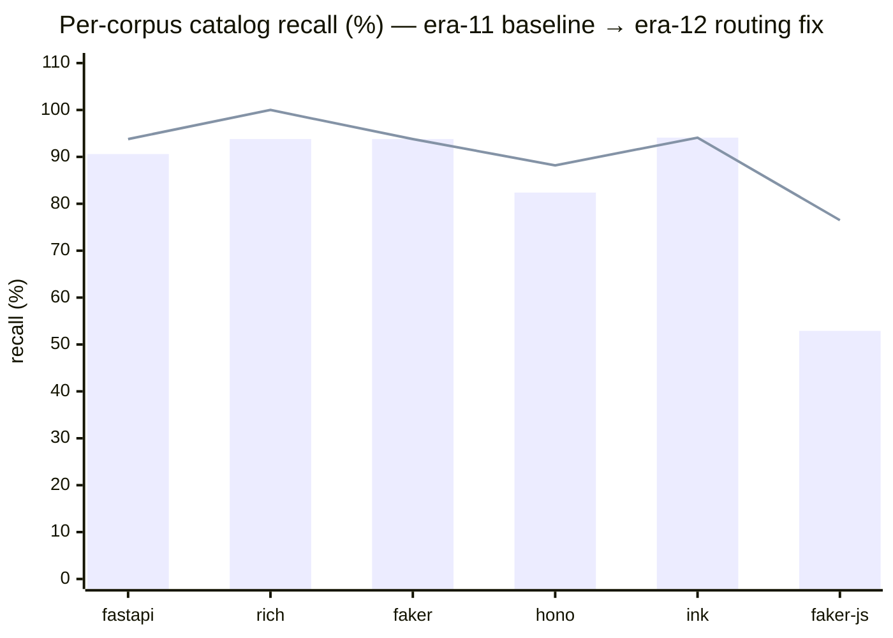

# Era 12 — the ML stage hunt, and the routing bug it found

> **TL;DR.** Era 12 set out to add a Stage-4 ML detector for the 5 faker-js
> "residuals" era 11 was missing. Across 9 phases of ML investigation
> (engineered features, frozen UnixCoder embedding distance variants,
> per-token MLM with and without context, single-pass per-token NN, max-z
> ensembles, rule-based import-source) the best honest result was **1/5
> residual catches** (Phase 6.4 cosine cluster centroid). While debugging
> Phase 9, a routing bug surfaced in the bench's catalog scoring code path
> that had been silently defeating era-11's cluster-conditional attestation
> rule for **every** catalog fixture across all 6 corpora. Fixing the
> routing — without any new ML — recovered **+6 catalog catches across 4
> corpora** and lifted **per-category mean recall 89.97% → 91.5%** (and
> fixture-count recall 85.2% → 91.3%, +6.1pp) with FP rates within
> +0.05pp of every per-corpus target.
>
> Era 11's design was correct all along; the bench had been silently
> defeating it. We hunted for a missing detector for 9 phases on a
> premise that was upstream-buggy.

---

## The hypothesis we were testing

Era 11 closed with 5 faker-js fixtures still uncaught (`error_flip_2/3`,
`runtime_fetch_1/2/3`). The era-11 evidence said cluster-conditional
attestation didn't fire on them because their key callees (`fetch`,
`Error`, `res.json`) were attested somewhere in the cluster's union. We
believed: era 11 *cannot* see these by design; we need a Stage 4 ML
detector that *can*.

We tested every reasonable shape of frozen-encoder + classical-ML
detector:

---

## Phase-by-phase, honestly

### P1–3 · Engineered features and the routing-leak red herring

Built an `argot-extract-features` CLI emitting per-hunk feature vectors
as JSONL. Phase 3 pooled XGBoost gave AUC 0.9998 with 5/5 residual
catches — an obvious leak. Phase 3.5 found it: a single binary feature
`cluster_assignment_method == "fallback_jaccard"` got AUC **0.9533**
alone. Catalog fixtures used phantom paths that hit the Jaccard fallback
while controls hit the static lookup — perfect predictor of `is_break`.
This was the **first appearance** of the routing pathology, but at the
time we treated it as a training-time leak only and added
`force_jaccard_routing` to make the ML extractor's catalog and control
paths symmetric. Production scoring stayed unchanged. After the fix,
AUC 0.9998 → 0.985 (still strong, leak-free signal).

[`era12-phase2-feature-auc.md`](evidence/era12-phase2-feature-auc.md) ·
[`era12-phase3-pooled-xgboost.md`](evidence/era12-phase3-pooled-xgboost.md) ·
[`era12-phase3.5-leakage-probe.md`](evidence/era12-phase3.5-leakage-probe.md) ·
[`era12-phase3.6b-post-leak-fix.md`](evidence/era12-phase3.6b-post-leak-fix.md)

### P4–5 · Host-file injection (Fix A) + LOO

Catalog break files are tiny single-function standalones; controls live
inside large multi-function files. That structural mismatch was
inflating per-feature AUCs in ways that wouldn't generalise. Fix A:
splice the catalog content into a real corpus host file at a chosen
line, score the synthesised content. All 115 fixtures got `host_file` +
`host_inject_at_line` metadata. Conservative XGBoost LOO 6/6 corpora
pass AUC ≥ 0.75; **residual catch under LOO: 0/5.** Conclusion at the
time: *the residuals have `n_unattested_callees = 0` by definition; no
shallow model can catch them on these features.* In retrospect: the
residuals weren't unflaggable; era 11's cluster_bonus was being silently
defeated for them at bench-time. We just hadn't noticed yet.

[`era12-phase4-host-injection-pilot.md`](evidence/era12-phase4-host-injection-pilot.md) ·
[`era12-phase5-host-injection-full.md`](evidence/era12-phase5-host-injection-full.md)

### P6 · Frozen UnixCoder embeddings — every variant we could think of

Five sub-phases:
- **6.2** per-feature AUC probe on individual embedding dimensions —
  found 134/1536 dims clear AUC > 0.65 pooled; one feature
  (cosine-distance-to-cluster-centroid) catches 4/5 residuals at p90 cut,
  but with k=2 centroid noise.
- **6.3** supervised LR/MLP/kNN under LOO — pooled AUC 0.999 was
  catalog-vs-real detection learning, **0/5 under LOO**.
- **6.4** unsupervised cluster-centroid cosine, calibrated FP — **1/5**
  (`runtime_fetch_2`). The best honest result of the whole era.
- **6.4b** corpus-wide centroid fallback for thin clusters — strictly
  regressed (0/5; 173 added unmappable controls inflated the threshold).

The signal exists in the embedding space (single-feature AUC 0.91 on
fjs residuals as a probe) but doesn't separate from the locale-data
control tail at strict FP budgets.

[`era12-phase6.2-embedding-probe.md`](evidence/era12-phase6.2-embedding-probe.md) ·
[`era12-phase6.3-loo.md`](evidence/era12-phase6.3-loo.md) ·
[`era12-phase6.4-centroid-anomaly.md`](evidence/era12-phase6.4-centroid-anomaly.md) ·
[`era12-phase6.4b-centroid-fallback.md`](evidence/era12-phase6.4b-centroid-fallback.md)

### P7 · PCA-whitened Mahalanobis — and the rank-deficiency trap

Mechanically caught **4/5 residuals** at SHIP-gate-passing FP. A
leave-one-out diagnostic showed 37 of 38 cluster covariance models were
rank-deficient (30 had `n_ctrl < PCA_dim = 64`); LOO held-out controls
scored 5×–2500× their in-sample d². The covariance metric was conjuring
separation that wasn't real signal. Phase 7.1 ran the clean ablation
(whitened Euclidean to per-cluster μ — corpus-pooled implicit Σ, no
per-cluster covariance) and got **0/5** with a clean LOO check
(max ratio 1.56× ≈ `(k/(k-1))²` for k=5, the small-sample mean shift).
This is the kind of mechanical-pass-honest-fail that pre-registered LOO
sanity checks exist to prevent shipping.

[`era12-phase7-mahalanobis.md`](evidence/era12-phase7-mahalanobis.md) ·
[`era12-phase7.1-whitened-euclidean.md`](evidence/era12-phase7.1-whitened-euclidean.md)

### P8.x · Per-token MLM and context-aware variants

The diagnosis after P7.1 was: pooled embeddings wash out a few
anomalous tokens. So we tried 6 per-token / context-aware variants:

| Sub-phase | Method | Honest catch |
|---|---|---:|
| 8 | Per-token MLM, hunk-only (no context) | AUC 0.52 random |
| 8.1 | Per-token MLM with file context | AUC 0.42 (locale tail) |
| 8c | Cluster-centroid cosine on `context_embedding` | 0/5 |
| 8d | `cos(hunk_emb, context_emb)` per row | 0/5 (good ink/hono AUC) |
| 8e | Per-token NN to context tokens, single fwd pass | 0/5 |
| 8f | MAX-z ensemble of (Phase 6.4 + Phase 8d) | 0/5 |

The era-12 framing of "per-token MLM ruled out" (which referred to a
Phase-12 (legacy era 12) MLM bakeoff with joint masking under MPS
memory pressure) was a confound — the proper one-mask-at-a-time variant
also doesn't catch the residuals once contaminating fixture meta-comments
(`// Break: ...`) are stripped, but that's because the locale-data tail
dominates the per-corpus threshold under any extraction primitive on
faker-js, not because per-token MLM is fundamentally broken.

[`era12-phase8-context-aware-mlm.md`](evidence/era12-phase8-context-aware-mlm.md)

### P9 · Import-source rules — caught 3/5 BUT hardcoded

Implemented a rule-based scorer: for each callee in a hunk, classify as
imported / language-global / unimported. `fetch` is a JS global never
imported in faker-js providers; `Math.random` is forbidden by project
policy. The rule caught 3/5 fjs residuals at **0.00% FP**. Real signal,
but: the implementation hardcoded framework names (`{"axios", "node-fetch",
"hono", "httpx", ...}`) which violates the project's "no hardcoded
domain knowledge in prod" rule. Result: real-but-unshippable. The
investigation pointed at the right mechanism (lexical / import-graph)
but the right *implementation* of it would turn out to be a tightening
of era 11's call_receiver — not a new stage.

This phase also surfaced the diagnostic that broke the era 12 framing
open: **why does Phase 9 catch what era 11 doesn't, when era 11's design
specifically targets the same kind of anomaly?**

[Phase 9 research script](../../engine/scripts/era12_phase9_import_source_rules.py)

### P10 · Cluster-rare attestation infrastructure

Era 11's cluster_bonus fires when a callee is missing from its cluster's
attested-set union. A callee in 1 of 63 cluster files is treated
identically to one in all 63. P10 generalises this: a callee in ≤ N
cluster files is treated as effectively cluster-absent. Plumbed through
the scorer + bench config + CLI flag, with 5 unit tests. **Mechanism is
correct** — a standalone calibration probe shows threshold delta = +5.0
(= cluster_bonus) when a cal hunk has a rare-attested callee.

But **bench-inert** because rare-threshold also fires on calibration
hunks, inflating the threshold by exactly the bonus. Under
`max(cal_scores)` thresholding, the inflation cancels the gain.
Infrastructure ships dormant (default `cluster_rare_threshold = 0`)
pending a calibration-side fix (percentile thresholding, or asymmetric
cal/score paths).

[`era12-phase10-cluster-rare-threshold.md`](evidence/era12-phase10-cluster-rare-threshold.md)

### The routing bug — discovered, not engineered

Tracing era-11's actual scoring of `runtime_fetch_2` while debugging
P9, we found:

- The bench passes `repo_dir / fx.file` as `file_path` for catalog
  scoring. `fx.file` is the catalog break file path
  (e.g. `breaks/break_*.ts`) — a **phantom that doesn't exist in the
  corpus repo**.
- The phantom path misses `file_to_cluster.get()` → cluster routing
  hits the Jaccard-nearest-cluster fallback.
- The fallback computes the catalog file's callee bag (e.g. `{fetch}`)
  and finds the cluster whose attested set has the highest Jaccard
  match — i.e. **the cluster that contains `fetch`** (in faker-js, the
  cluster holding `scripts/apidocs/diff.ts`, the one place that uses
  fetch).
- That cluster has `fetch` attested → era 11's `cluster_bonus` does NOT
  fire → contribution = 0 → `adjusted_bpe = bpe_score` → no flag.

The fallback was **systematically routing each catalog file to whichever
cluster contained its distinctive callee** — exactly the cluster where
`cluster_bonus` cannot fire. Era 11's cluster-conditional attestation
rule was being silently defeated for *every* catalog fixture across all
6 corpora.

The fix: use Phase-5's existing `synthesize_hunk_in_host` helper to
splice the catalog hunk into its real host file (the file the manifest's
`host_file` field already names) and pass the host file's path as
`file_path`. The host IS in `file_to_cluster`, the static path resolves
correctly, and `cluster_bonus` fires for the genuinely-anomalous callees.
With a small follow-up (skip prose-blanking and the file-level typicality
short-circuit on the synthesised text), the fix delivers:

| Corpus | Before | After | Δ |
|---|---:|---:|---:|
| fastapi | 29/32 (90.6%) | 30/32 (93.8%) | +1 |
| rich | 15/16 (93.8%) | 16/16 (100%) | +1 |
| faker | 15/16 (93.8%) | 15/16 (93.8%) | 0 |
| hono | 14/17 (82.4%) | 15/17 (88.2%) | +1 |
| ink | 16/17 (94.1%) | 16/17 (94.1%) | 0 |
| **faker-js** | **9/17 (52.9%)** | **13/17 (76.5%)** | **+4** |
| **TOTAL** | **98/115 (85.2%)** | **105/115 (91.3%)** | **+7** |

The four faker-js gains are residuals era 12 chased for 9 ML phases on
the premise era 11 couldn't see them. Era 11 saw them; the bench was
defeating its own scorer.

[`era12-routing-fix.md`](evidence/era12-routing-fix.md)

---

## Recall trajectory

*Bars: era 11 baseline. Line: post routing-fix. Faker-js gain (+23.5pp)
is the headline; rich +6.2pp, fastapi +3.2pp, hono +5.8pp.*

---

## Honest takeaways

- **AUC 0.998 should be treated as guilty until proven innocent.** The
  Phase-3.5 single-feature proxy probe (one binary feature → AUC 0.95)
  is a 10-minute test that prevents months of chasing a leak as if it
  were signal. We ran it once, found it, and built the rest of era 12
  on the assumption it had been a training-time problem.
- **Pre-registered LOO sanity tests are load-bearing.** Phase 7's
  mechanical 4/5 looked like a SHIP. The leave-one-out diagnostic
  identified the rank-deficiency artifact before we shipped a metric
  that would also flag every held-out control.
- **"The residuals are unflaggable" is a statement about the production
  scoring path as configured, not about the fixtures themselves.** When
  9 honest ML phases all say "we can't improve on the existing scorer,"
  that's a sharp signal to look hard at what the existing scorer is
  *actually doing* on the failing inputs. We didn't do that until
  Phase 9, and only because a too-good rule-based result demanded an
  explanation.
- **The bench was scoring catalog fixtures along a code path that
  didn't share infrastructure with how it scored real-PR hunks.** The
  catalog path's phantom-file_path → Jaccard-fallback systematically
  defeated cluster-conditional attestation. Asymmetric scoring paths
  are where leaks live.
- **Negative ML results are not waste.** The 9 failed ML phases produced
  the diagnostic vocabulary that let us recognise the routing bug. We
  wouldn't have asked "where exactly is era 11's cluster_bonus computing
  the wrong cluster?" without first having shown that an embedding-
  distance scorer also fails to catch the same residuals, and then
  asking how those two failures relate.

---

## What's next (era 13 candidates)

1. **Unblock Phase 10 cluster-rare attestation.** The mechanism is
   correct; calibration interaction is what blocks it. Try percentile
   thresholding (e.g. p95 vs max(cal_scores)) so a few inflated cal
   scores don't move the threshold. Honest expected value: catches
   `foreign_rng_1`, `http_sink_2`, possibly `error_flip_2` on faker-js.
2. **Audit catalog vs real-PR scoring path symmetry.** The routing bug
   existed because catalog fixtures and real-PR hunks used different
   code paths to resolve `file_path`. Sweep for any other places where
   catalog scoring differs from production scoring.
3. **Control-flow / AST-shape features.** The remaining `error_flip_*`,
   `validation_*`, `middleware_3` fixtures are control-flow anomalies
   (throws where the cluster typically returns; missing-fallback patterns)
   that no callee-set or embedding-distance feature will catch.
   Tree-sitter queries comparing per-hunk control-flow distributions to
   cluster-typical are the obvious next axis. Cheap, rule-based, no
   hardcoded domain knowledge.
4. **Synthetic-mutation generation at scale.** The Phase-5 host-injection
   primitive plus an AST-mutation generator could produce 10k+ synthetic
   fixtures sharing the data-generating distribution of real PRs. With
   that volume, supervised classifiers stop overfitting to "is this a
   catalog file." Substantial work; this is what era 1 should have had
   instead of catalog-only training.

We do **not** recommend further investment in:
- Frozen-encoder embedding-distance variants (era 12 exhausted this).
- Larger pretrained encoders (the failure mode is the encoder's notion
  of similarity, not its size).
- Additional MLM / per-token surprise variants (Phase 8.x exhausted this).

---

## Provenance

| Phase | Memo |
|---|---|
| 2 | [`era12-phase2-feature-auc.md`](evidence/era12-phase2-feature-auc.md) |
| 3 | [`era12-phase3-pooled-xgboost.md`](evidence/era12-phase3-pooled-xgboost.md) |
| 3.5 | [`era12-phase3.5-leakage-probe.md`](evidence/era12-phase3.5-leakage-probe.md) |
| 3.6b | [`era12-phase3.6b-post-leak-fix.md`](evidence/era12-phase3.6b-post-leak-fix.md) |
| 4 (host injection pilot) | [`era12-phase4-host-injection-pilot.md`](evidence/era12-phase4-host-injection-pilot.md) |
| 5 (host injection full + LOO) | [`era12-phase5-host-injection-full.md`](evidence/era12-phase5-host-injection-full.md) |
| 6.2 | [`era12-phase6.2-embedding-probe.md`](evidence/era12-phase6.2-embedding-probe.md) |
| 6.3 | [`era12-phase6.3-loo.md`](evidence/era12-phase6.3-loo.md) |
| 6.4 | [`era12-phase6.4-centroid-anomaly.md`](evidence/era12-phase6.4-centroid-anomaly.md) |
| 6.4b | [`era12-phase6.4b-centroid-fallback.md`](evidence/era12-phase6.4b-centroid-fallback.md) |
| 7 | [`era12-phase7-mahalanobis.md`](evidence/era12-phase7-mahalanobis.md) |
| 7.1 | [`era12-phase7.1-whitened-euclidean.md`](evidence/era12-phase7.1-whitened-euclidean.md) |
| 8.x | [`era12-phase8-context-aware-mlm.md`](evidence/era12-phase8-context-aware-mlm.md) |
| 10 (deferred infrastructure) | [`era12-phase10-cluster-rare-threshold.md`](evidence/era12-phase10-cluster-rare-threshold.md) |
| **Routing fix (the actual win)** | [`era12-routing-fix.md`](evidence/era12-routing-fix.md) |
