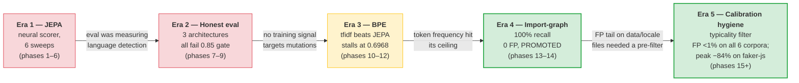
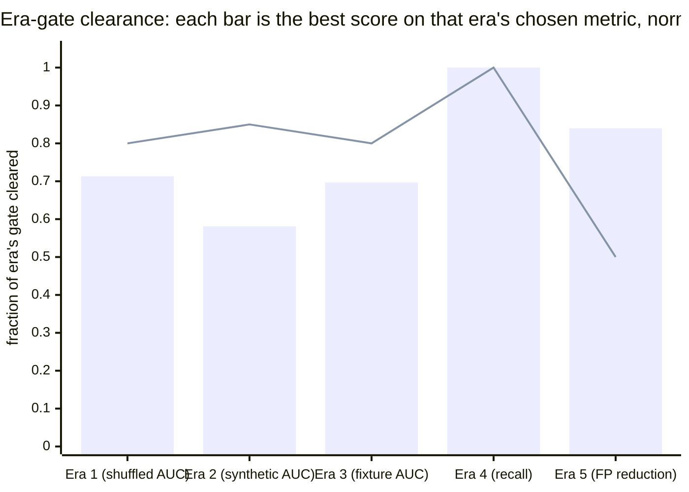

# argot research

> **How a GPU-hungry neural scorer became a 180-line statistical pipeline.**
> Four eras, three dead ends, one breakthrough — 14 phases of experiments
> condensed into four short narratives and 27 evidence docs.

## What argot does today

argot is a style linter that learns a repo's voice from its git history
and scores new code by how far it diverges. The current production
scorer is a two-stage pipeline: `ImportGraphScorer` flags hunks that
introduce modules never seen in the repo, then a BPE log-ratio scorer
catches stdlib-only breaks against a per-repo calibration threshold.

The path here was not direct.

## Timeline

| Era | Phases | Headline finding | Link |
|---|---|---|---|
| **JEPA era** | 1–6 | Wins did not compound and cross-repo AUC was measuring language detection, not style — best honest metric (shuffled AUC) plateaued at 0.713 | [01-jepa-era.md](01-jepa-era.md) |
| **Honest eval** | 7–9 | Three architectures (from-scratch encoders, density heads, frozen pretrained) all failed the 0.85 gate at 0.48–0.58 — targeted mutations carried no detectable training signal | [02-pivot-to-honest-eval.md](02-pivot-to-honest-eval.md) |
| **Token-frequency signal hunt** | 10–12 | Zero-training `tfidf_anomaly` beat the JEPA ensemble (AUC 0.6968 vs 0.6532) and was promoted as the new default, but stalled short of the 0.80 gate | [03-bpe-signal-hunt.md](03-bpe-signal-hunt.md) |
| **Import-graph breakthrough** | 13–14 | `SequentialImportBpeScorer` flagged 46/46 breaks with 0 FP across 189 calibration+control hunks; TS bring-up clean on hono (0/22), ink (3/14 all INTENTIONAL), and faker-js (2/46 after 74.8% locale-data filter) | [04-import-graph-breakthrough.md](04-import-graph-breakthrough.md) |
| **Calibration hygiene** | 15+ | AST-derived typicality predicate brought FP rate below 1% on all 6 corpora; peak reduction on faker-js (5.0% → 0.8%). Ink recall improved +6.6 pp as a side effect of calibration-pool cleanup; one fixture regression on rich (ansi_raw_2 at threshold boundary). | [05-calibration-hygiene.md](05-calibration-hygiene.md) |

**Metric notes:** Era 1's *shuffled AUC* is AUC on a permutation-shuffled
control condition, the honest generalization metric from phase 2. Era 2's
*synthetic AUC* is AUC on mutation-generated breaks. Era 3's *fixture AUC*
is AUC on handcrafted break/control pairs. Era 4 reports raw *recall* on
the validation fixture catalog. Era 5 reports peak *FP reduction* on the
worst-affected corpus (faker-js).

## The arc in one chart

Each era's best number on its own gate — the scorer got simpler, honest,
and eventually good enough:

Bars are the best result; the line marks the era's gate. Eras 1–3 came
in under; eras 4–5 cleared it.

## Evidence

Each era doc cites peer docs under `docs/research/evidence/`. Those are
freshly written, 200–400 word summaries of the experiments the narrative
load-bears on — 27 in total, covering every cited result. The era docs
are the story; the evidence docs are the receipts.

## What's next

The era-5 predicate lives at `engine/argot/scoring/filters/typicality.py`
and is applied by the production `SequentialImportBpeScorer` at both
calibration and inference. Remaining research items:

- **Calibration pool composition** — the file-level filter at
  `collect_candidates` changed from `is_data_dominant + is_auto_generated`
  to `is_atypical_file` during the port, which shifted rich's threshold up
  by 0.16 and cost the ansi_raw_2 fixture. A targeted fix (restore
  `is_data_dominant` as the primary file-level filter, make typicality
  opt-in at that scope) could recover rich's 90% recall but trades against
  FP elsewhere. See era-5 Interpretation for the tradeoff analysis.
- **Object-keyed structured data** (documented limit in era 5) — a 5th
  feature treating TS `property_identifier` nodes in `pair` position as
  literal-equivalent, or a Python class-boilerplate-stripped ratio.
- **Semantic breaks invisible to token novelty** (era-4 weakness #2)
  — rule-based or AST-pattern stage for categories like `foreign_rng`,
  `http_sink`, `runtime_fetch`.
- **Keyword-compatible reframings** (era-4 weakness #3) — Flask-style
  `@app.route` in a FastAPI corpus still scores below the threshold.
