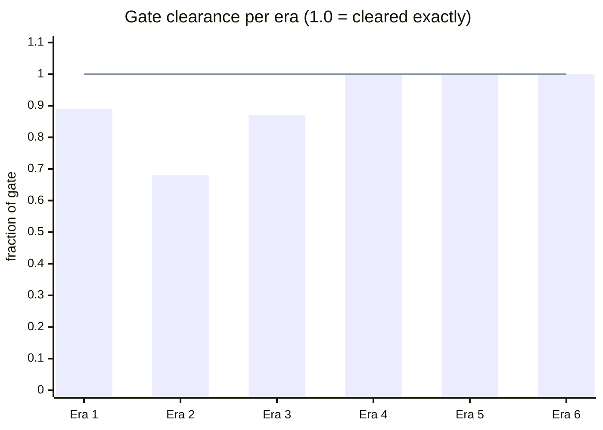
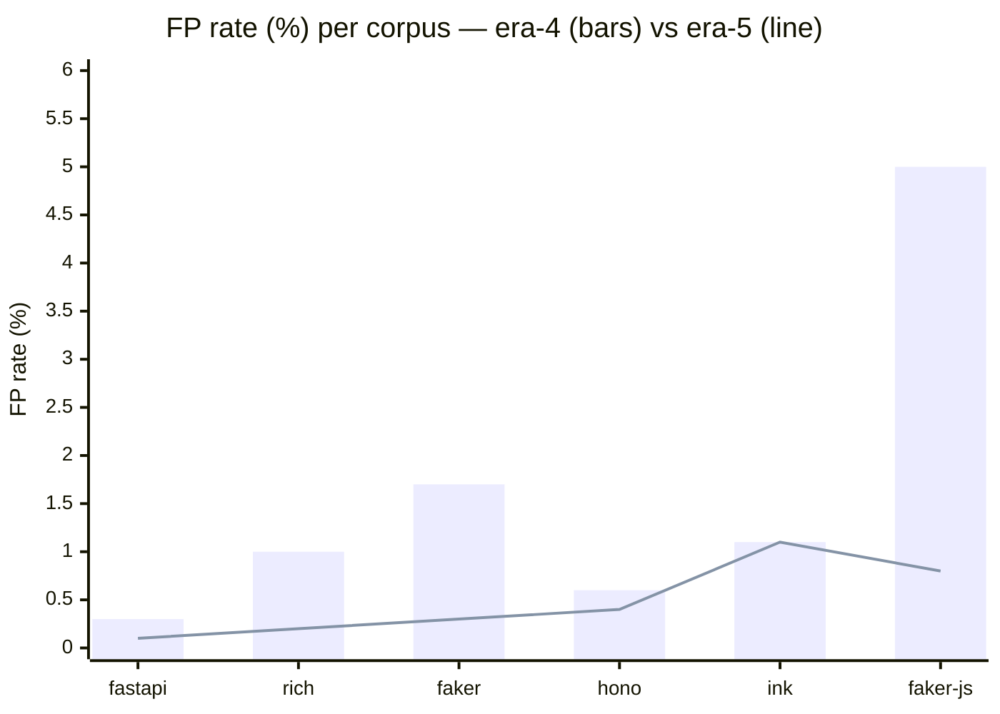
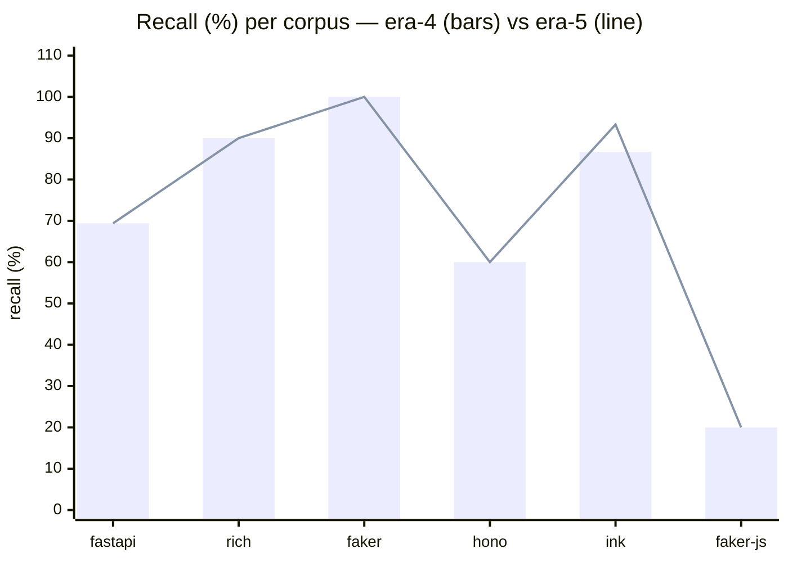
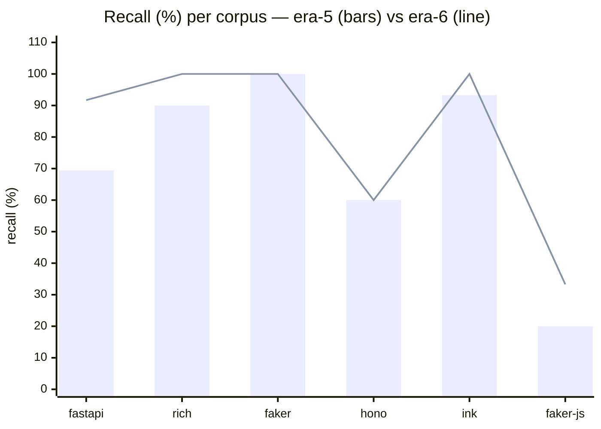
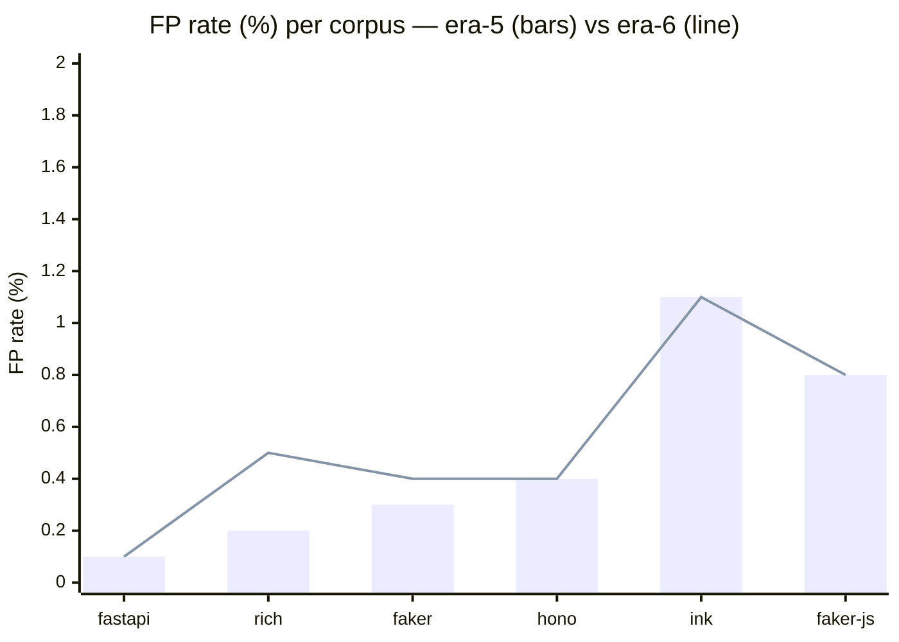

# argot research

> **How a GPU-hungry neural scorer became a ~220-line statistical pipeline.**
> Six eras, three dead ends, two breakthroughs and a parsing-artifact
> mystery — 15+ phases of experiments condensed into six short narratives
> and 29 evidence docs.

## What argot does today

argot is a style linter that learns a repo's voice from its git history
and scores new code by how far it diverges. The current production
scorer is a three-stage pipeline: `ImportGraphScorer` flags hunks that
introduce modules never seen in the repo, a call-receiver stage adds a
soft penalty for hunks invoking callees the repo itself never calls, and
a BPE log-ratio scorer catches stdlib-only breaks against a per-repo
calibration threshold.

The path here was not direct.

```mermaid
flowchart LR
    E1["<b>Era 1 — JEPA</b><br/>neural scorer,<br/>6 sweeps<br/>(phases 1–6)"]
    E2["<b>Era 2 — Honest eval</b><br/>3 architectures<br/>all fail 0.85 gate<br/>(phases 7–9)"]
    E3["<b>Era 3 — BPE</b><br/>tfidf beats JEPA<br/>stalls at 0.6968<br/>(phases 10–12)"]
    E4["<b>Era 4 — Import-graph</b><br/>100% recall<br/>0 FP, PROMOTED<br/>(phases 13–14)"]

    E1 -->|"eval was measuring<br/>language detection"| E2
    E2 -->|"no training signal<br/>targets mutations"| E3
    E3 -->|"token frequency hit<br/>its ceiling"| E4
    E4 -->|"FP tail on data/locale<br/>files needed a pre-filter"| E5

    E5["<b>Era 5 — Calibration hygiene</b><br/>typicality filter<br/>FP ≤1.1% on all 6 corpora;<br/>peak −84% on faker-js<br/>(phases 15+)"]

    E5 -->|"context-dependent breaks<br/>still slip past BPE"| E6
    E6["<b>Era 6 — Call receiver</b><br/>Stage 1.5 soft penalty;<br/>avg recall 72.1%→80.8%<br/>FP ≤1.1% on all 6"]

    style E4 fill:#d4edda,stroke:#28a745,stroke-width:2px
    style E5 fill:#d4edda,stroke:#28a745,stroke-width:2px
    style E6 fill:#d4edda,stroke:#28a745,stroke-width:2px
    style E1 fill:#f8d7da,stroke:#dc3545
    style E2 fill:#f8d7da,stroke:#dc3545
    style E3 fill:#fff3cd,stroke:#ffc107
```

## Timeline

| Era | Phases | Headline finding | Link |
|---|---|---|---|
| **JEPA era** | 1–6 | Wins did not compound and cross-repo AUC was measuring language detection, not style — best honest metric (shuffled AUC) plateaued at 0.713 | [01-jepa-era.md](01-jepa-era.md) |
| **Honest eval** | 7–9 | Three architectures (from-scratch encoders, density heads, frozen pretrained) all failed the 0.85 gate at 0.48–0.58 — targeted mutations carried no detectable training signal | [02-pivot-to-honest-eval.md](02-pivot-to-honest-eval.md) |
| **Token-frequency signal hunt** | 10–12 | Zero-training `tfidf_anomaly` beat the JEPA ensemble (AUC 0.6968 vs 0.6532) and was promoted as the new default, but stalled short of the 0.80 gate | [03-bpe-signal-hunt.md](03-bpe-signal-hunt.md) |
| **Import-graph breakthrough** | 13–14 | `SequentialImportBpeScorer` flagged 46/46 breaks with 0 FP across 189 calibration+control hunks; TS bring-up clean on hono (0/22), ink (3/14 all INTENTIONAL), and faker-js (2/46 after 74.8% locale-data filter) | [04-import-graph-breakthrough.md](04-import-graph-breakthrough.md) |
| **Calibration hygiene** | 15+ | AST-derived typicality predicate brought FP rate ≤1.1% on all 6 corpora; peak reduction on faker-js (5.0% → 0.8%). Ink recall improved +6.6 pp and rich fully recovered to 90% as side effects of calibration-pool cleanup. | [05-calibration-hygiene.md](05-calibration-hygiene.md) |
| **Call-receiver scorer** | 16+ | Stage 1.5 presence signal over call-expression receivers, shipped as a soft additive penalty to BPE (`adjusted = bpe + α · min(n_unattested, 5)`, α=1.0). Four bench configurations (k=1, k=2, α=0.5, α=1.0) failed gates before a data-driven investigation revealed most new FPs were a tree-sitter artifact on out-of-context hunk slices, not a scorer issue. A six-line root-ERROR guard unlocked the gate: avg recall 72.1% → 80.8%, FP ≤ 1.1% on all six corpora, 0/91 category regressions. | [06-call-receiver.md](06-call-receiver.md) |

## The arc across six eras

Each era had a pre-registered success gate in its own metric
(shuffled AUC for eras 1–3, recall for era 4, "FP ≤1.5% on all
corpora" for era 5, "avg recall ≥80% + FP ≤1.5% + no regression"
for era 6). The chart below normalizes each era's achievement to
a fraction of its own gate — so a bar of 1.0 means "cleared
exactly", below 1.0 means "came in under".

| Era | Best result | Gate | Clearance |
|:---|---:|---:|---:|
| 1 (JEPA) | shuffled AUC 0.713 | 0.80 | 0.89 |
| 2 (honest eval) | synthetic AUC 0.581 | 0.85 | 0.68 |
| 3 (token-freq hunt) | fixture AUC 0.6968 | 0.80 | 0.87 |
| 4 (import-graph) | recall 1.0 | 1.0 | 1.00 |
| 5 (calibration hygiene) | 6/6 corpora at FP ≤1.5% | 6/6 | 1.00 |
| 6 (call-receiver) | avg recall 80.8%, FP ≤1.1%, 0 regressions | 4/4 gates | 1.00 |

Eras 1–3 came in short on their own gates. Era 4 cleared
exactly. Era 5 cleared its gate (FP ≤1.5% on all six corpora)
with ink the closest at 1.1%; peak FP reduction 84% on faker-js
(5.0% → 0.8%). Era 6 cleared all four pre-registered gates
after five bench configurations and a data-driven investigation
revealed a tree-sitter parsing artifact rather than a scorer
design flaw; the final fix was six lines.

## Era-4 → era-5: what changed in detail

Era 5's contribution is FP hygiene on top of era 4's recall.
Per-corpus detail, era-4 baseline (bars) → era-5 (line):

### False-positive rate

FP dropped on 5 of 6; unchanged on ink. Peak reduction on
faker-js (5.0% → 0.8%). All six corpora now below 1.5%.

### Recall

Unchanged on 4 of 6 corpora; +6.6 pp on ink; +0 pp on rich
(ansi_raw_2 recovered by Option A). Net break-fixture
count across the 91-fixture catalog: zero change.

### Summary table

| Corpus | FP (era 4 → 5) | Recall (era 4 → 5) |
|:---|---:|---:|
| fastapi  | 0.3% → **0.1%** | 69.4% → 69.4% |
| rich     | 1.0% → **0.2%** | 90.0% → **90.0%** |
| faker    | 1.7% → **0.3%** | 100%  → 100%  |
| hono     | 0.6% → **0.4%** | 60.0% → 60.0% |
| ink      | 1.1% → 1.1%     | 86.7% → **93.3%** |
| faker-js | 5.0% → **0.8%** | 20.0% → 20.0% |

Recall limits on hono (60%) and faker-js (20%) are era-4
carryover — the scorer can't detect context-dependent breaks
where the tokens themselves are idiomatic (`Math.random` in a
provider file, Express patterns in a Hono app). Era 6's
call-receiver scorer addresses this axis.

## Era-5 → era-6: what changed in detail

Era 6's contribution is recall on context-dependent breaks,
without giving back era 5's FP hygiene. Per-corpus detail, era-5
baseline (bars) → era-6 (line):

### Recall

Recall climbed on 4 of 6 corpora: fastapi +22.3 pp (69.4 → 91.7),
rich +10.0 pp (90 → 100), ink +6.7 pp (93.3 → 100), faker-js
+13.3 pp (20 → 33.3). Flat on faker (already at ceiling) and
hono (remaining misses are complex-chain or no-foreign-callee
cases the extractor skips).

### False-positive rate

Within noise on four corpora. Rich nudged 0.2% → 0.5% and faker
0.3% → 0.4% — still well inside the 1.5% gate. The pre-registered
max-FP constraint held on every corpus.

### Summary table

| Corpus | FP (era 5 → 6) | Recall (era 5 → 6) |
|:---|---:|---:|
| fastapi  | 0.1% → 0.1% | 69.4% → **91.7%** |
| rich     | 0.2% → 0.5% | 90.0% → **100.0%** |
| faker    | 0.3% → 0.4% | 100%  → 100%  |
| hono     | 0.4% → 0.4% | 60.0% → 60.0% |
| ink      | 1.1% → 1.1% | 93.3% → **100.0%** |
| faker-js | 0.8% → 0.8% | 20.0% → **33.3%** |

Average recall 72.1% → 80.8%. Every ship gate cleared.

## Evidence

Each era doc cites peer docs under `docs/research/evidence/`. Those are
freshly written, 200–400 word summaries of the experiments the narrative
load-bears on — 29 in total after era 6, covering every cited result. The
era docs are the story; the evidence docs are the receipts.

## What's next

The era-6 scorer lives at `engine/argot/scoring/scorers/call_receiver.py`
(after the production port) and runs as Stage 1.5 in
`SequentialImportBpeScorer`. Remaining research items:

- **Object-keyed structured data** (documented limit in era 5) — a 5th
  typicality feature treating TS `property_identifier` nodes in `pair`
  position as literal-equivalent, or a Python class-boilerplate-stripped
  ratio. Would close the faker-js locale-file BPE-FP residual.
- **Complex-chain callees** (era-6 documented limit) — the call-receiver
  extractor returns `None` for callees bottoming at a call expression
  (`Router().route(path).get()`). Canonicalizing with a `<call>`
  placeholder would recover hono routing_2 and similar.
- **Single-callee foreign-receiver breaks** (era-6 documented limit) —
  faker-js `foreign_rng_1` and `_3` have a single `Math.random()` call
  each, below the α=1.0 penalty threshold. A frequency-weighted variant
  of the scorer could close this without re-exploding FP.
- **Semantic breaks with no foreign callee at all** — hono
  `middleware_3` (sync `next()` vs `await next()`) has no receiver to
  flag; the scorer is structurally blind to it.
- **Keyword-compatible reframings** (era-4 weakness #3) — Flask-style
  `@app.route` in a FastAPI corpus still scores below the threshold.
